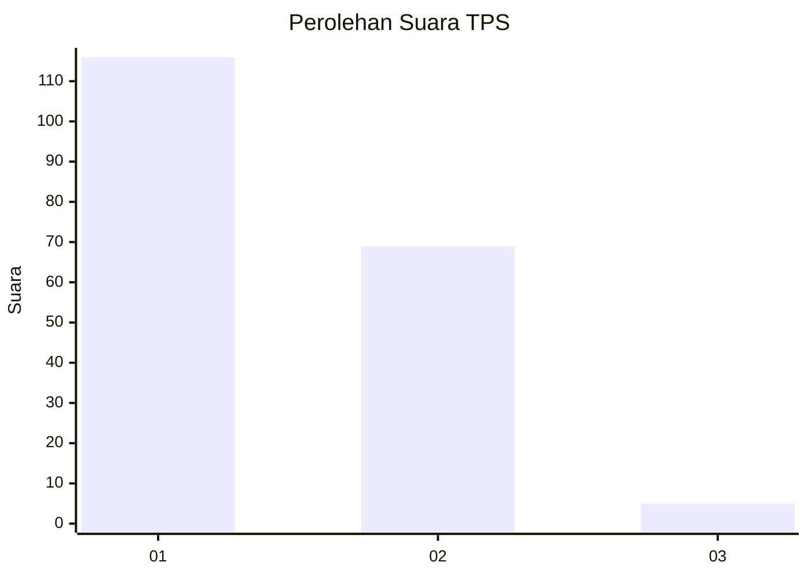
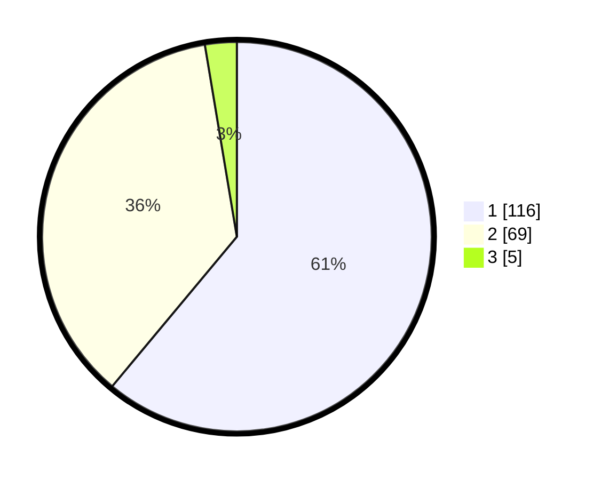

# Hasil

## Grafik

## Tabel

| No. | Nama Paslon    | Suara | Suara (raw) | Persentase |
|:--- |:-------------- | -----:| -----------:| ----------:|
| 1   | ANIES MUHAIMIN | 116   | [116][p-1]  | 61,05      |
| 2   | PRABOWO GIBRAN | 69    | [69][p-2]   | 36,32      |
| 3   | GANJAR MAHFUD  | 5     | [5][p-3]    | 2,63       |

[p-1]: https://github.com/gigit-pemilu/pemilu-2024-11-aceh/blob/main/pilpres/hitung-suara/sub/11-aceh/sub/17-bener-meriah/sub/01-pintu-rime-gayo/sub/2001-blang-rakal/sub/001-tps/sub/paslon-1.txt
[p-2]: https://github.com/gigit-pemilu/pemilu-2024-11-aceh/blob/main/pilpres/hitung-suara/sub/11-aceh/sub/17-bener-meriah/sub/01-pintu-rime-gayo/sub/2001-blang-rakal/sub/001-tps/sub/paslon-2.txt
[p-3]: https://github.com/gigit-pemilu/pemilu-2024-11-aceh/blob/main/pilpres/hitung-suara/sub/11-aceh/sub/17-bener-meriah/sub/01-pintu-rime-gayo/sub/2001-blang-rakal/sub/001-tps/sub/paslon-3.txt

## Foto C Plano

https://sirekap-obj-formc.kpu.go.id/73bd/pemilu/ppwp/11/17/01/20/01/1117012001001-20240224-160036--6e962494-9cce-4a13-bc73-ead2b92b6346.jpg

https://sirekap-obj-formc.kpu.go.id/73bd/pemilu/ppwp/11/17/01/20/01/1117012001001-20240224-160143--0e1e39eb-1a4e-4098-8c30-dbbbee4dd322.jpg

https://sirekap-obj-formc.kpu.go.id/73bd/pemilu/ppwp/11/17/01/20/01/1117012001001-20240224-160232--5bf9203a-9b26-4d98-851d-f509a62479fc.jpg

## Metadata

| Key        | Value               |
| ---------- | ------------------- |
| Time Stamp | 2024-02-28 20:00:00 |

