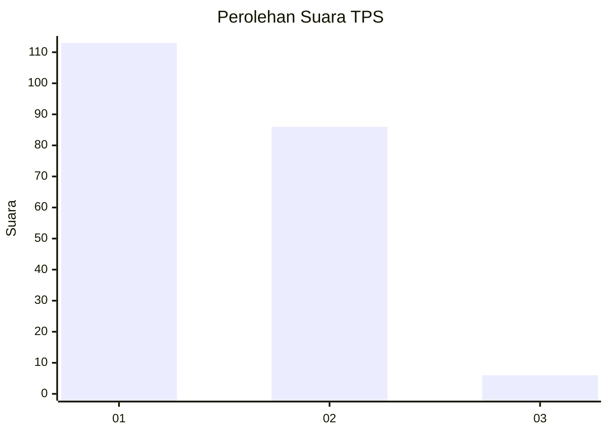
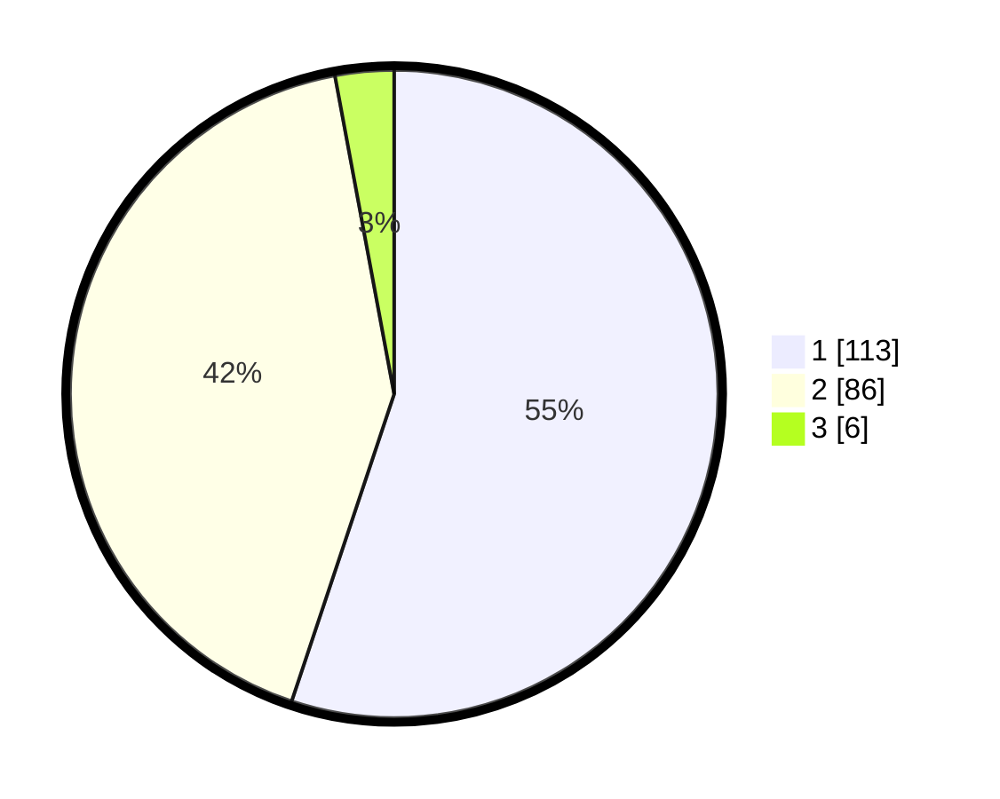

# Hasil

## Grafik

## Tabel

| No. | Nama Paslon    | Suara | Suara (raw) | Persentase |
|:--- |:-------------- | -----:| -----------:| ----------:|
| 1   | ANIES MUHAIMIN | 113   | [113][p-1]  | 55,12      |
| 2   | PRABOWO GIBRAN | 86    | [86][p-2]   | 41,95      |
| 3   | GANJAR MAHFUD  | 6     | [6][p-3]    | 2,93       |

[p-1]: https://github.com/gigit-pemilu/pemilu-2024-11-aceh/blob/main/pilpres/hitung-suara/sub/11-aceh/sub/17-bener-meriah/sub/01-pintu-rime-gayo/sub/2001-blang-rakal/sub/002-tps/sub/paslon-1.txt
[p-2]: https://github.com/gigit-pemilu/pemilu-2024-11-aceh/blob/main/pilpres/hitung-suara/sub/11-aceh/sub/17-bener-meriah/sub/01-pintu-rime-gayo/sub/2001-blang-rakal/sub/002-tps/sub/paslon-2.txt
[p-3]: https://github.com/gigit-pemilu/pemilu-2024-11-aceh/blob/main/pilpres/hitung-suara/sub/11-aceh/sub/17-bener-meriah/sub/01-pintu-rime-gayo/sub/2001-blang-rakal/sub/002-tps/sub/paslon-3.txt

## Foto C Plano

https://sirekap-obj-formc.kpu.go.id/f94f/pemilu/ppwp/11/17/01/20/01/1117012001002-20240214-231324--a4a7ee32-0b2c-41d7-afa5-63424783c45a.jpg

https://sirekap-obj-formc.kpu.go.id/f94f/pemilu/ppwp/11/17/01/20/01/1117012001002-20240214-231339--5e926f4b-5c4c-4ec0-941a-a33beff3936b.jpg

https://sirekap-obj-formc.kpu.go.id/f94f/pemilu/ppwp/11/17/01/20/01/1117012001002-20240214-231404--fe55d8b7-fda0-4cb3-8c8a-812e54ed15b5.jpg

## Metadata

| Key        | Value               |
| ---------- | ------------------- |
| Time Stamp | 2024-02-24 22:31:28 |

