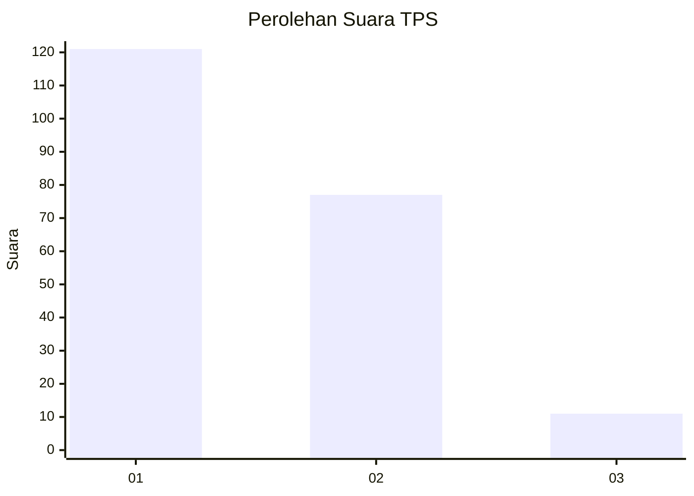
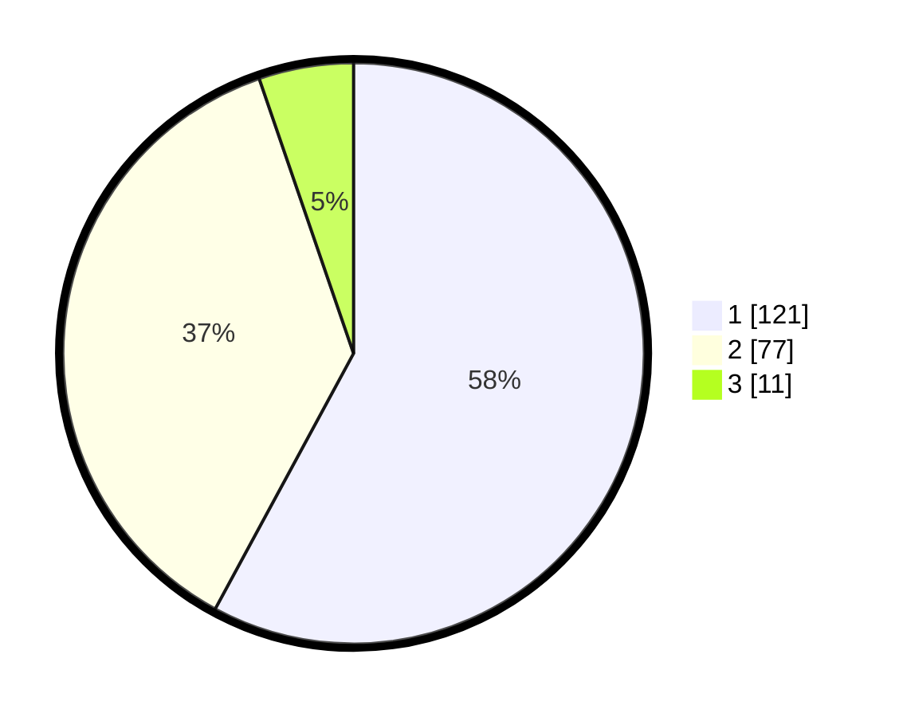

# Hasil

## Grafik

## Tabel

| No. | Nama Paslon    | Suara | Suara (raw) | Persentase |
|:--- |:-------------- | -----:| -----------:| ----------:|
| 1   | ANIES MUHAIMIN | 121   | [121][p-1]  | 57,89      |
| 2   | PRABOWO GIBRAN | 77    | [77][p-2]   | 36,84      |
| 3   | GANJAR MAHFUD  | 11    | [11][p-3]   | 5,26       |

[p-1]: https://github.com/gigit-pemilu/pemilu-2024-11-aceh/blob/main/pilpres/hitung-suara/sub/11-aceh/sub/17-bener-meriah/sub/01-pintu-rime-gayo/sub/2001-blang-rakal/sub/003-tps/sub/paslon-1.txt
[p-2]: https://github.com/gigit-pemilu/pemilu-2024-11-aceh/blob/main/pilpres/hitung-suara/sub/11-aceh/sub/17-bener-meriah/sub/01-pintu-rime-gayo/sub/2001-blang-rakal/sub/003-tps/sub/paslon-2.txt
[p-3]: https://github.com/gigit-pemilu/pemilu-2024-11-aceh/blob/main/pilpres/hitung-suara/sub/11-aceh/sub/17-bener-meriah/sub/01-pintu-rime-gayo/sub/2001-blang-rakal/sub/003-tps/sub/paslon-3.txt

## Foto C Plano

https://sirekap-obj-formc.kpu.go.id/cd35/pemilu/ppwp/11/17/01/20/01/1117012001003-20240214-214327--6e2a74bc-b867-4069-bac8-d05b0927c0cd.jpg

https://sirekap-obj-formc.kpu.go.id/cd35/pemilu/ppwp/11/17/01/20/01/1117012001003-20240214-213536--f34fde07-de90-4d56-a27c-8caabf97eec9.jpg

https://sirekap-obj-formc.kpu.go.id/cd35/pemilu/ppwp/11/17/01/20/01/1117012001003-20240214-213338--c4317321-0882-40e4-bfc9-2a34cd605aaa.jpg

## Metadata

| Key        | Value               |
| ---------- | ------------------- |
| Time Stamp | 2024-02-24 22:31:28 |

