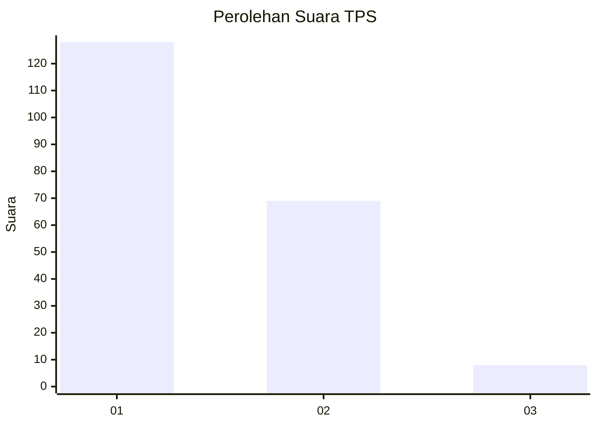
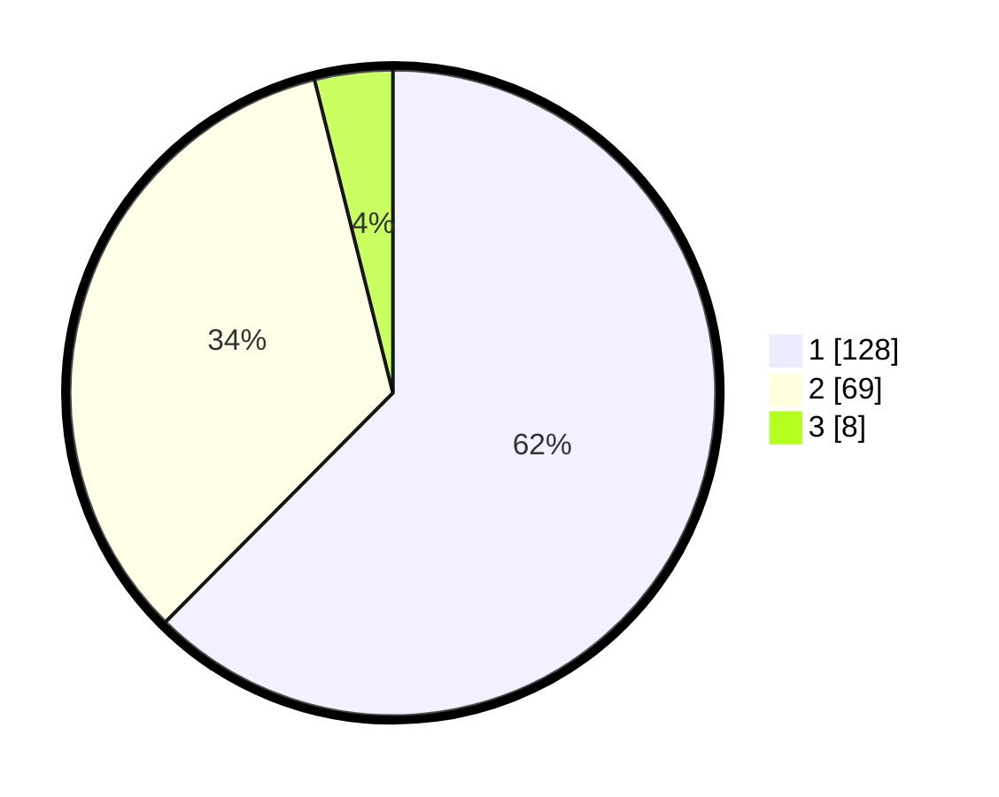

# Hasil

## Grafik

## Tabel

| No. | Nama Paslon    | Suara | Suara (raw) | Persentase |
|:--- |:-------------- | -----:| -----------:| ----------:|
| 1   | ANIES MUHAIMIN | 128   | [128][p-1]  | 62,44      |
| 2   | PRABOWO GIBRAN | 69    | [69][p-2]   | 33,66      |
| 3   | GANJAR MAHFUD  | 8     | [8][p-3]    | 3,90       |

[p-1]: https://github.com/gigit-pemilu/pemilu-2024-11-aceh/blob/main/pilpres/hitung-suara/sub/11-aceh/sub/17-bener-meriah/sub/01-pintu-rime-gayo/sub/2001-blang-rakal/sub/004-tps/sub/paslon-1.txt
[p-2]: https://github.com/gigit-pemilu/pemilu-2024-11-aceh/blob/main/pilpres/hitung-suara/sub/11-aceh/sub/17-bener-meriah/sub/01-pintu-rime-gayo/sub/2001-blang-rakal/sub/004-tps/sub/paslon-2.txt
[p-3]: https://github.com/gigit-pemilu/pemilu-2024-11-aceh/blob/main/pilpres/hitung-suara/sub/11-aceh/sub/17-bener-meriah/sub/01-pintu-rime-gayo/sub/2001-blang-rakal/sub/004-tps/sub/paslon-3.txt

## Foto C Plano

https://sirekap-obj-formc.kpu.go.id/bc24/pemilu/ppwp/11/17/01/20/01/1117012001004-20240224-123436--579fbc2c-6552-46f2-8be0-e76d0e09a9ab.jpg

https://sirekap-obj-formc.kpu.go.id/bc24/pemilu/ppwp/11/17/01/20/01/1117012001004-20240224-123150--98caec5f-4bda-49de-aca7-63c25874f73d.jpg

https://sirekap-obj-formc.kpu.go.id/bc24/pemilu/ppwp/11/17/01/20/01/1117012001004-20240224-123359--71622350-5426-482d-a3fb-cbad23438262.jpg

## Metadata

| Key        | Value               |
| ---------- | ------------------- |
| Time Stamp | 2024-02-28 20:00:00 |

