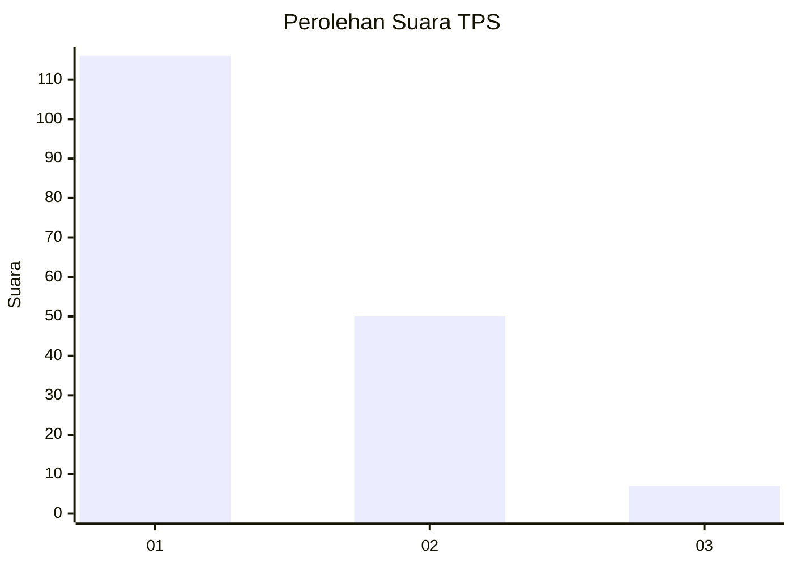
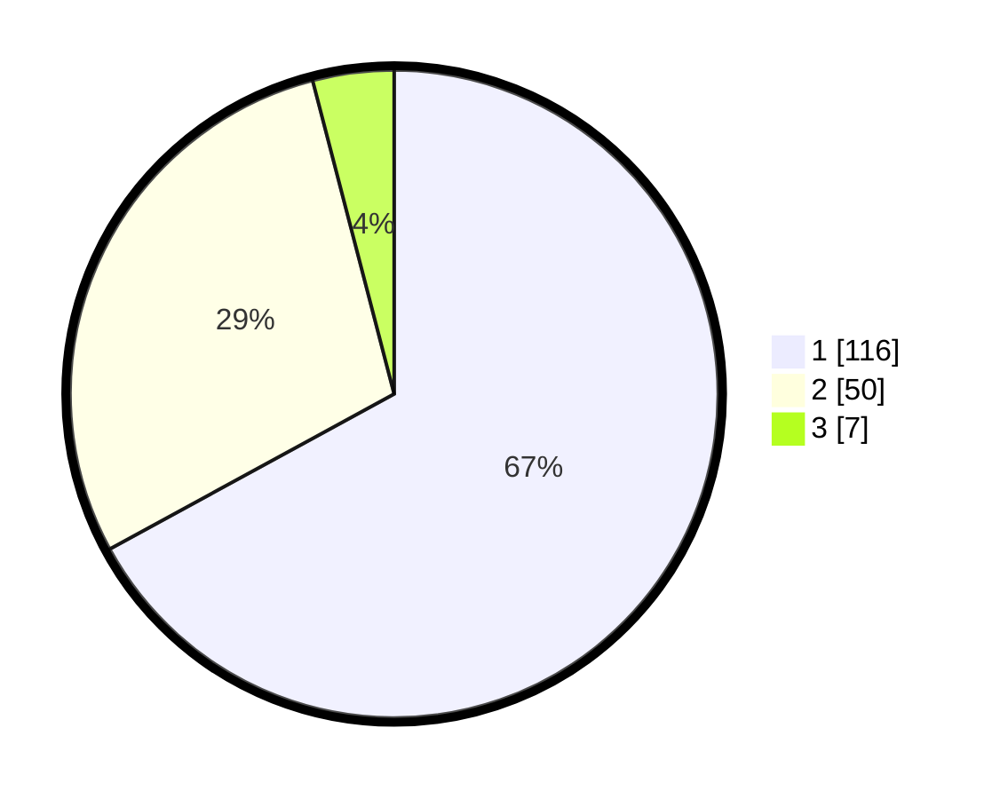

# Hasil

## Grafik

## Tabel

| No. | Nama Paslon    | Suara | Suara (raw) | Persentase |
|:--- |:-------------- | -----:| -----------:| ----------:|
| 1   | ANIES MUHAIMIN | 116   | [116][p-1]  | 67,05      |
| 2   | PRABOWO GIBRAN | 50    | [50][p-2]   | 28,90      |
| 3   | GANJAR MAHFUD  | 7     | [7][p-3]    | 4,05       |

[p-1]: https://github.com/gigit-pemilu/pemilu-2024-11-aceh/blob/main/pilpres/hitung-suara/sub/11-aceh/sub/17-bener-meriah/sub/01-pintu-rime-gayo/sub/2003-alur-cincin/sub/001-tps/sub/paslon-1.txt
[p-2]: https://github.com/gigit-pemilu/pemilu-2024-11-aceh/blob/main/pilpres/hitung-suara/sub/11-aceh/sub/17-bener-meriah/sub/01-pintu-rime-gayo/sub/2003-alur-cincin/sub/001-tps/sub/paslon-2.txt
[p-3]: https://github.com/gigit-pemilu/pemilu-2024-11-aceh/blob/main/pilpres/hitung-suara/sub/11-aceh/sub/17-bener-meriah/sub/01-pintu-rime-gayo/sub/2003-alur-cincin/sub/001-tps/sub/paslon-3.txt

## Foto C Plano

https://sirekap-obj-formc.kpu.go.id/99a7/pemilu/ppwp/11/17/01/20/03/1117012003001-20240220-102427--9b3dec0a-d4a4-461d-8106-2330b440697b.jpg

https://sirekap-obj-formc.kpu.go.id/99a7/pemilu/ppwp/11/17/01/20/03/1117012003001-20240220-102540--592d0e32-3ea1-4f0d-92fa-36891e8eec05.jpg

https://sirekap-obj-formc.kpu.go.id/99a7/pemilu/ppwp/11/17/01/20/03/1117012003001-20240220-102507--baf9021a-3823-461e-8152-130adc16055f.jpg

## Metadata

| Key        | Value               |
| ---------- | ------------------- |
| Time Stamp | 2024-02-24 22:31:28 |

