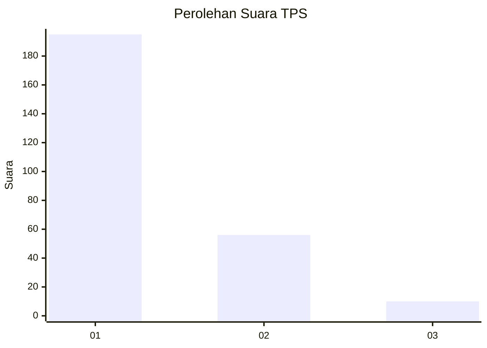
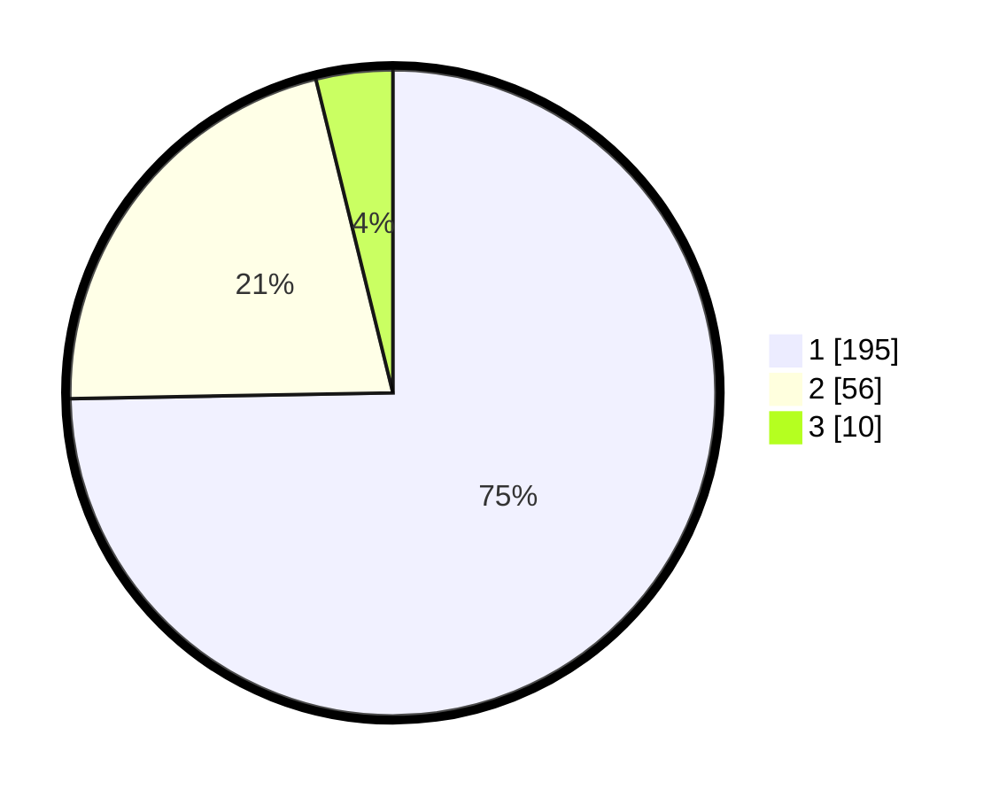

# Hasil

## Grafik

## Tabel

| No. | Nama Paslon    | Suara | Suara (raw) | Persentase |
|:--- |:-------------- | -----:| -----------:| ----------:|
| 1   | ANIES MUHAIMIN | 195   | [195][p-1]  | 74,71      |
| 2   | PRABOWO GIBRAN | 56    | [56][p-2]   | 21,46      |
| 3   | GANJAR MAHFUD  | 10    | [10][p-3]   | 3,83       |

[p-1]: https://github.com/gigit-pemilu/pemilu-2024-11-aceh/blob/main/pilpres/hitung-suara/sub/11-aceh/sub/17-bener-meriah/sub/01-pintu-rime-gayo/sub/2008-perdamaian/sub/001-tps/sub/paslon-1.txt
[p-2]: https://github.com/gigit-pemilu/pemilu-2024-11-aceh/blob/main/pilpres/hitung-suara/sub/11-aceh/sub/17-bener-meriah/sub/01-pintu-rime-gayo/sub/2008-perdamaian/sub/001-tps/sub/paslon-2.txt
[p-3]: https://github.com/gigit-pemilu/pemilu-2024-11-aceh/blob/main/pilpres/hitung-suara/sub/11-aceh/sub/17-bener-meriah/sub/01-pintu-rime-gayo/sub/2008-perdamaian/sub/001-tps/sub/paslon-3.txt

## Foto C Plano

https://sirekap-obj-formc.kpu.go.id/793e/pemilu/ppwp/11/17/01/20/08/1117012008001-20240219-142329--e26c9aa9-fee9-4ed1-b9b6-769b1b57977e.jpg

https://sirekap-obj-formc.kpu.go.id/793e/pemilu/ppwp/11/17/01/20/08/1117012008001-20240219-142222--fa4761d4-82c3-4276-982b-1111b03b4f2e.jpg

https://sirekap-obj-formc.kpu.go.id/793e/pemilu/ppwp/11/17/01/20/08/1117012008001-20240219-144754--41607b0c-c857-4966-b535-49d5c070f707.jpg

## Metadata

| Key        | Value               |
| ---------- | ------------------- |
| Time Stamp | 2024-02-24 22:31:28 |

