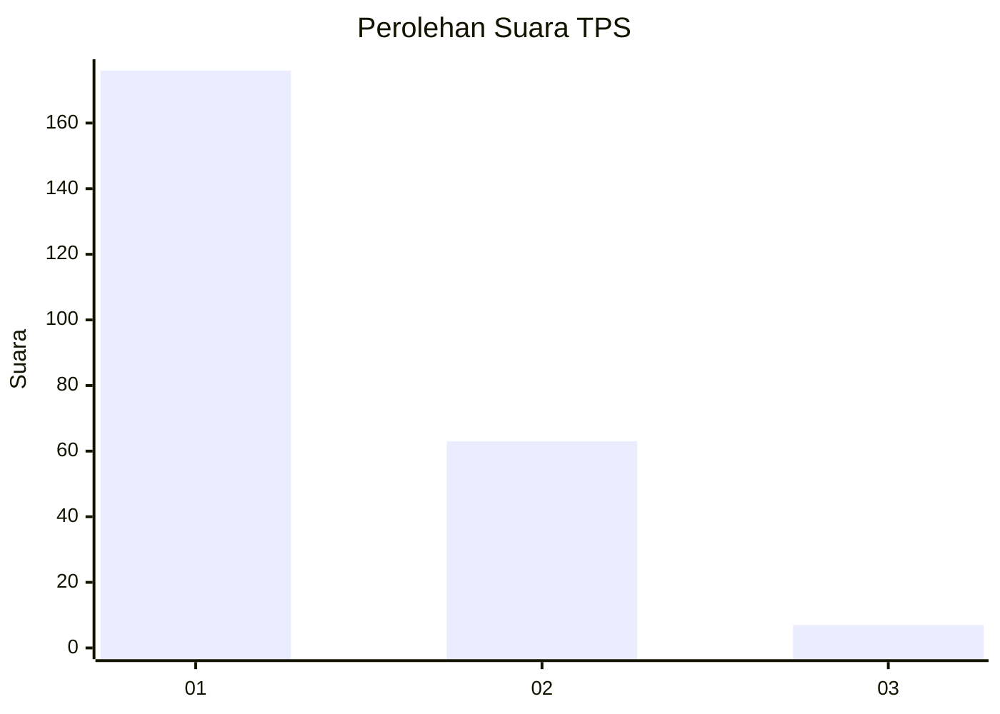
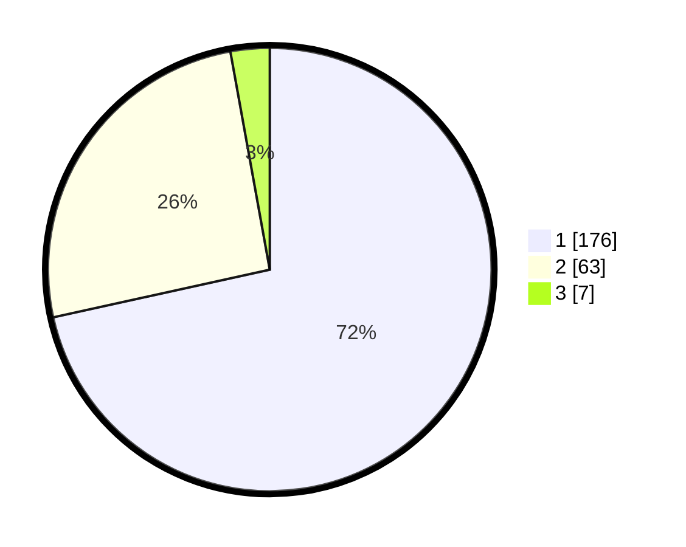

# Hasil

## Grafik

## Tabel

| No. | Nama Paslon    | Suara | Suara (raw) | Persentase |
|:--- |:-------------- | -----:| -----------:| ----------:|
| 1   | ANIES MUHAIMIN | 176   | [176][p-1]  | 71,54      |
| 2   | PRABOWO GIBRAN | 63    | [63][p-2]   | 25,61      |
| 3   | GANJAR MAHFUD  | 7     | [7][p-3]    | 2,85       |

[p-1]: https://github.com/gigit-pemilu/pemilu-2024-11-aceh/blob/main/pilpres/hitung-suara/sub/11-aceh/sub/17-bener-meriah/sub/01-pintu-rime-gayo/sub/2008-perdamaian/sub/002-tps/sub/paslon-1.txt
[p-2]: https://github.com/gigit-pemilu/pemilu-2024-11-aceh/blob/main/pilpres/hitung-suara/sub/11-aceh/sub/17-bener-meriah/sub/01-pintu-rime-gayo/sub/2008-perdamaian/sub/002-tps/sub/paslon-2.txt
[p-3]: https://github.com/gigit-pemilu/pemilu-2024-11-aceh/blob/main/pilpres/hitung-suara/sub/11-aceh/sub/17-bener-meriah/sub/01-pintu-rime-gayo/sub/2008-perdamaian/sub/002-tps/sub/paslon-3.txt

## Foto C Plano

https://sirekap-obj-formc.kpu.go.id/6e44/pemilu/ppwp/11/17/01/20/08/1117012008002-20240219-123600--76833321-abc9-4e03-9e6b-bd603302013b.jpg

https://sirekap-obj-formc.kpu.go.id/6e44/pemilu/ppwp/11/17/01/20/08/1117012008002-20240219-123633--8191d9cd-39db-41e3-9382-97224fc6fc15.jpg

https://sirekap-obj-formc.kpu.go.id/6e44/pemilu/ppwp/11/17/01/20/08/1117012008002-20240219-123701--be223bd1-251e-4433-a852-4af110a4352f.jpg

## Metadata

| Key        | Value               |
| ---------- | ------------------- |
| Time Stamp | 2024-02-24 22:31:28 |

