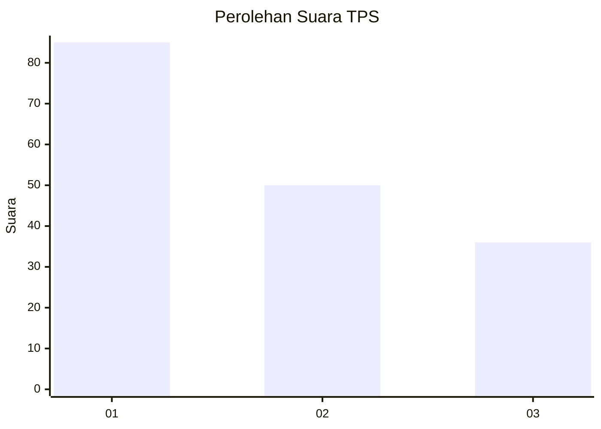
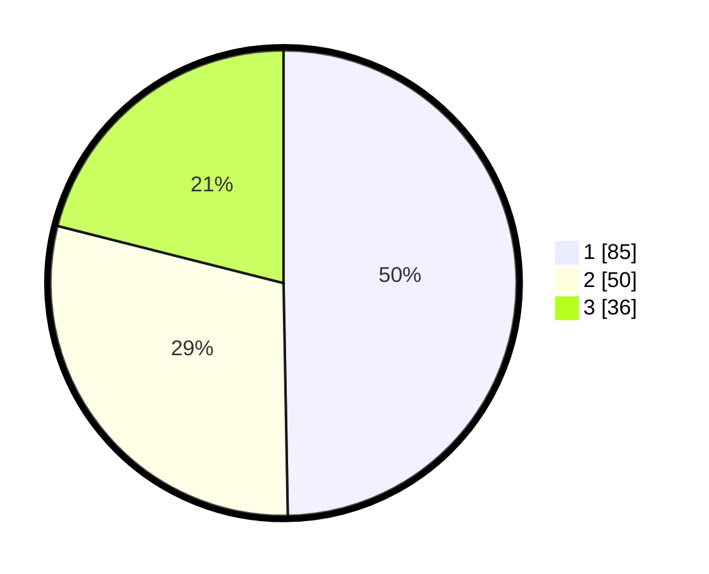

# Hasil

## Grafik

## Tabel

| No. | Nama Paslon    | Suara | Suara (raw) | Persentase |
|:--- |:-------------- | -----:| -----------:| ----------:|
| 1   | ANIES MUHAIMIN | 85    | [85][p-1]   | 49,71      |
| 2   | PRABOWO GIBRAN | 50    | [50][p-2]   | 29,24      |
| 3   | GANJAR MAHFUD  | 36    | [36][p-3]   | 21,05      |

[p-1]: https://github.com/gigit-pemilu/pemilu-2024-11-aceh/blob/main/pilpres/hitung-suara/sub/11-aceh/sub/17-bener-meriah/sub/01-pintu-rime-gayo/sub/2009-ulu-naron/sub/001-tps/sub/paslon-1.txt
[p-2]: https://github.com/gigit-pemilu/pemilu-2024-11-aceh/blob/main/pilpres/hitung-suara/sub/11-aceh/sub/17-bener-meriah/sub/01-pintu-rime-gayo/sub/2009-ulu-naron/sub/001-tps/sub/paslon-2.txt
[p-3]: https://github.com/gigit-pemilu/pemilu-2024-11-aceh/blob/main/pilpres/hitung-suara/sub/11-aceh/sub/17-bener-meriah/sub/01-pintu-rime-gayo/sub/2009-ulu-naron/sub/001-tps/sub/paslon-3.txt

## Foto C Plano

https://sirekap-obj-formc.kpu.go.id/670f/pemilu/ppwp/11/17/01/20/09/1117012009001-20240218-172356--d94bfe9b-a69a-4526-b370-d2808acc5b20.jpg

https://sirekap-obj-formc.kpu.go.id/670f/pemilu/ppwp/11/17/01/20/09/1117012009001-20240218-172433--c0fc9dbf-d1f8-4f1a-9f6b-f774e958478d.jpg

https://sirekap-obj-formc.kpu.go.id/670f/pemilu/ppwp/11/17/01/20/09/1117012009001-20240218-172520--713ca693-d54d-4202-b8d1-e9cd5fb0b377.jpg

## Metadata

| Key        | Value               |
| ---------- | ------------------- |
| Time Stamp | 2024-02-24 22:31:28 |

