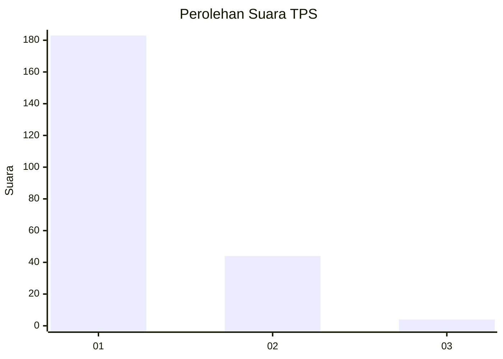
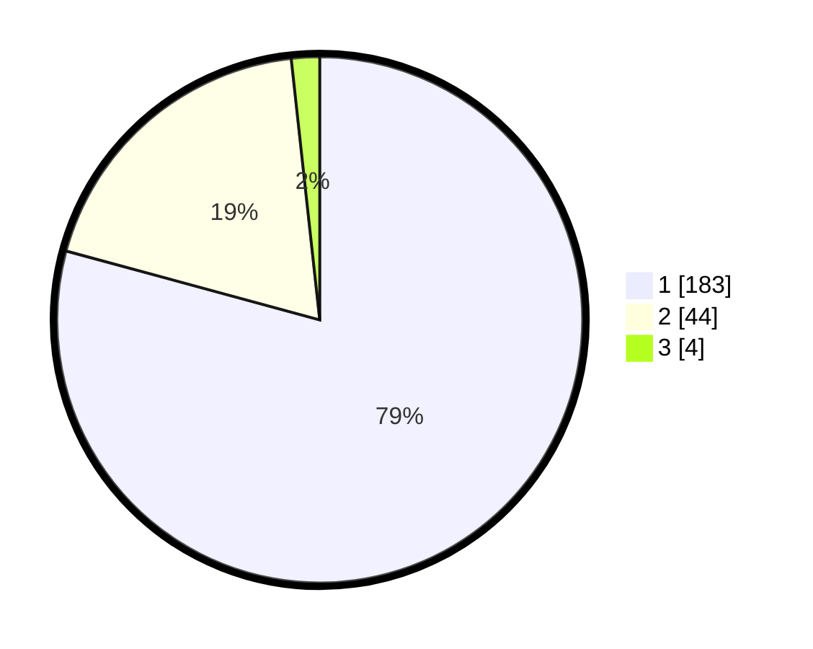

# Hasil

## Grafik

## Tabel

| No. | Nama Paslon    | Suara | Suara (raw) | Persentase |
|:--- |:-------------- | -----:| -----------:| ----------:|
| 1   | ANIES MUHAIMIN | 183   | [183][p-1]  | 79,22      |
| 2   | PRABOWO GIBRAN | 44    | [44][p-2]   | 19,05      |
| 3   | GANJAR MAHFUD  | 4     | [4][p-3]    | 1,73       |

[p-1]: https://github.com/gigit-pemilu/pemilu-2024-11-aceh/blob/main/pilpres/hitung-suara/sub/11-aceh/sub/17-bener-meriah/sub/01-pintu-rime-gayo/sub/2011-pancar-jelobok/sub/002-tps/sub/paslon-1.txt
[p-2]: https://github.com/gigit-pemilu/pemilu-2024-11-aceh/blob/main/pilpres/hitung-suara/sub/11-aceh/sub/17-bener-meriah/sub/01-pintu-rime-gayo/sub/2011-pancar-jelobok/sub/002-tps/sub/paslon-2.txt
[p-3]: https://github.com/gigit-pemilu/pemilu-2024-11-aceh/blob/main/pilpres/hitung-suara/sub/11-aceh/sub/17-bener-meriah/sub/01-pintu-rime-gayo/sub/2011-pancar-jelobok/sub/002-tps/sub/paslon-3.txt

## Foto C Plano

https://sirekap-obj-formc.kpu.go.id/98f0/pemilu/ppwp/11/17/01/20/11/1117012011002-20240214-200836--90f5b230-22fd-4d7b-8cd6-7861f532afc2.jpg

https://sirekap-obj-formc.kpu.go.id/98f0/pemilu/ppwp/11/17/01/20/11/1117012011002-20240214-201052--a2c59f39-4ffd-4d6b-b466-a93f538723c9.jpg

https://sirekap-obj-formc.kpu.go.id/98f0/pemilu/ppwp/11/17/01/20/11/1117012011002-20240214-201734--e86d7275-2f0d-401c-a421-0132d07d2eab.jpg

## Metadata

| Key        | Value               |
| ---------- | ------------------- |
| Time Stamp | 2024-02-24 22:31:28 |

