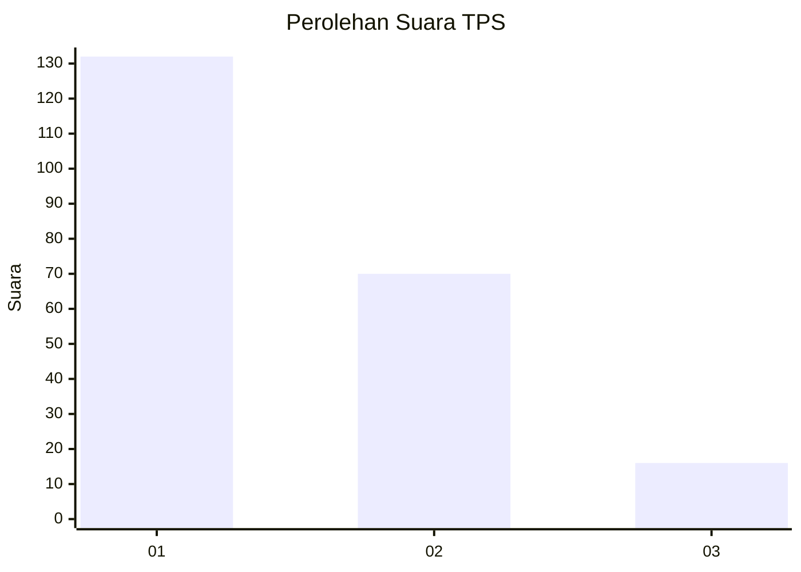
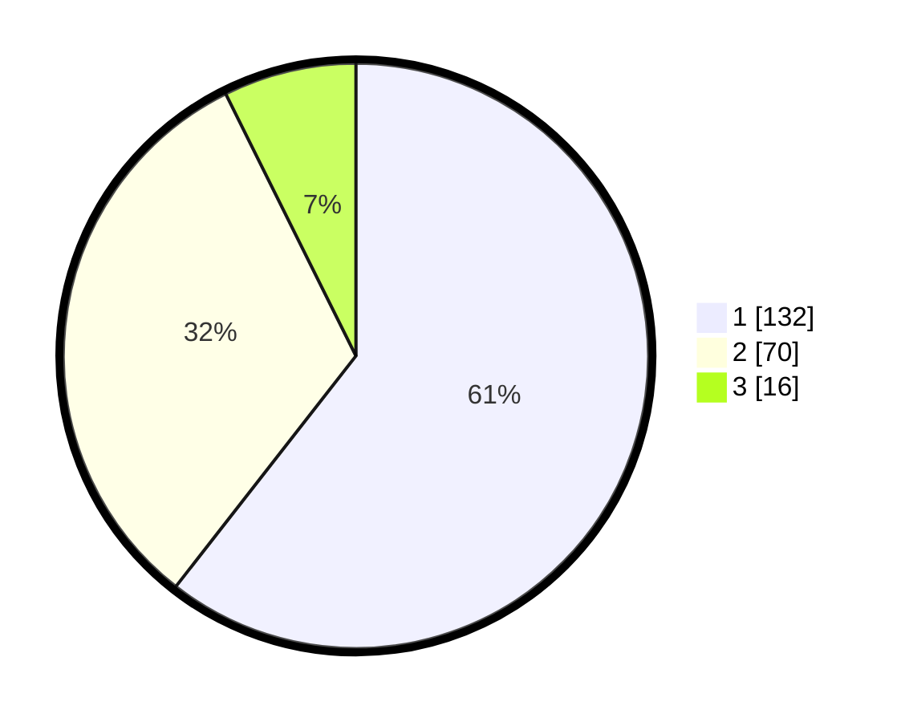

# Hasil

## Grafik

## Tabel

| No. | Nama Paslon    | Suara | Suara (raw) | Persentase |
|:--- |:-------------- | -----:| -----------:| ----------:|
| 1   | ANIES MUHAIMIN | 132   | [132][p-1]  | 60,55      |
| 2   | PRABOWO GIBRAN | 70    | [70][p-2]   | 32,11      |
| 3   | GANJAR MAHFUD  | 16    | [16][p-3]   | 7,34       |

[p-1]: https://github.com/gigit-pemilu/pemilu-2024-11-aceh/blob/main/pilpres/hitung-suara/sub/11-aceh/sub/17-bener-meriah/sub/01-pintu-rime-gayo/sub/2012-alur-gading/sub/002-tps/sub/paslon-1.txt
[p-2]: https://github.com/gigit-pemilu/pemilu-2024-11-aceh/blob/main/pilpres/hitung-suara/sub/11-aceh/sub/17-bener-meriah/sub/01-pintu-rime-gayo/sub/2012-alur-gading/sub/002-tps/sub/paslon-2.txt
[p-3]: https://github.com/gigit-pemilu/pemilu-2024-11-aceh/blob/main/pilpres/hitung-suara/sub/11-aceh/sub/17-bener-meriah/sub/01-pintu-rime-gayo/sub/2012-alur-gading/sub/002-tps/sub/paslon-3.txt

## Foto C Plano

https://sirekap-obj-formc.kpu.go.id/45db/pemilu/ppwp/11/17/01/20/12/1117012012002-20240223-161630--03a050d6-be55-4af1-8300-fae6876ae08d.jpg

https://sirekap-obj-formc.kpu.go.id/45db/pemilu/ppwp/11/17/01/20/12/1117012012002-20240223-102243--cf497f97-d7cd-42c1-a385-1d1db885e601.jpg

https://sirekap-obj-formc.kpu.go.id/45db/pemilu/ppwp/11/17/01/20/12/1117012012002-20240223-102311--e1c32e2a-47ac-4409-9400-0de70909835b.jpg

## Metadata

| Key        | Value               |
| ---------- | ------------------- |
| Time Stamp | 2024-02-24 22:31:28 |

