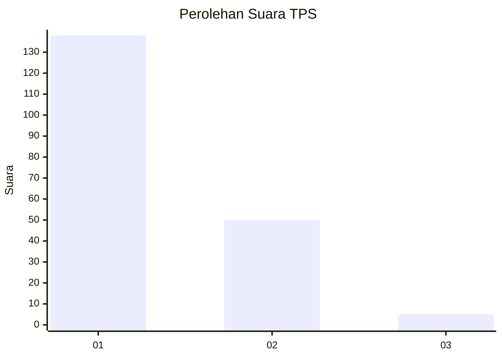
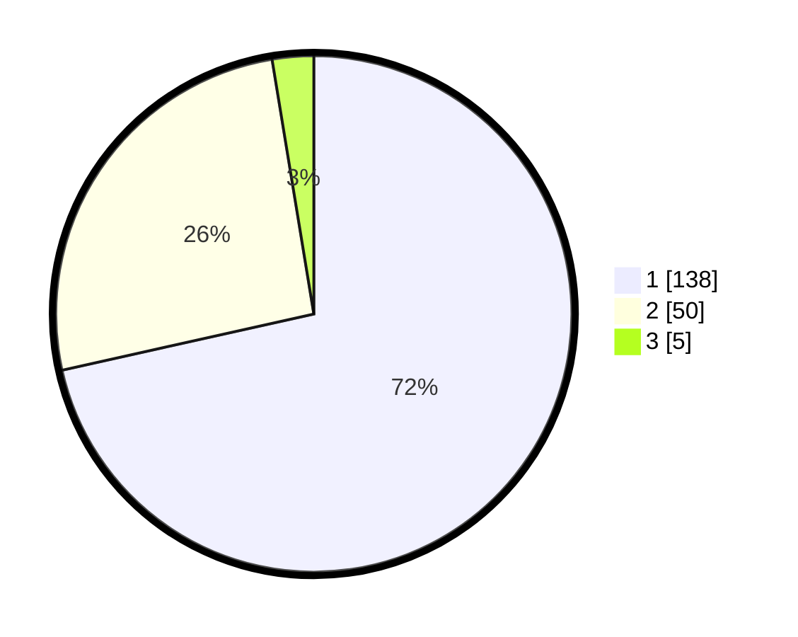

# Hasil

## Grafik

## Tabel

| No. | Nama Paslon    | Suara | Suara (raw) | Persentase |
|:--- |:-------------- | -----:| -----------:| ----------:|
| 1   | ANIES MUHAIMIN | 138   | [138][p-1]  | 71,50      |
| 2   | PRABOWO GIBRAN | 50    | [50][p-2]   | 25,91      |
| 3   | GANJAR MAHFUD  | 5     | [5][p-3]    | 2,59       |

[p-1]: https://github.com/gigit-pemilu/pemilu-2024-11-aceh/blob/main/pilpres/hitung-suara/sub/11-aceh/sub/17-bener-meriah/sub/01-pintu-rime-gayo/sub/2013-rime-raya/sub/001-tps/sub/paslon-1.txt
[p-2]: https://github.com/gigit-pemilu/pemilu-2024-11-aceh/blob/main/pilpres/hitung-suara/sub/11-aceh/sub/17-bener-meriah/sub/01-pintu-rime-gayo/sub/2013-rime-raya/sub/001-tps/sub/paslon-2.txt
[p-3]: https://github.com/gigit-pemilu/pemilu-2024-11-aceh/blob/main/pilpres/hitung-suara/sub/11-aceh/sub/17-bener-meriah/sub/01-pintu-rime-gayo/sub/2013-rime-raya/sub/001-tps/sub/paslon-3.txt

## Foto C Plano

https://sirekap-obj-formc.kpu.go.id/e784/pemilu/ppwp/11/17/01/20/13/1117012013001-20240221-095747--a9409f03-fadc-48b8-94c0-9ea8a91372b1.jpg

https://sirekap-obj-formc.kpu.go.id/e784/pemilu/ppwp/11/17/01/20/13/1117012013001-20240221-095818--cbb6de09-4a6d-4d06-967d-81dcf18a78e2.jpg

https://sirekap-obj-formc.kpu.go.id/e784/pemilu/ppwp/11/17/01/20/13/1117012013001-20240221-095851--150041c6-37eb-4e79-be05-498017c2ac86.jpg

## Metadata

| Key        | Value               |
| ---------- | ------------------- |
| Time Stamp | 2024-02-24 22:31:28 |

