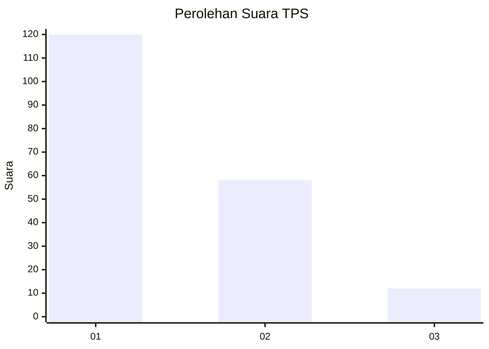
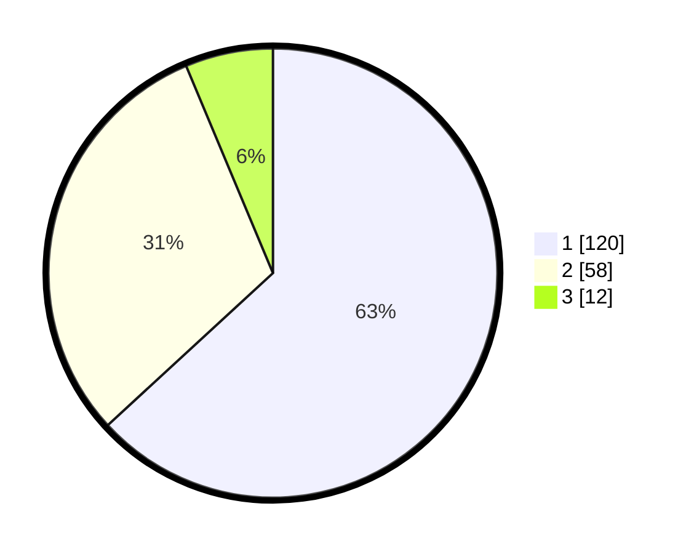

# Hasil

## Grafik

## Tabel

| No. | Nama Paslon    | Suara | Suara (raw) | Persentase |
|:--- |:-------------- | -----:| -----------:| ----------:|
| 1   | ANIES MUHAIMIN | 120   | [120][p-1]  | 63,16      |
| 2   | PRABOWO GIBRAN | 58    | [58][p-2]   | 30,53      |
| 3   | GANJAR MAHFUD  | 12    | [12][p-3]   | 6,32       |

[p-1]: https://github.com/gigit-pemilu/pemilu-2024-11-aceh/blob/main/pilpres/hitung-suara/sub/11-aceh/sub/17-bener-meriah/sub/01-pintu-rime-gayo/sub/2013-rime-raya/sub/002-tps/sub/paslon-1.txt
[p-2]: https://github.com/gigit-pemilu/pemilu-2024-11-aceh/blob/main/pilpres/hitung-suara/sub/11-aceh/sub/17-bener-meriah/sub/01-pintu-rime-gayo/sub/2013-rime-raya/sub/002-tps/sub/paslon-2.txt
[p-3]: https://github.com/gigit-pemilu/pemilu-2024-11-aceh/blob/main/pilpres/hitung-suara/sub/11-aceh/sub/17-bener-meriah/sub/01-pintu-rime-gayo/sub/2013-rime-raya/sub/002-tps/sub/paslon-3.txt

## Foto C Plano

https://sirekap-obj-formc.kpu.go.id/6963/pemilu/ppwp/11/17/01/20/13/1117012013002-20240221-113248--1b549a3d-2505-41b1-9824-1a65e80d2700.jpg

https://sirekap-obj-formc.kpu.go.id/6963/pemilu/ppwp/11/17/01/20/13/1117012013002-20240221-113040--2df20b9e-da28-4e24-9cca-2388247e7b54.jpg

https://sirekap-obj-formc.kpu.go.id/6963/pemilu/ppwp/11/17/01/20/13/1117012013002-20240221-113111--f14b7417-f1b4-4082-8d59-085ab15cfe97.jpg

## Metadata

| Key        | Value               |
| ---------- | ------------------- |
| Time Stamp | 2024-02-25 12:00:00 |

