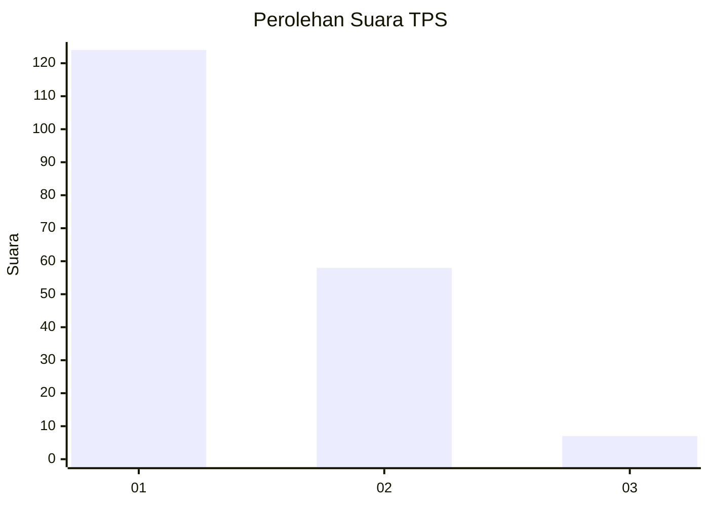
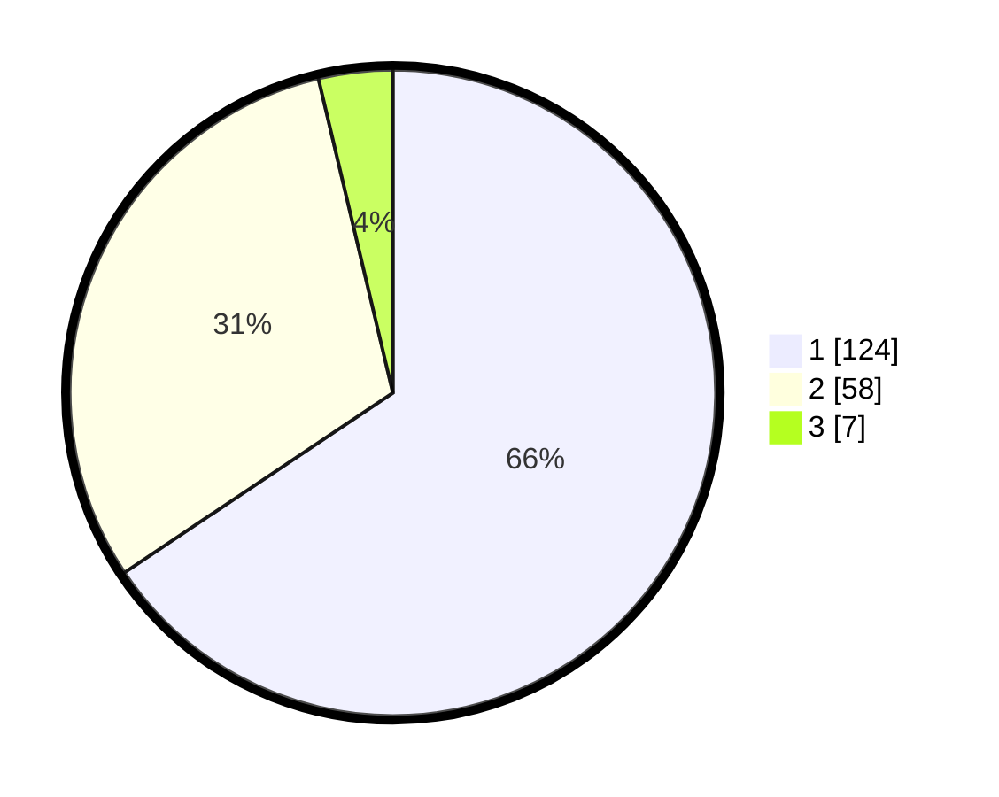

# Hasil

## Grafik

## Tabel

| No. | Nama Paslon    | Suara | Suara (raw) | Persentase |
|:--- |:-------------- | -----:| -----------:| ----------:|
| 1   | ANIES MUHAIMIN | 124   | [124][p-1]  | 65,61      |
| 2   | PRABOWO GIBRAN | 58    | [58][p-2]   | 30,69      |
| 3   | GANJAR MAHFUD  | 7     | [7][p-3]    | 3,70       |

[p-1]: https://github.com/gigit-pemilu/pemilu-2024-11-aceh/blob/main/pilpres/hitung-suara/sub/11-aceh/sub/17-bener-meriah/sub/01-pintu-rime-gayo/sub/2013-rime-raya/sub/003-tps/sub/paslon-1.txt
[p-2]: https://github.com/gigit-pemilu/pemilu-2024-11-aceh/blob/main/pilpres/hitung-suara/sub/11-aceh/sub/17-bener-meriah/sub/01-pintu-rime-gayo/sub/2013-rime-raya/sub/003-tps/sub/paslon-2.txt
[p-3]: https://github.com/gigit-pemilu/pemilu-2024-11-aceh/blob/main/pilpres/hitung-suara/sub/11-aceh/sub/17-bener-meriah/sub/01-pintu-rime-gayo/sub/2013-rime-raya/sub/003-tps/sub/paslon-3.txt

## Foto C Plano

https://sirekap-obj-formc.kpu.go.id/585d/pemilu/ppwp/11/17/01/20/13/1117012013003-20240221-161356--a6eca769-18cd-4162-80b0-359d1a095578.jpg

https://sirekap-obj-formc.kpu.go.id/585d/pemilu/ppwp/11/17/01/20/13/1117012013003-20240221-161443--78f92fe6-eaae-4893-970a-98a76c888491.jpg

https://sirekap-obj-formc.kpu.go.id/585d/pemilu/ppwp/11/17/01/20/13/1117012013003-20240221-161517--a03abd19-85e1-4833-b5b6-44847d0f794d.jpg

## Metadata

| Key        | Value               |
| ---------- | ------------------- |
| Time Stamp | 2024-02-24 22:31:28 |

