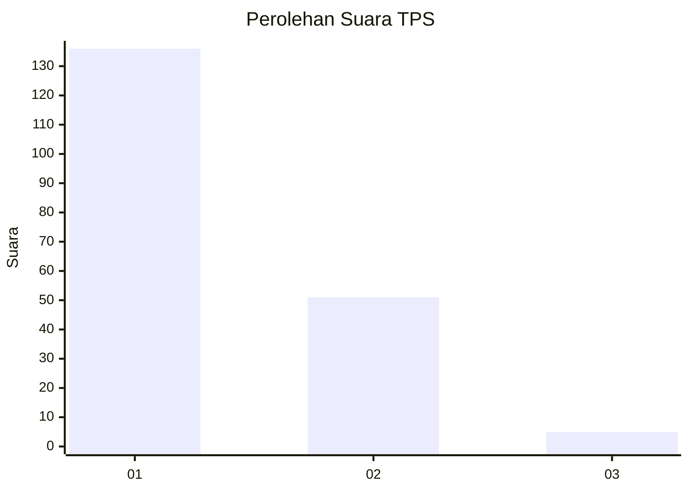
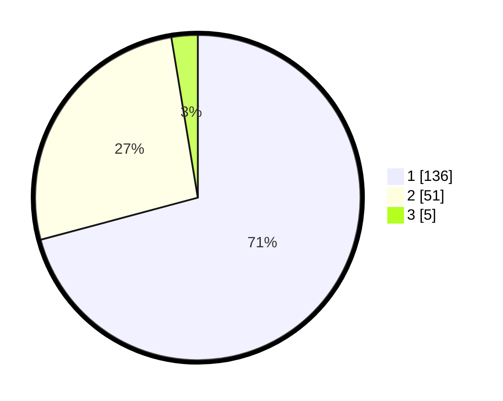

# Hasil

## Grafik

## Tabel

| No. | Nama Paslon    | Suara | Suara (raw) | Persentase |
|:--- |:-------------- | -----:| -----------:| ----------:|
| 1   | ANIES MUHAIMIN | 136   | [136][p-1]  | 70,83      |
| 2   | PRABOWO GIBRAN | 51    | [51][p-2]   | 26,56      |
| 3   | GANJAR MAHFUD  | 5     | [5][p-3]    | 2,60       |

[p-1]: https://github.com/gigit-pemilu/pemilu-2024-11-aceh/blob/main/pilpres/hitung-suara/sub/11-aceh/sub/17-bener-meriah/sub/01-pintu-rime-gayo/sub/2013-rime-raya/sub/004-tps/sub/paslon-1.txt
[p-2]: https://github.com/gigit-pemilu/pemilu-2024-11-aceh/blob/main/pilpres/hitung-suara/sub/11-aceh/sub/17-bener-meriah/sub/01-pintu-rime-gayo/sub/2013-rime-raya/sub/004-tps/sub/paslon-2.txt
[p-3]: https://github.com/gigit-pemilu/pemilu-2024-11-aceh/blob/main/pilpres/hitung-suara/sub/11-aceh/sub/17-bener-meriah/sub/01-pintu-rime-gayo/sub/2013-rime-raya/sub/004-tps/sub/paslon-3.txt

## Foto C Plano

https://sirekap-obj-formc.kpu.go.id/1f87/pemilu/ppwp/11/17/01/20/13/1117012013004-20240221-172425--b9c84fdf-a0e9-4662-9ea1-9df4fad22a9c.jpg

https://sirekap-obj-formc.kpu.go.id/1f87/pemilu/ppwp/11/17/01/20/13/1117012013004-20240221-172505--7d2fa4c9-72ee-4f4c-b412-6ea7f1bb66da.jpg

https://sirekap-obj-formc.kpu.go.id/1f87/pemilu/ppwp/11/17/01/20/13/1117012013004-20240221-172541--ab693490-0b69-4d8d-b3ad-a4feeb44fd3b.jpg

## Metadata

| Key        | Value               |
| ---------- | ------------------- |
| Time Stamp | 2024-02-24 22:31:28 |

