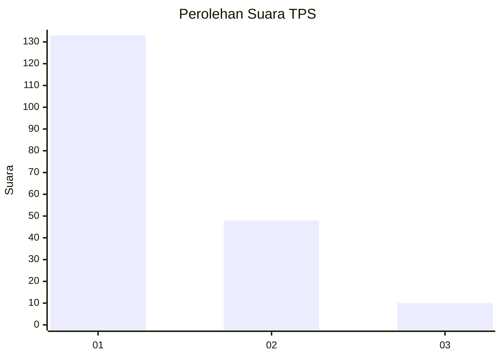
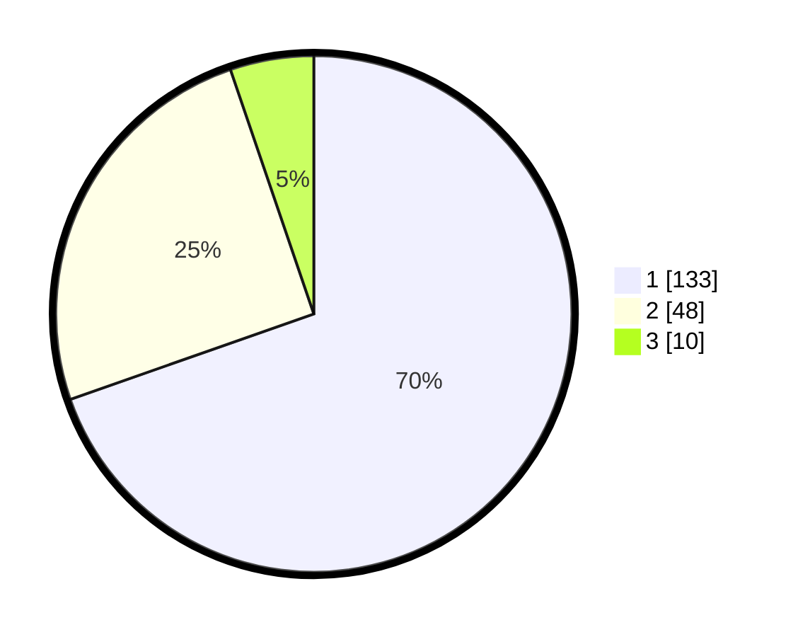

# Hasil

## Grafik

## Tabel

| No. | Nama Paslon    | Suara | Suara (raw) | Persentase |
|:--- |:-------------- | -----:| -----------:| ----------:|
| 1   | ANIES MUHAIMIN | 133   | [133][p-1]  | 69,63      |
| 2   | PRABOWO GIBRAN | 48    | [48][p-2]   | 25,13      |
| 3   | GANJAR MAHFUD  | 10    | [10][p-3]   | 5,24       |

[p-1]: https://github.com/gigit-pemilu/pemilu-2024-11-aceh/blob/main/pilpres/hitung-suara/sub/11-aceh/sub/17-bener-meriah/sub/01-pintu-rime-gayo/sub/2013-rime-raya/sub/005-tps/sub/paslon-1.txt
[p-2]: https://github.com/gigit-pemilu/pemilu-2024-11-aceh/blob/main/pilpres/hitung-suara/sub/11-aceh/sub/17-bener-meriah/sub/01-pintu-rime-gayo/sub/2013-rime-raya/sub/005-tps/sub/paslon-2.txt
[p-3]: https://github.com/gigit-pemilu/pemilu-2024-11-aceh/blob/main/pilpres/hitung-suara/sub/11-aceh/sub/17-bener-meriah/sub/01-pintu-rime-gayo/sub/2013-rime-raya/sub/005-tps/sub/paslon-3.txt

## Foto C Plano

https://sirekap-obj-formc.kpu.go.id/6cbd/pemilu/ppwp/11/17/01/20/13/1117012013005-20240221-201900--079e146f-2912-4d08-9484-80a1b2eb7a59.jpg

https://sirekap-obj-formc.kpu.go.id/6cbd/pemilu/ppwp/11/17/01/20/13/1117012013005-20240221-201957--06ae887a-b81f-4471-851f-cfde5e955af1.jpg

https://sirekap-obj-formc.kpu.go.id/6cbd/pemilu/ppwp/11/17/01/20/13/1117012013005-20240221-202116--c6577645-da1e-499a-9afc-787931d57031.jpg

## Metadata

| Key        | Value               |
| ---------- | ------------------- |
| Time Stamp | 2024-02-24 22:31:28 |

