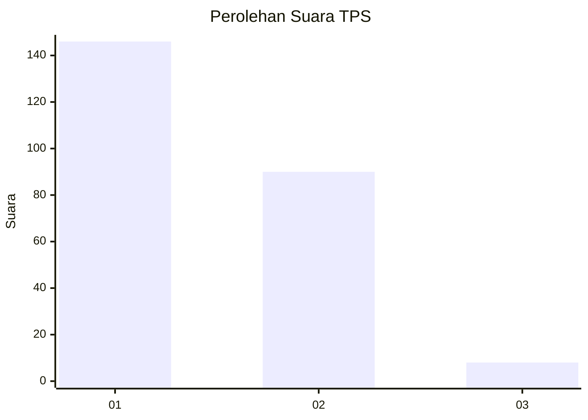
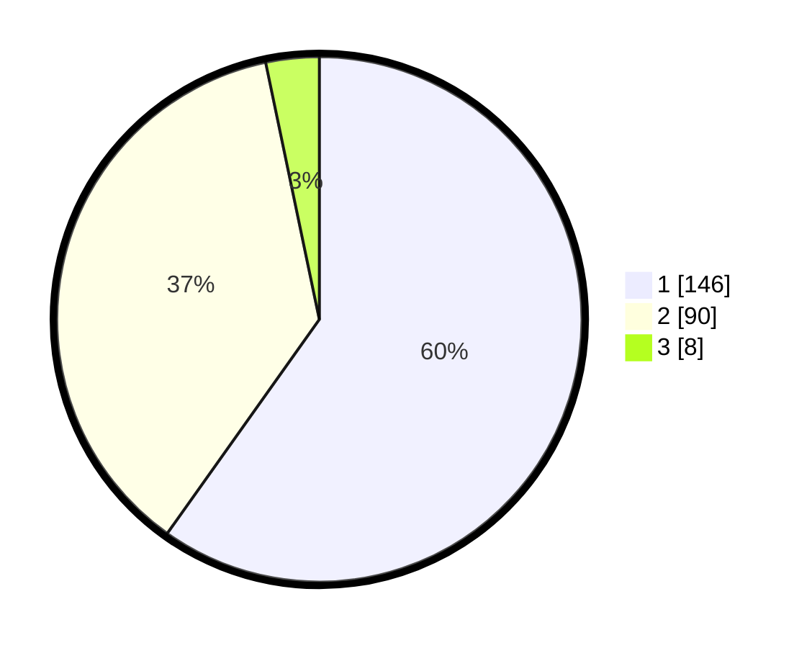

# Hasil

## Grafik

## Tabel

| No. | Nama Paslon    | Suara | Suara (raw) | Persentase |
|:--- |:-------------- | -----:| -----------:| ----------:|
| 1   | ANIES MUHAIMIN | 146   | [146][p-1]  | 59,84      |
| 2   | PRABOWO GIBRAN | 90    | [90][p-2]   | 36,89      |
| 3   | GANJAR MAHFUD  | 8     | [8][p-3]    | 3,28       |

[p-1]: https://github.com/gigit-pemilu/pemilu-2024-11-aceh/blob/main/pilpres/hitung-suara/sub/11-aceh/sub/17-bener-meriah/sub/01-pintu-rime-gayo/sub/2014-singah-mulo/sub/001-tps/sub/paslon-1.txt
[p-2]: https://github.com/gigit-pemilu/pemilu-2024-11-aceh/blob/main/pilpres/hitung-suara/sub/11-aceh/sub/17-bener-meriah/sub/01-pintu-rime-gayo/sub/2014-singah-mulo/sub/001-tps/sub/paslon-2.txt
[p-3]: https://github.com/gigit-pemilu/pemilu-2024-11-aceh/blob/main/pilpres/hitung-suara/sub/11-aceh/sub/17-bener-meriah/sub/01-pintu-rime-gayo/sub/2014-singah-mulo/sub/001-tps/sub/paslon-3.txt

## Foto C Plano

https://sirekap-obj-formc.kpu.go.id/9500/pemilu/ppwp/11/17/01/20/14/1117012014001-20240214-195225--0ec104e5-91ef-42a9-bab3-f945acce59fd.jpg

https://sirekap-obj-formc.kpu.go.id/9500/pemilu/ppwp/11/17/01/20/14/1117012014001-20240214-195251--51da1425-c6f4-47d3-bee2-de1381b0ea60.jpg

https://sirekap-obj-formc.kpu.go.id/9500/pemilu/ppwp/11/17/01/20/14/1117012014001-20240214-195316--b437b33f-6b13-4281-a823-35b3984f73a2.jpg

## Metadata

| Key        | Value               |
| ---------- | ------------------- |
| Time Stamp | 2024-02-19 06:16:00 |

