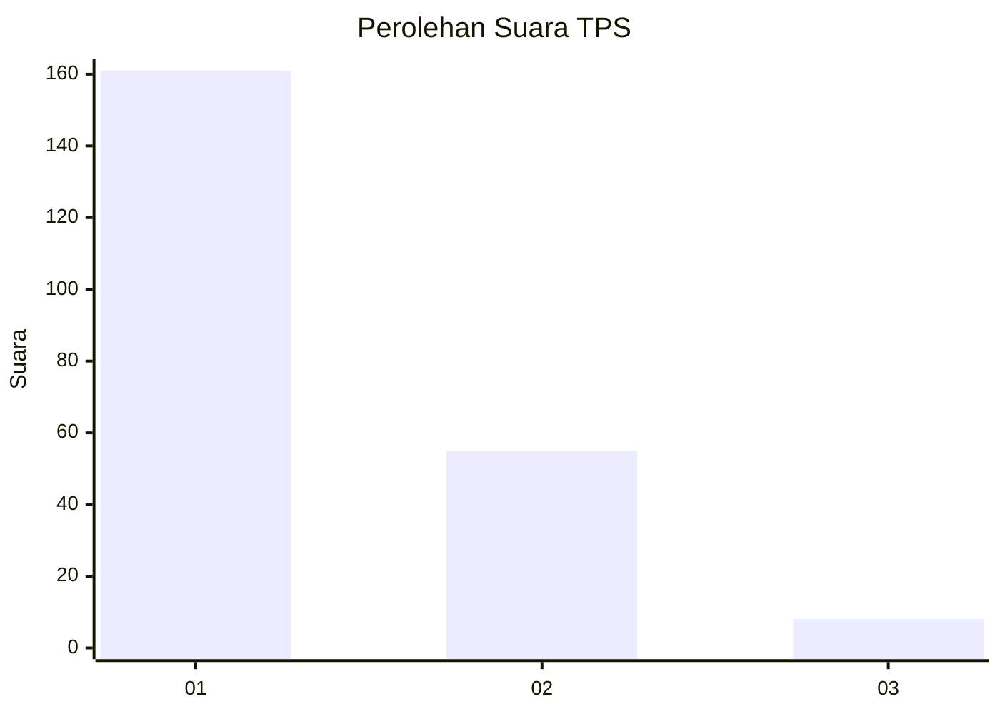
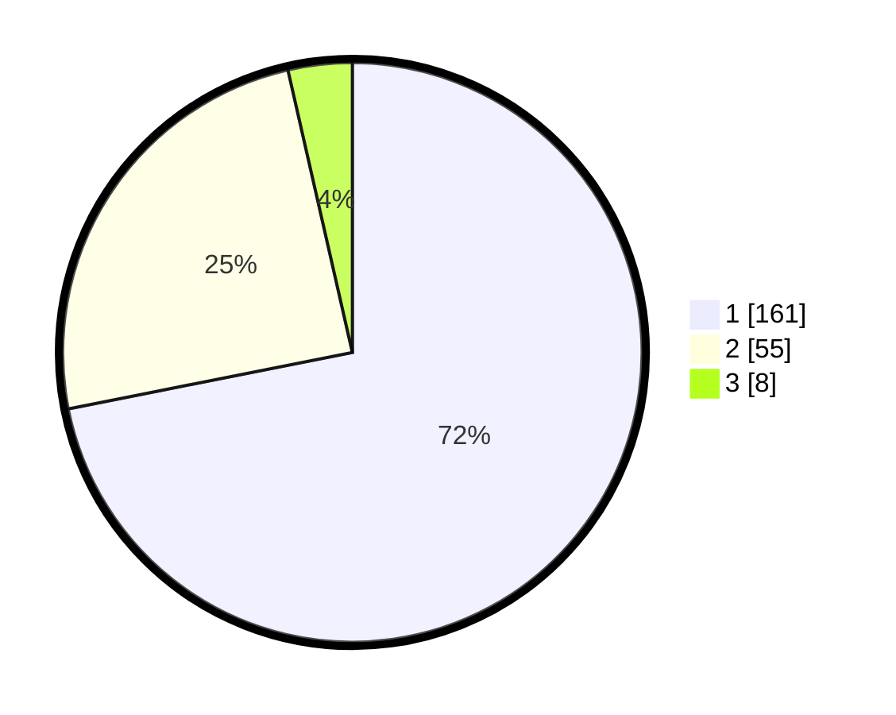

# Hasil

## Grafik

## Tabel

| No. | Nama Paslon    | Suara | Suara (raw) | Persentase |
|:--- |:-------------- | -----:| -----------:| ----------:|
| 1   | ANIES MUHAIMIN | 161   | [161][p-1]  | 71,88      |
| 2   | PRABOWO GIBRAN | 55    | [55][p-2]   | 24,55      |
| 3   | GANJAR MAHFUD  | 8     | [8][p-3]    | 3,57       |

[p-1]: https://github.com/gigit-pemilu/pemilu-2024-11-aceh/blob/main/pilpres/hitung-suara/sub/11-aceh/sub/17-bener-meriah/sub/01-pintu-rime-gayo/sub/2014-singah-mulo/sub/002-tps/sub/paslon-1.txt
[p-2]: https://github.com/gigit-pemilu/pemilu-2024-11-aceh/blob/main/pilpres/hitung-suara/sub/11-aceh/sub/17-bener-meriah/sub/01-pintu-rime-gayo/sub/2014-singah-mulo/sub/002-tps/sub/paslon-2.txt
[p-3]: https://github.com/gigit-pemilu/pemilu-2024-11-aceh/blob/main/pilpres/hitung-suara/sub/11-aceh/sub/17-bener-meriah/sub/01-pintu-rime-gayo/sub/2014-singah-mulo/sub/002-tps/sub/paslon-3.txt

## Foto C Plano

https://sirekap-obj-formc.kpu.go.id/a27e/pemilu/ppwp/11/17/01/20/14/1117012014002-20240222-150325--cc80af14-0345-4277-952f-8226cb2fcb41.jpg

https://sirekap-obj-formc.kpu.go.id/a27e/pemilu/ppwp/11/17/01/20/14/1117012014002-20240214-201513--feee080b-d322-4068-bcf8-61b09ebe3bf7.jpg

https://sirekap-obj-formc.kpu.go.id/a27e/pemilu/ppwp/11/17/01/20/14/1117012014002-20240214-201700--920c17bd-76b0-45a8-87e7-6ebf88eddbf6.jpg

## Metadata

| Key        | Value               |
| ---------- | ------------------- |
| Time Stamp | 2024-02-22 16:00:00 |

