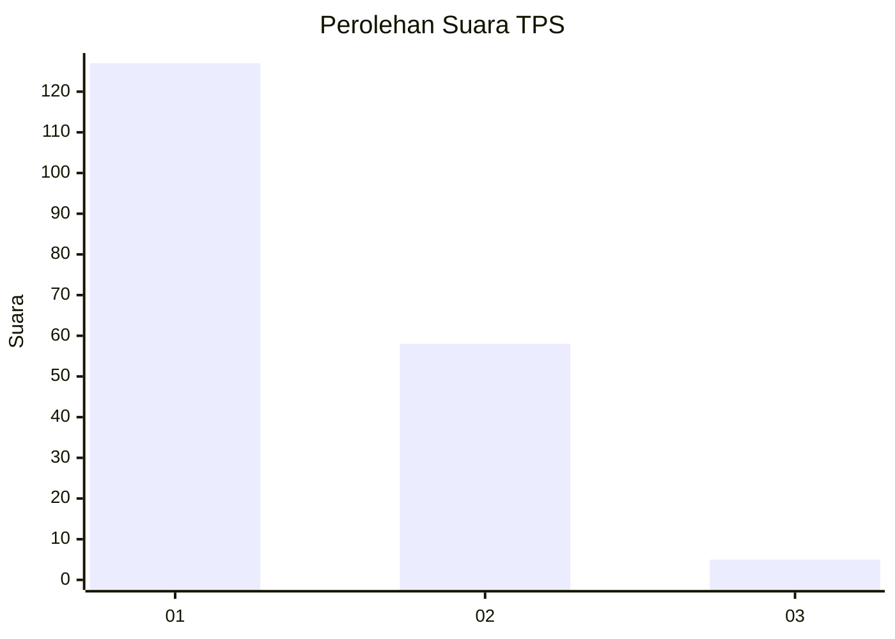
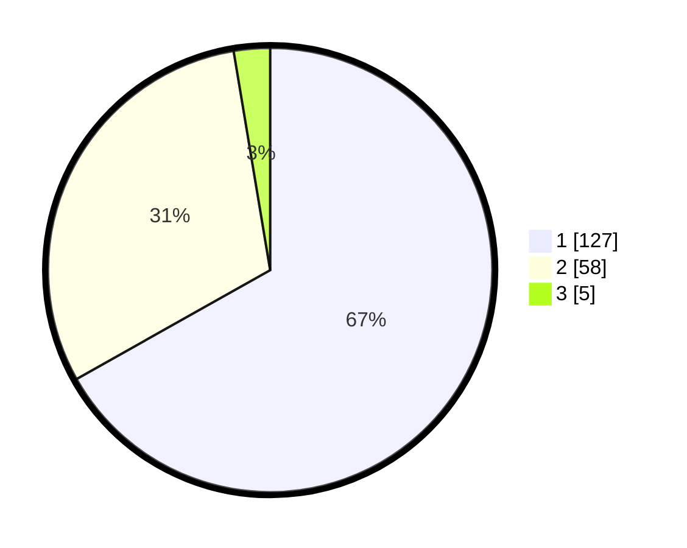

# Hasil

## Grafik

## Tabel

| No. | Nama Paslon    | Suara | Suara (raw) | Persentase |
|:--- |:-------------- | -----:| -----------:| ----------:|
| 1   | ANIES MUHAIMIN | 127   | [127][p-1]  | 66,84      |
| 2   | PRABOWO GIBRAN | 58    | [58][p-2]   | 30,53      |
| 3   | GANJAR MAHFUD  | 5     | [5][p-3]    | 2,63       |

[p-1]: https://github.com/gigit-pemilu/pemilu-2024-11-aceh/blob/main/pilpres/hitung-suara/sub/11-aceh/sub/17-bener-meriah/sub/01-pintu-rime-gayo/sub/2015-simpang-lancang/sub/001-tps/sub/paslon-1.txt
[p-2]: https://github.com/gigit-pemilu/pemilu-2024-11-aceh/blob/main/pilpres/hitung-suara/sub/11-aceh/sub/17-bener-meriah/sub/01-pintu-rime-gayo/sub/2015-simpang-lancang/sub/001-tps/sub/paslon-2.txt
[p-3]: https://github.com/gigit-pemilu/pemilu-2024-11-aceh/blob/main/pilpres/hitung-suara/sub/11-aceh/sub/17-bener-meriah/sub/01-pintu-rime-gayo/sub/2015-simpang-lancang/sub/001-tps/sub/paslon-3.txt

## Foto C Plano

https://sirekap-obj-formc.kpu.go.id/7578/pemilu/ppwp/11/17/01/20/15/1117012015001-20240219-093342--b01dff43-2d21-409b-91e6-d226b25922d1.jpg

https://sirekap-obj-formc.kpu.go.id/7578/pemilu/ppwp/11/17/01/20/15/1117012015001-20240219-093413--45505d77-6b7b-4e30-8d07-8a8bf4e41fc1.jpg

https://sirekap-obj-formc.kpu.go.id/7578/pemilu/ppwp/11/17/01/20/15/1117012015001-20240219-093445--3ce8c085-d60c-4190-a33f-105cefcea60d.jpg

## Metadata

| Key        | Value               |
| ---------- | ------------------- |
| Time Stamp | 2024-02-24 22:31:28 |

