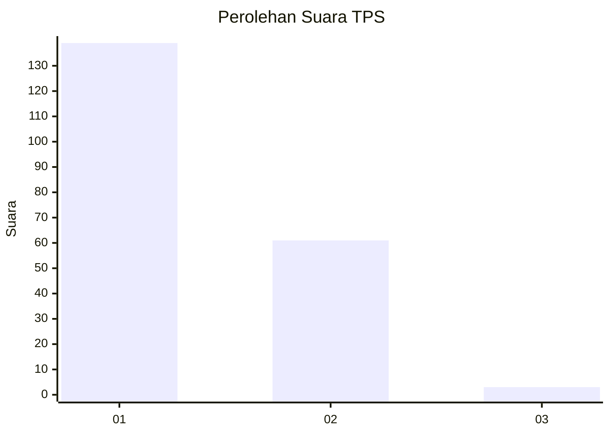
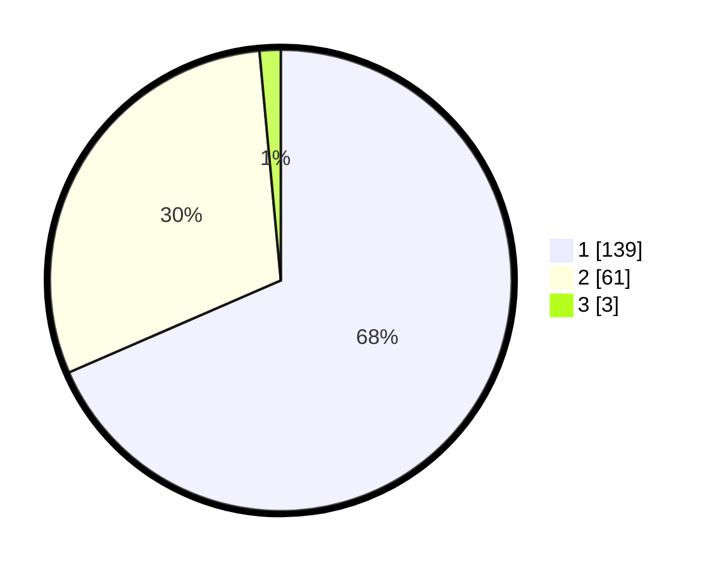

# Hasil

## Grafik

## Tabel

| No. | Nama Paslon    | Suara | Suara (raw) | Persentase |
|:--- |:-------------- | -----:| -----------:| ----------:|
| 1   | ANIES MUHAIMIN | 139   | [139][p-1]  | 68,47      |
| 2   | PRABOWO GIBRAN | 61    | [61][p-2]   | 30,05      |
| 3   | GANJAR MAHFUD  | 3     | [3][p-3]    | 1,48       |

[p-1]: https://github.com/gigit-pemilu/pemilu-2024-11-aceh/blob/main/pilpres/hitung-suara/sub/11-aceh/sub/17-bener-meriah/sub/01-pintu-rime-gayo/sub/2015-simpang-lancang/sub/002-tps/sub/paslon-1.txt
[p-2]: https://github.com/gigit-pemilu/pemilu-2024-11-aceh/blob/main/pilpres/hitung-suara/sub/11-aceh/sub/17-bener-meriah/sub/01-pintu-rime-gayo/sub/2015-simpang-lancang/sub/002-tps/sub/paslon-2.txt
[p-3]: https://github.com/gigit-pemilu/pemilu-2024-11-aceh/blob/main/pilpres/hitung-suara/sub/11-aceh/sub/17-bener-meriah/sub/01-pintu-rime-gayo/sub/2015-simpang-lancang/sub/002-tps/sub/paslon-3.txt

## Foto C Plano

https://sirekap-obj-formc.kpu.go.id/dfe2/pemilu/ppwp/11/17/01/20/15/1117012015002-20240215-103341--77de200a-be98-40f4-98b6-e420d4a0073b.jpg

https://sirekap-obj-formc.kpu.go.id/dfe2/pemilu/ppwp/11/17/01/20/15/1117012015002-20240215-103402--a5de9f10-0c5f-4012-8ebe-dad426982592.jpg

https://sirekap-obj-formc.kpu.go.id/dfe2/pemilu/ppwp/11/17/01/20/15/1117012015002-20240215-103420--5175bc6e-d3fc-4183-9ea9-f2aa14b8891f.jpg

## Metadata

| Key        | Value               |
| ---------- | ------------------- |
| Time Stamp | 2024-02-24 22:31:28 |

