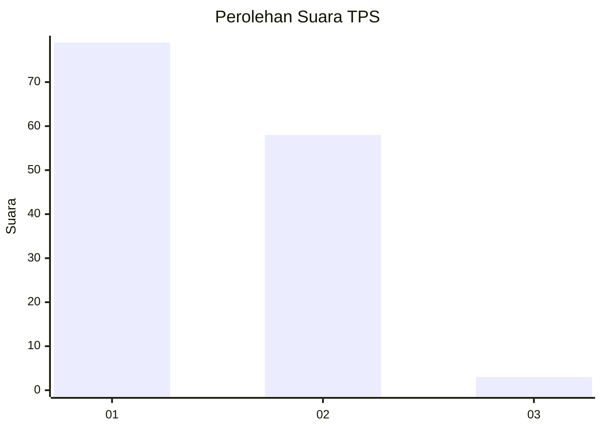
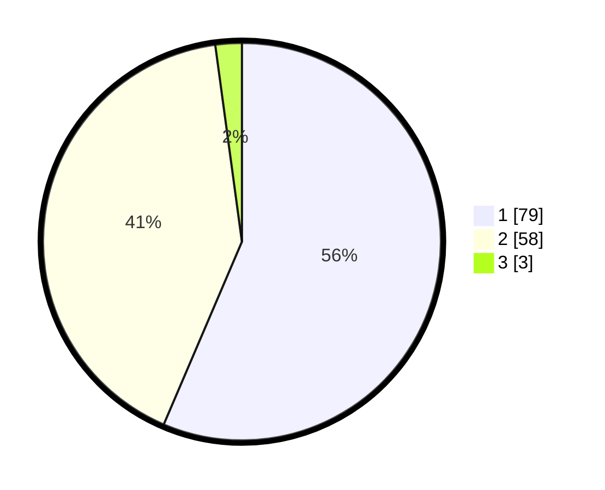

# Hasil

## Grafik

## Tabel

| No. | Nama Paslon    | Suara | Suara (raw) | Persentase |
|:--- |:-------------- | -----:| -----------:| ----------:|
| 1   | ANIES MUHAIMIN | 79    | [79][p-1]   | 56,43      |
| 2   | PRABOWO GIBRAN | 58    | [58][p-2]   | 41,43      |
| 3   | GANJAR MAHFUD  | 3     | [3][p-3]    | 2,14       |

[p-1]: https://github.com/gigit-pemilu/pemilu-2024-11-aceh/blob/main/pilpres/hitung-suara/sub/11-aceh/sub/17-bener-meriah/sub/01-pintu-rime-gayo/sub/2019-musara-pakat/sub/001-tps/sub/paslon-1.txt
[p-2]: https://github.com/gigit-pemilu/pemilu-2024-11-aceh/blob/main/pilpres/hitung-suara/sub/11-aceh/sub/17-bener-meriah/sub/01-pintu-rime-gayo/sub/2019-musara-pakat/sub/001-tps/sub/paslon-2.txt
[p-3]: https://github.com/gigit-pemilu/pemilu-2024-11-aceh/blob/main/pilpres/hitung-suara/sub/11-aceh/sub/17-bener-meriah/sub/01-pintu-rime-gayo/sub/2019-musara-pakat/sub/001-tps/sub/paslon-3.txt

## Foto C Plano

https://sirekap-obj-formc.kpu.go.id/5c12/pemilu/ppwp/11/17/01/20/19/1117012019001-20240218-140628--54b2de8f-5374-449f-b979-d201cca73385.jpg

https://sirekap-obj-formc.kpu.go.id/5c12/pemilu/ppwp/11/17/01/20/19/1117012019001-20240218-140500--450d567a-7b6f-414e-bf6a-383f28bb2636.jpg

https://sirekap-obj-formc.kpu.go.id/5c12/pemilu/ppwp/11/17/01/20/19/1117012019001-20240218-140418--b56d1fd5-45c1-46dc-872b-f69ca4349fd4.jpg

## Metadata

| Key        | Value               |
| ---------- | ------------------- |
| Time Stamp | 2024-02-24 22:31:28 |

