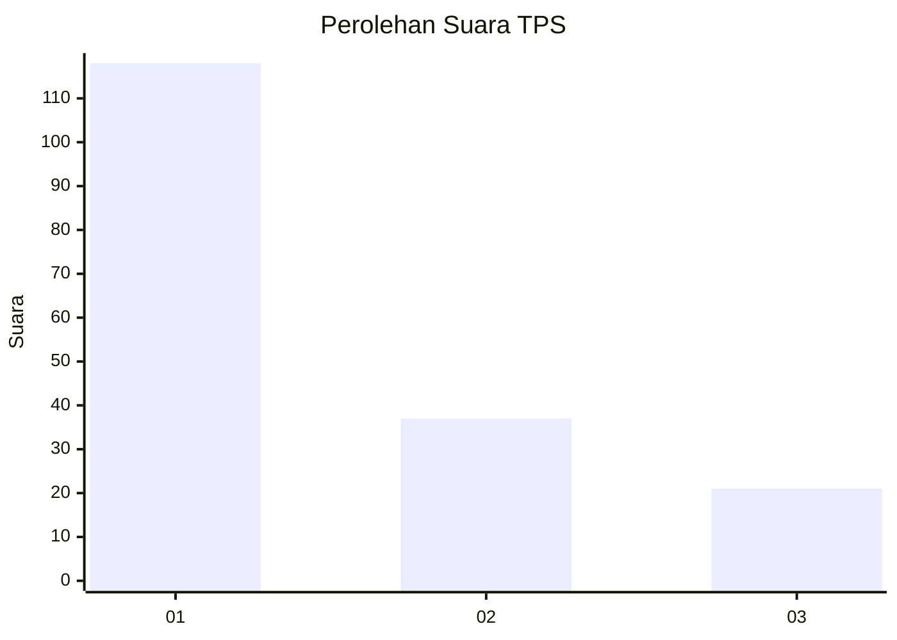
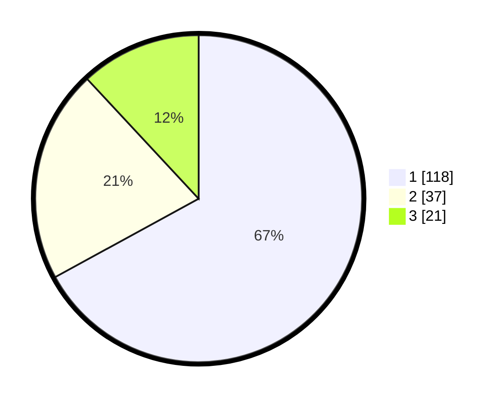

# Hasil

## Grafik

## Tabel

| No. | Nama Paslon    | Suara | Suara (raw) | Persentase |
|:--- |:-------------- | -----:| -----------:| ----------:|
| 1   | ANIES MUHAIMIN | 118   | [118][p-1]  | 67,05      |
| 2   | PRABOWO GIBRAN | 37    | [37][p-2]   | 21,02      |
| 3   | GANJAR MAHFUD  | 21    | [21][p-3]   | 11,93      |

[p-1]: https://github.com/gigit-pemilu/pemilu-2024-11-aceh/blob/main/pilpres/hitung-suara/sub/11-aceh/sub/17-bener-meriah/sub/02-permata/sub/2007-pantan-tengah-jaya/sub/002-tps/sub/paslon-1.txt
[p-2]: https://github.com/gigit-pemilu/pemilu-2024-11-aceh/blob/main/pilpres/hitung-suara/sub/11-aceh/sub/17-bener-meriah/sub/02-permata/sub/2007-pantan-tengah-jaya/sub/002-tps/sub/paslon-2.txt
[p-3]: https://github.com/gigit-pemilu/pemilu-2024-11-aceh/blob/main/pilpres/hitung-suara/sub/11-aceh/sub/17-bener-meriah/sub/02-permata/sub/2007-pantan-tengah-jaya/sub/002-tps/sub/paslon-3.txt

## Foto C Plano

https://sirekap-obj-formc.kpu.go.id/171e/pemilu/ppwp/11/17/02/20/07/1117022007002-20240215-094611--5ddb8ba0-b9be-49f1-a437-0e9225cde743.jpg

https://sirekap-obj-formc.kpu.go.id/171e/pemilu/ppwp/11/17/02/20/07/1117022007002-20240215-005822--2f222647-8a1e-4dcc-b20f-f081b290b85d.jpg

https://sirekap-obj-formc.kpu.go.id/171e/pemilu/ppwp/11/17/02/20/07/1117022007002-20240215-010113--90ed0926-884e-4861-bc2e-646853e51dd1.jpg

## Metadata

| Key        | Value               |
| ---------- | ------------------- |
| Time Stamp | 2024-02-24 22:31:28 |

