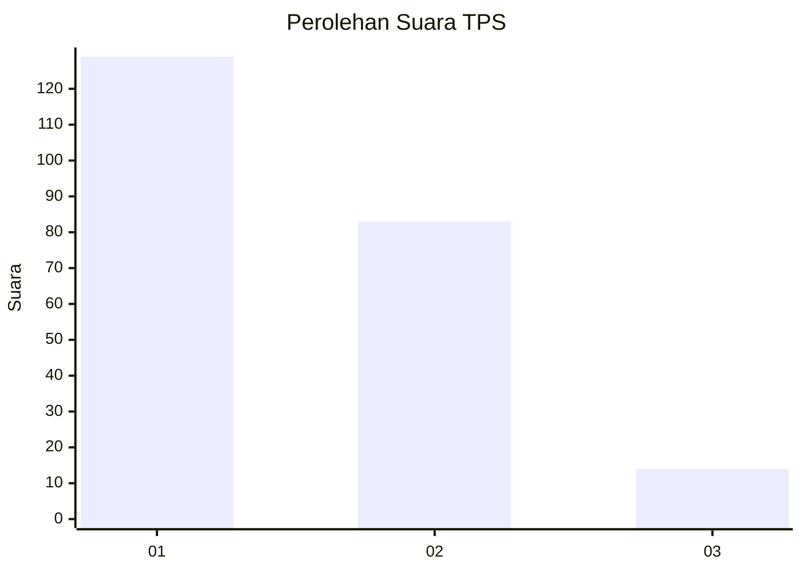
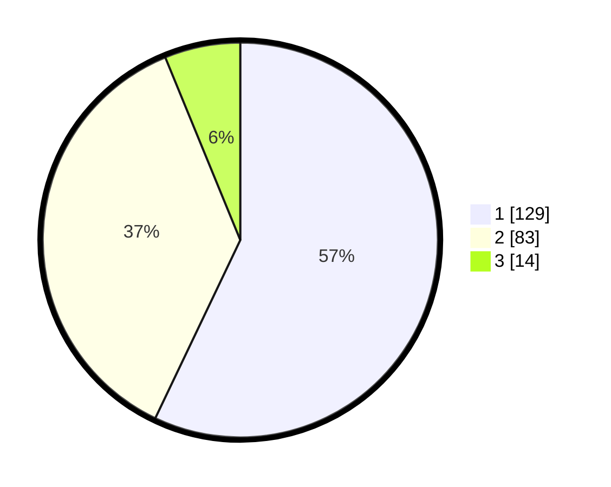

# Hasil

## Grafik

## Tabel

| No. | Nama Paslon    | Suara | Suara (raw) | Persentase |
|:--- |:-------------- | -----:| -----------:| ----------:|
| 1   | ANIES MUHAIMIN | 129   | [129][p-1]  | 57,08      |
| 2   | PRABOWO GIBRAN | 83    | [83][p-2]   | 36,73      |
| 3   | GANJAR MAHFUD  | 14    | [14][p-3]   | 6,19       |

[p-1]: https://github.com/gigit-pemilu/pemilu-2024-11-aceh/blob/main/pilpres/hitung-suara/sub/11-aceh/sub/17-bener-meriah/sub/02-permata/sub/2013-wih-tenang-uken/sub/003-tps/sub/paslon-1.txt
[p-2]: https://github.com/gigit-pemilu/pemilu-2024-11-aceh/blob/main/pilpres/hitung-suara/sub/11-aceh/sub/17-bener-meriah/sub/02-permata/sub/2013-wih-tenang-uken/sub/003-tps/sub/paslon-2.txt
[p-3]: https://github.com/gigit-pemilu/pemilu-2024-11-aceh/blob/main/pilpres/hitung-suara/sub/11-aceh/sub/17-bener-meriah/sub/02-permata/sub/2013-wih-tenang-uken/sub/003-tps/sub/paslon-3.txt

## Foto C Plano

https://sirekap-obj-formc.kpu.go.id/c6e4/pemilu/ppwp/11/17/02/20/13/1117022013003-20240215-102002--332f6ec6-cca6-4a9b-82e4-ac32292c3fd9.jpg

https://sirekap-obj-formc.kpu.go.id/c6e4/pemilu/ppwp/11/17/02/20/13/1117022013003-20240214-223505--69506449-e009-4a0e-b140-3d8621fb5b34.jpg

https://sirekap-obj-formc.kpu.go.id/c6e4/pemilu/ppwp/11/17/02/20/13/1117022013003-20240215-101613--9a899c69-fb59-4e58-9752-6d6d147cb28d.jpg

## Metadata

| Key        | Value               |
| ---------- | ------------------- |
| Time Stamp | 2024-02-24 22:31:28 |

