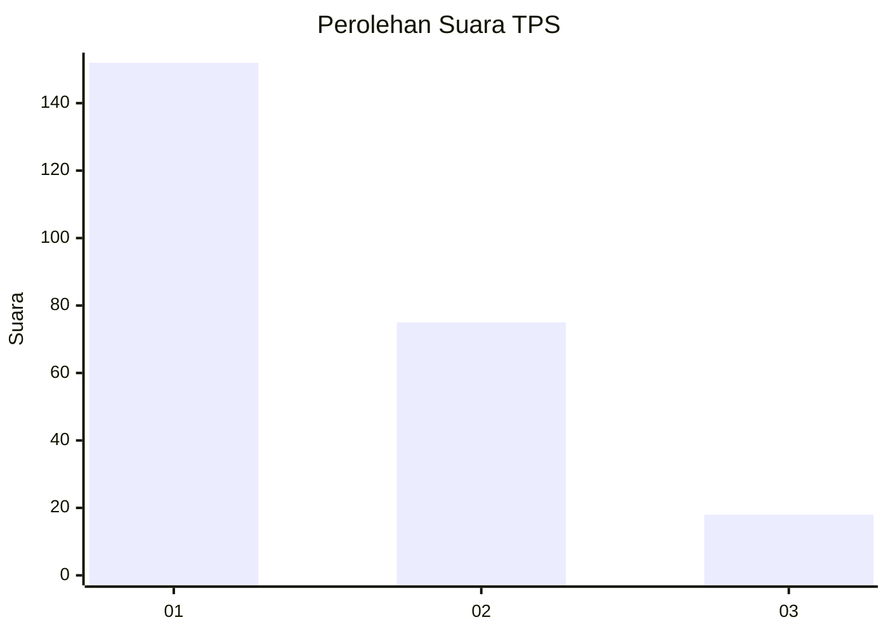
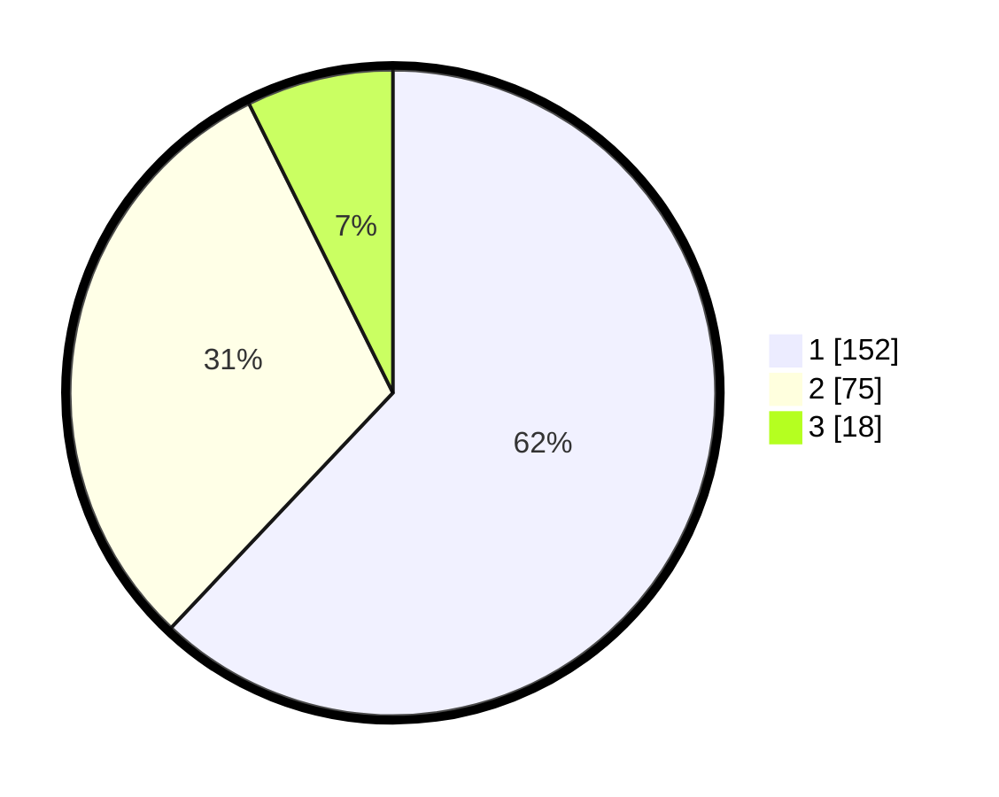

# Hasil

## Grafik

## Tabel

| No. | Nama Paslon    | Suara | Suara (raw) | Persentase |
|:--- |:-------------- | -----:| -----------:| ----------:|
| 1   | ANIES MUHAIMIN | 152   | [152][p-1]  | 62,04      |
| 2   | PRABOWO GIBRAN | 75    | [75][p-2]   | 30,61      |
| 3   | GANJAR MAHFUD  | 18    | [18][p-3]   | 7,35       |

[p-1]: https://github.com/gigit-pemilu/pemilu-2024-11-aceh/blob/main/pilpres/hitung-suara/sub/11-aceh/sub/17-bener-meriah/sub/02-permata/sub/2013-wih-tenang-uken/sub/006-tps/sub/paslon-1.txt
[p-2]: https://github.com/gigit-pemilu/pemilu-2024-11-aceh/blob/main/pilpres/hitung-suara/sub/11-aceh/sub/17-bener-meriah/sub/02-permata/sub/2013-wih-tenang-uken/sub/006-tps/sub/paslon-2.txt
[p-3]: https://github.com/gigit-pemilu/pemilu-2024-11-aceh/blob/main/pilpres/hitung-suara/sub/11-aceh/sub/17-bener-meriah/sub/02-permata/sub/2013-wih-tenang-uken/sub/006-tps/sub/paslon-3.txt

## Foto C Plano

https://sirekap-obj-formc.kpu.go.id/44bc/pemilu/ppwp/11/17/02/20/13/1117022013006-20240215-093413--5b2d0080-3073-41e2-bd56-7fe1b783dc0c.jpg

https://sirekap-obj-formc.kpu.go.id/44bc/pemilu/ppwp/11/17/02/20/13/1117022013006-20240215-093619--0cdda52a-906c-4a41-9cb7-9af2375735ce.jpg

https://sirekap-obj-formc.kpu.go.id/44bc/pemilu/ppwp/11/17/02/20/13/1117022013006-20240215-093912--36af0987-c3ae-4dd0-a04f-8ec81837c451.jpg

## Metadata

| Key        | Value               |
| ---------- | ------------------- |
| Time Stamp | 2024-02-24 22:31:28 |

