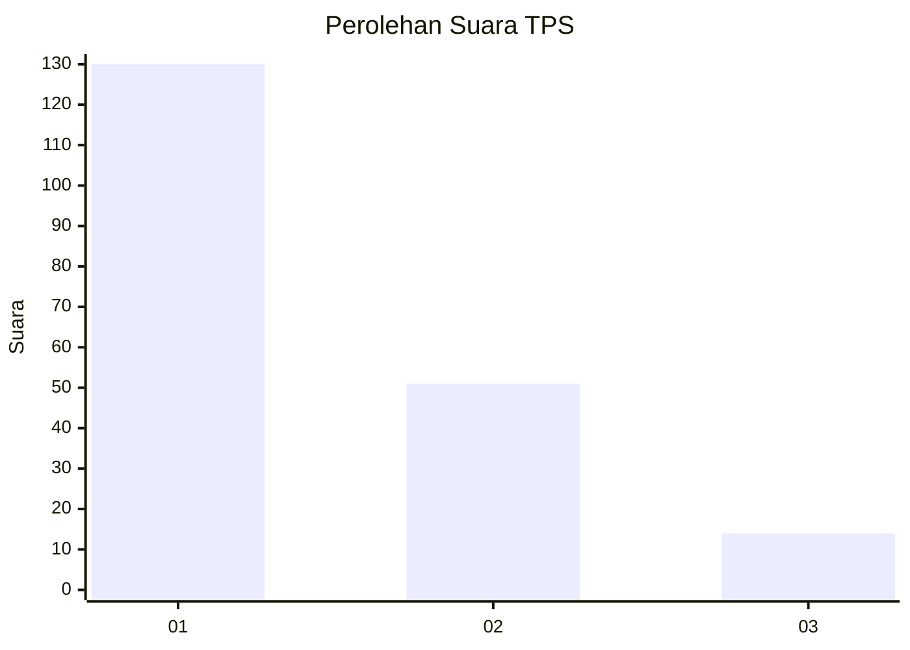
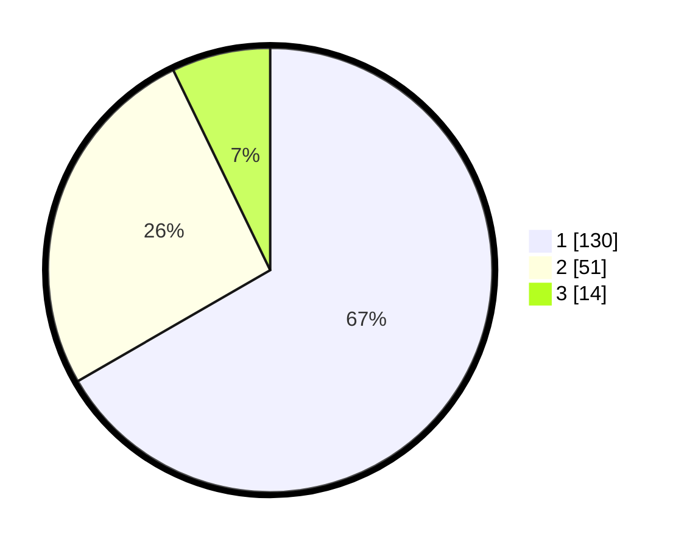

# Hasil

## Grafik

## Tabel

| No. | Nama Paslon    | Suara | Suara (raw) | Persentase |
|:--- |:-------------- | -----:| -----------:| ----------:|
| 1   | ANIES MUHAIMIN | 130   | [130][p-1]  | 66,67      |
| 2   | PRABOWO GIBRAN | 51    | [51][p-2]   | 26,15      |
| 3   | GANJAR MAHFUD  | 14    | [14][p-3]   | 7,18       |

[p-1]: https://github.com/gigit-pemilu/pemilu-2024-11-aceh/blob/main/pilpres/hitung-suara/sub/11-aceh/sub/17-bener-meriah/sub/02-permata/sub/2019-jungke/sub/002-tps/sub/paslon-1.txt
[p-2]: https://github.com/gigit-pemilu/pemilu-2024-11-aceh/blob/main/pilpres/hitung-suara/sub/11-aceh/sub/17-bener-meriah/sub/02-permata/sub/2019-jungke/sub/002-tps/sub/paslon-2.txt
[p-3]: https://github.com/gigit-pemilu/pemilu-2024-11-aceh/blob/main/pilpres/hitung-suara/sub/11-aceh/sub/17-bener-meriah/sub/02-permata/sub/2019-jungke/sub/002-tps/sub/paslon-3.txt

## Foto C Plano

https://sirekap-obj-formc.kpu.go.id/3c56/pemilu/ppwp/11/17/02/20/19/1117022019002-20240215-014021--46b97d68-a484-4c30-b079-7de407ca9152.jpg

https://sirekap-obj-formc.kpu.go.id/3c56/pemilu/ppwp/11/17/02/20/19/1117022019002-20240215-000831--748c51fe-6b3b-4917-87b1-15383b9939db.jpg

https://sirekap-obj-formc.kpu.go.id/3c56/pemilu/ppwp/11/17/02/20/19/1117022019002-20240215-014212--4309f0d5-a49a-4f1a-a9c1-09386fc6a175.jpg

## Metadata

| Key        | Value               |
| ---------- | ------------------- |
| Time Stamp | 2024-02-24 22:31:28 |

