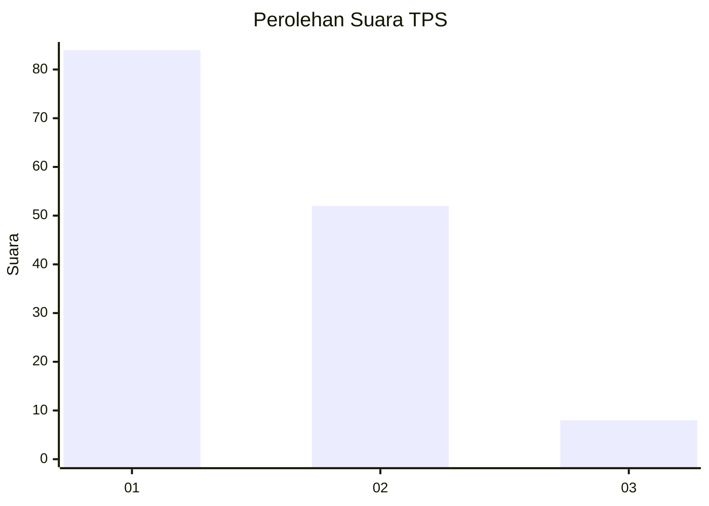
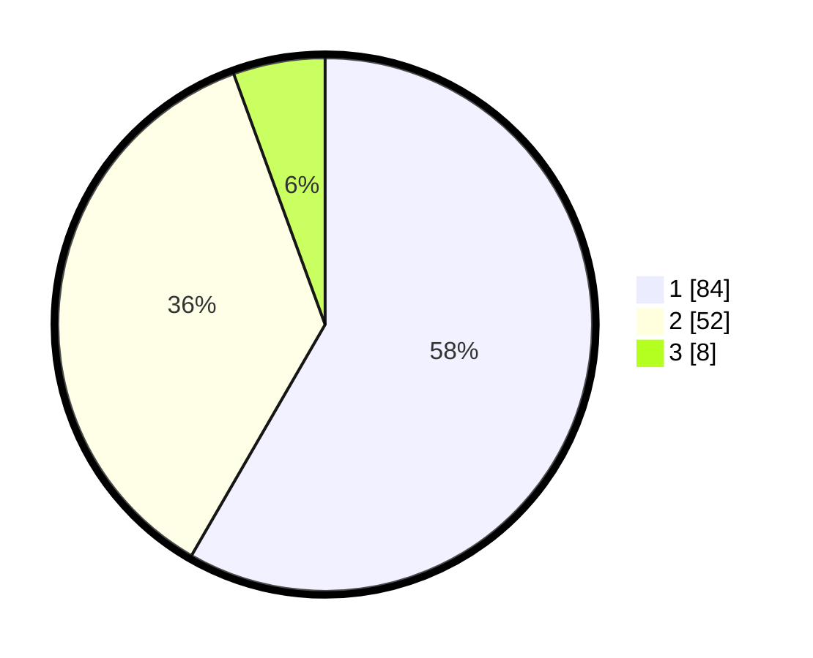

# Hasil

## Grafik

## Tabel

| No. | Nama Paslon    | Suara | Suara (raw) | Persentase |
|:--- |:-------------- | -----:| -----------:| ----------:|
| 1   | ANIES MUHAIMIN | 84    | [84][p-1]   | 58,33      |
| 2   | PRABOWO GIBRAN | 52    | [52][p-2]   | 36,11      |
| 3   | GANJAR MAHFUD  | 8     | [8][p-3]    | 5,56       |

[p-1]: https://github.com/gigit-pemilu/pemilu-2024-11-aceh/blob/main/pilpres/hitung-suara/sub/11-aceh/sub/17-bener-meriah/sub/02-permata/sub/2021-bale-musara/sub/001-tps/sub/paslon-1.txt
[p-2]: https://github.com/gigit-pemilu/pemilu-2024-11-aceh/blob/main/pilpres/hitung-suara/sub/11-aceh/sub/17-bener-meriah/sub/02-permata/sub/2021-bale-musara/sub/001-tps/sub/paslon-2.txt
[p-3]: https://github.com/gigit-pemilu/pemilu-2024-11-aceh/blob/main/pilpres/hitung-suara/sub/11-aceh/sub/17-bener-meriah/sub/02-permata/sub/2021-bale-musara/sub/001-tps/sub/paslon-3.txt

## Foto C Plano

https://sirekap-obj-formc.kpu.go.id/46a8/pemilu/ppwp/11/17/02/20/21/1117022021001-20240215-104330--6d609c98-affb-4534-895d-0487db06417d.jpg

https://sirekap-obj-formc.kpu.go.id/46a8/pemilu/ppwp/11/17/02/20/21/1117022021001-20240215-104651--1d69c96b-941d-4c8b-bf8a-f854732c13cf.jpg

https://sirekap-obj-formc.kpu.go.id/46a8/pemilu/ppwp/11/17/02/20/21/1117022021001-20240215-105821--d6690409-fcc3-4083-9d91-263b60f8b85c.jpg

## Metadata

| Key        | Value               |
| ---------- | ------------------- |
| Time Stamp | 2024-02-24 22:31:28 |

