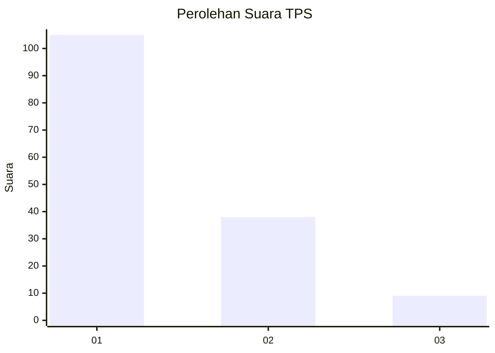
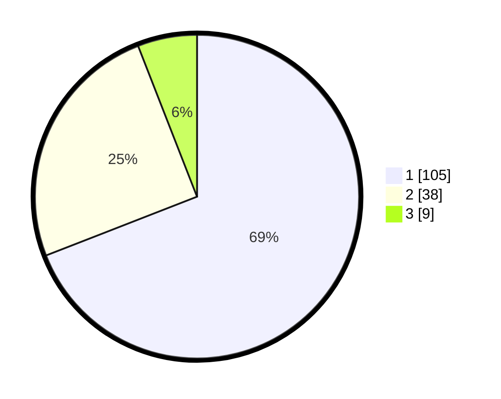

# Hasil

## Grafik

## Tabel

| No. | Nama Paslon    | Suara | Suara (raw) | Persentase |
|:--- |:-------------- | -----:| -----------:| ----------:|
| 1   | ANIES MUHAIMIN | 105   | [105][p-1]  | 69,08      |
| 2   | PRABOWO GIBRAN | 38    | [38][p-2]   | 25,00      |
| 3   | GANJAR MAHFUD  | 9     | [9][p-3]    | 5,92       |

[p-1]: https://github.com/gigit-pemilu/pemilu-2024-11-aceh/blob/main/pilpres/hitung-suara/sub/11-aceh/sub/17-bener-meriah/sub/02-permata/sub/2021-bale-musara/sub/002-tps/sub/paslon-1.txt
[p-2]: https://github.com/gigit-pemilu/pemilu-2024-11-aceh/blob/main/pilpres/hitung-suara/sub/11-aceh/sub/17-bener-meriah/sub/02-permata/sub/2021-bale-musara/sub/002-tps/sub/paslon-2.txt
[p-3]: https://github.com/gigit-pemilu/pemilu-2024-11-aceh/blob/main/pilpres/hitung-suara/sub/11-aceh/sub/17-bener-meriah/sub/02-permata/sub/2021-bale-musara/sub/002-tps/sub/paslon-3.txt

## Foto C Plano

https://sirekap-obj-formc.kpu.go.id/aa55/pemilu/ppwp/11/17/02/20/21/1117022021002-20240215-163202--449a3a44-6912-4b8b-8596-9debcc2758f8.jpg

https://sirekap-obj-formc.kpu.go.id/aa55/pemilu/ppwp/11/17/02/20/21/1117022021002-20240215-113139--2f21fa8c-15dd-4351-9c6f-e1951db9b01f.jpg

https://sirekap-obj-formc.kpu.go.id/aa55/pemilu/ppwp/11/17/02/20/21/1117022021002-20240215-113358--e0fa1f92-0770-4d84-9f17-ada19941b096.jpg

## Metadata

| Key        | Value               |
| ---------- | ------------------- |
| Time Stamp | 2024-02-24 22:31:28 |

