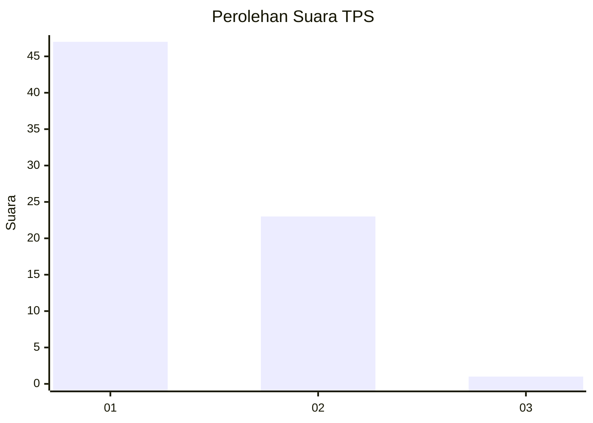
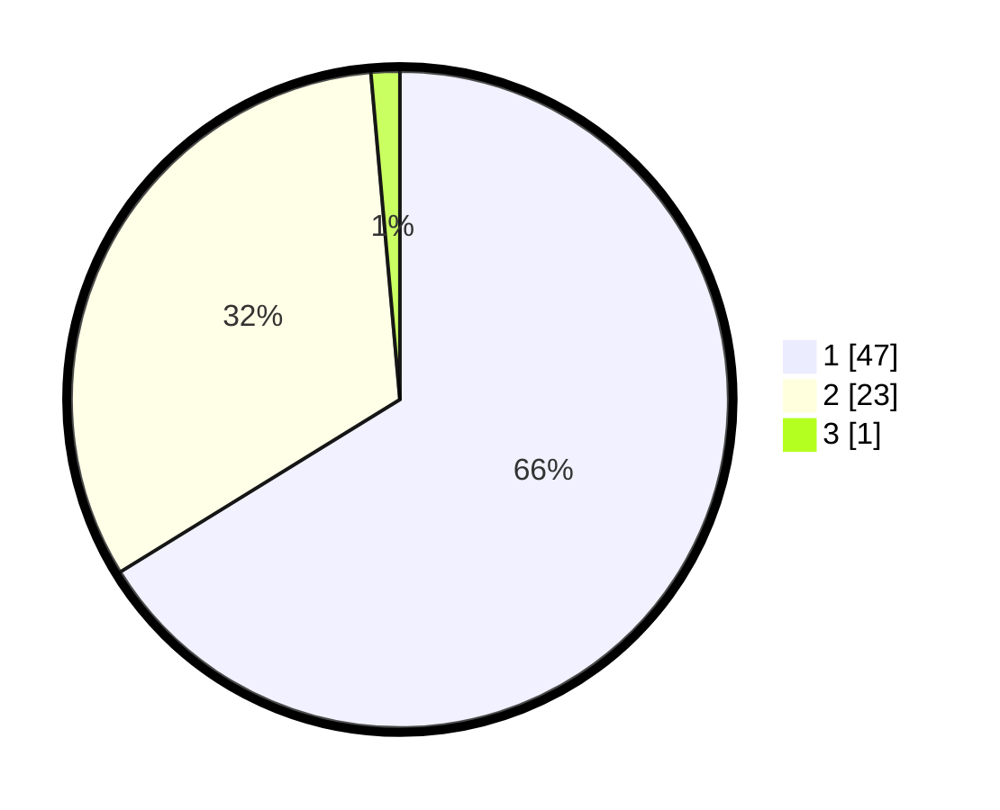

# Hasil

## Grafik

## Tabel

| No. | Nama Paslon    | Suara | Suara (raw) | Persentase |
|:--- |:-------------- | -----:| -----------:| ----------:|
| 1   | ANIES MUHAIMIN | 47    | [47][p-1]   | 66,20      |
| 2   | PRABOWO GIBRAN | 23    | [23][p-2]   | 32,39      |
| 3   | GANJAR MAHFUD  | 1     | [1][p-3]    | 1,41       |

[p-1]: https://github.com/gigit-pemilu/pemilu-2024-11-aceh/blob/main/pilpres/hitung-suara/sub/11-aceh/sub/17-bener-meriah/sub/03-syiah-utama/sub/2004-goneng/sub/001-tps/sub/paslon-1.txt
[p-2]: https://github.com/gigit-pemilu/pemilu-2024-11-aceh/blob/main/pilpres/hitung-suara/sub/11-aceh/sub/17-bener-meriah/sub/03-syiah-utama/sub/2004-goneng/sub/001-tps/sub/paslon-2.txt
[p-3]: https://github.com/gigit-pemilu/pemilu-2024-11-aceh/blob/main/pilpres/hitung-suara/sub/11-aceh/sub/17-bener-meriah/sub/03-syiah-utama/sub/2004-goneng/sub/001-tps/sub/paslon-3.txt

## Foto C Plano

https://sirekap-obj-formc.kpu.go.id/be94/pemilu/ppwp/11/17/03/20/04/1117032004001-20240218-130015--ffd366c3-701d-48c1-aa80-beef4094af62.jpg

https://sirekap-obj-formc.kpu.go.id/be94/pemilu/ppwp/11/17/03/20/04/1117032004001-20240218-130017--830fcccd-0b04-497f-a569-12c230b55a14.jpg

https://sirekap-obj-formc.kpu.go.id/be94/pemilu/ppwp/11/17/03/20/04/1117032004001-20240218-130016--b441bfee-397d-495f-9600-72e2ac7d54e9.jpg

## Metadata

| Key        | Value               |
| ---------- | ------------------- |
| Time Stamp | 2024-02-19 11:00:00 |

## DATA PEMILIH TETAP

Jumlah pemilih dalam DPT: **69**.
 * L: **34**.
 * P: **35**.

## DATA PENGGUNA HAK PILIH

Jumlah pengguna hak pilih dalam DPT: **69**.
 * L: **34**.
 * P: **35**.

Jumlah pengguna hak pilih dalam DPTb: **2**.
 * L: **0**.
 * P: **2**.

Jumlah pengguna hak pilih dalam DPK: **0**.
 * L: **0**.
 * P: **0**.

Jumlah pengguna hak pilih: **0**.
 * L: **0**.
 * P: **0**.

## JUMLAH SUARA SAH DAN TIDAK SAH

JUMLAH SELURUH SUARA SAH: **71**.

JUMLAH SUARA TIDAK SAH: **0**.

JUMLAH SELURUH SUARA SAH DAN SUARA TIDAK SAH: **71**.

