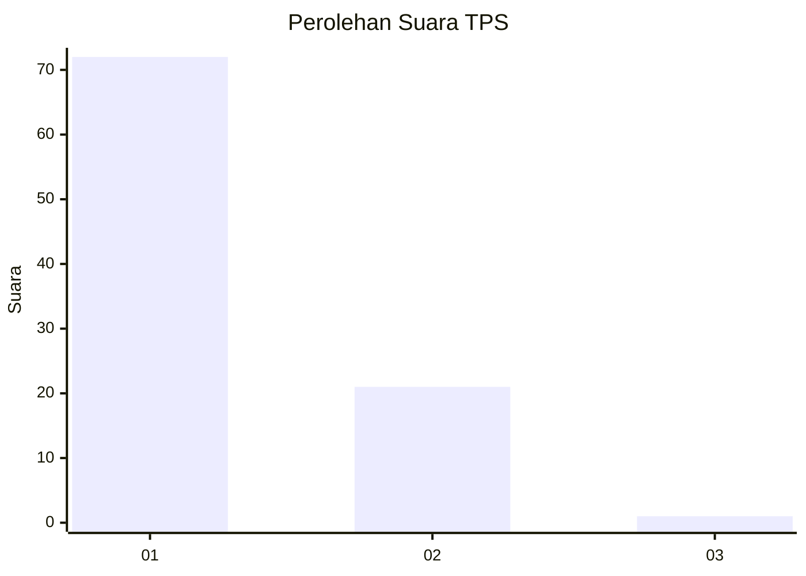
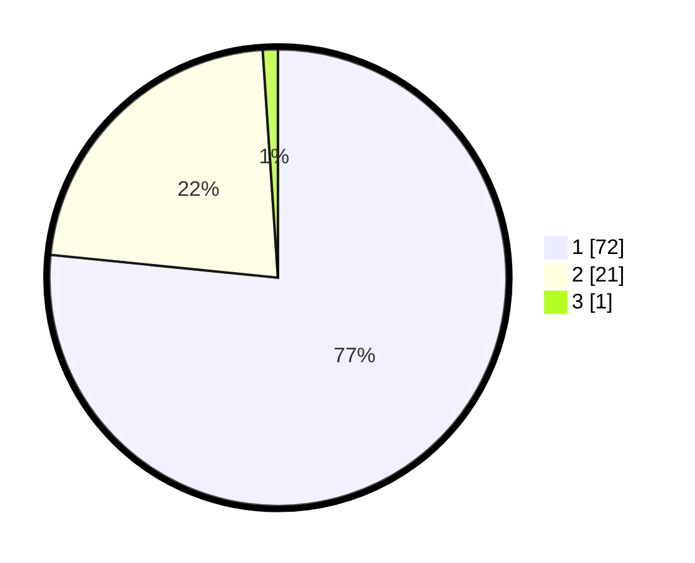

# Hasil

## Grafik

## Tabel

| No. | Nama Paslon    | Suara | Suara (raw) | Persentase |
|:--- |:-------------- | -----:| -----------:| ----------:|
| 1   | ANIES MUHAIMIN | 72    | [72][p-1]   | 76,60      |
| 2   | PRABOWO GIBRAN | 21    | [21][p-2]   | 22,34      |
| 3   | GANJAR MAHFUD  | 1     | [1][p-3]    | 1,06       |

[p-1]: https://github.com/gigit-pemilu/pemilu-2024-11-aceh/blob/main/pilpres/hitung-suara/sub/11-aceh/sub/17-bener-meriah/sub/03-syiah-utama/sub/2008-kutelah-lane/sub/001-tps/sub/paslon-1.txt
[p-2]: https://github.com/gigit-pemilu/pemilu-2024-11-aceh/blob/main/pilpres/hitung-suara/sub/11-aceh/sub/17-bener-meriah/sub/03-syiah-utama/sub/2008-kutelah-lane/sub/001-tps/sub/paslon-2.txt
[p-3]: https://github.com/gigit-pemilu/pemilu-2024-11-aceh/blob/main/pilpres/hitung-suara/sub/11-aceh/sub/17-bener-meriah/sub/03-syiah-utama/sub/2008-kutelah-lane/sub/001-tps/sub/paslon-3.txt

## Foto C Plano

https://sirekap-obj-formc.kpu.go.id/b438/pemilu/ppwp/11/17/03/20/08/1117032008001-20240219-142715--6cccd77f-3214-4fab-9e54-9292aa367bab.jpg

https://sirekap-obj-formc.kpu.go.id/b438/pemilu/ppwp/11/17/03/20/08/1117032008001-20240219-142717--d79f4ae1-a48c-4967-af64-8abf3eb4376b.jpg

https://sirekap-obj-formc.kpu.go.id/b438/pemilu/ppwp/11/17/03/20/08/1117032008001-20240219-142716--d54055e2-3b55-4c81-9d71-f3db1536a288.jpg

## Metadata

| Key        | Value               |
| ---------- | ------------------- |
| Time Stamp | 2024-02-24 22:31:28 |

## DATA PEMILIH TETAP

Jumlah pemilih dalam DPT: **93**.
 * L: **47**.
 * P: **46**.

## DATA PENGGUNA HAK PILIH

Jumlah pengguna hak pilih dalam DPT: **87**.
 * L: **47**.
 * P: **40**.

Jumlah pengguna hak pilih dalam DPTb: **1**.
 * L: **0**.
 * P: **1**.

Jumlah pengguna hak pilih dalam DPK: **7**.
 * L: **5**.
 * P: **2**.

Jumlah pengguna hak pilih: **95**.
 * L: **52**.
 * P: **43**.

## JUMLAH SUARA SAH DAN TIDAK SAH

JUMLAH SELURUH SUARA SAH: **0**.

JUMLAH SUARA TIDAK SAH: **0**.

JUMLAH SELURUH SUARA SAH DAN SUARA TIDAK SAH: **0**.

