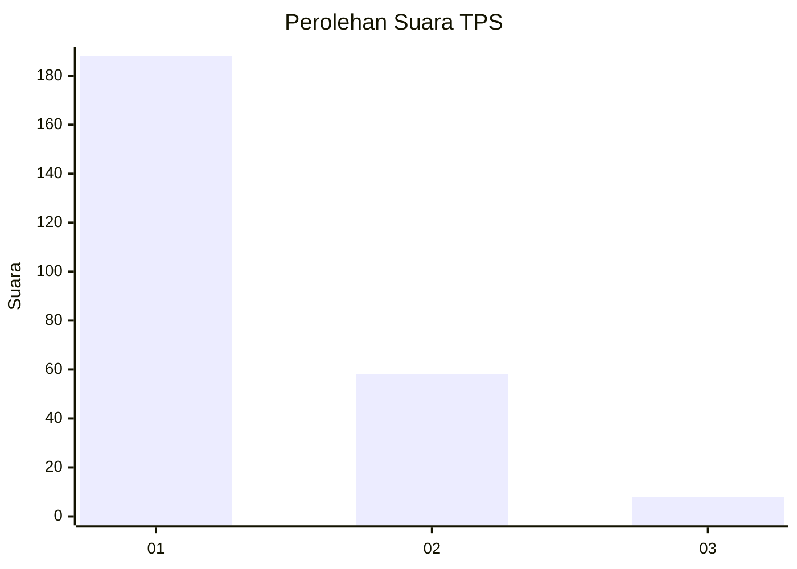
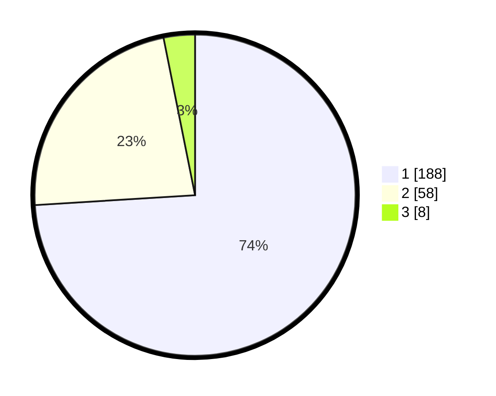

# Hasil

## Grafik

## Tabel

| No. | Nama Paslon    | Suara | Suara (raw) | Persentase |
|:--- |:-------------- | -----:| -----------:| ----------:|
| 1   | ANIES MUHAIMIN | 188   | [188][p-1]  | 74,02      |
| 2   | PRABOWO GIBRAN | 58    | [58][p-2]   | 22,83      |
| 3   | GANJAR MAHFUD  | 8     | [8][p-3]    | 3,15       |

[p-1]: https://github.com/gigit-pemilu/pemilu-2024-11-aceh/blob/main/pilpres/hitung-suara/sub/11-aceh/sub/17-bener-meriah/sub/04-bandar/sub/2010-hakim-wih-ilang/sub/001-tps/sub/paslon-1.txt
[p-2]: https://github.com/gigit-pemilu/pemilu-2024-11-aceh/blob/main/pilpres/hitung-suara/sub/11-aceh/sub/17-bener-meriah/sub/04-bandar/sub/2010-hakim-wih-ilang/sub/001-tps/sub/paslon-2.txt
[p-3]: https://github.com/gigit-pemilu/pemilu-2024-11-aceh/blob/main/pilpres/hitung-suara/sub/11-aceh/sub/17-bener-meriah/sub/04-bandar/sub/2010-hakim-wih-ilang/sub/001-tps/sub/paslon-3.txt

## Foto C Plano

https://sirekap-obj-formc.kpu.go.id/62d7/pemilu/ppwp/11/17/04/20/10/1117042010001-20240214-210745--4909b1e5-81f3-4035-9a8d-f93854bb15c7.jpg

https://sirekap-obj-formc.kpu.go.id/62d7/pemilu/ppwp/11/17/04/20/10/1117042010001-20240214-194633--3a32da8a-f04c-4a92-af04-05d184336cd8.jpg

https://sirekap-obj-formc.kpu.go.id/62d7/pemilu/ppwp/11/17/04/20/10/1117042010001-20240214-195303--db9666ac-4f2d-4cc3-ac31-b62a787d9aea.jpg

## Metadata

| Key        | Value               |
| ---------- | ------------------- |
| Time Stamp | 2024-02-25 17:00:00 |

