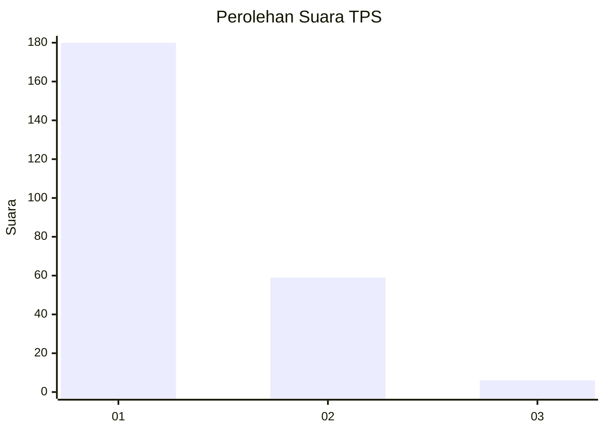
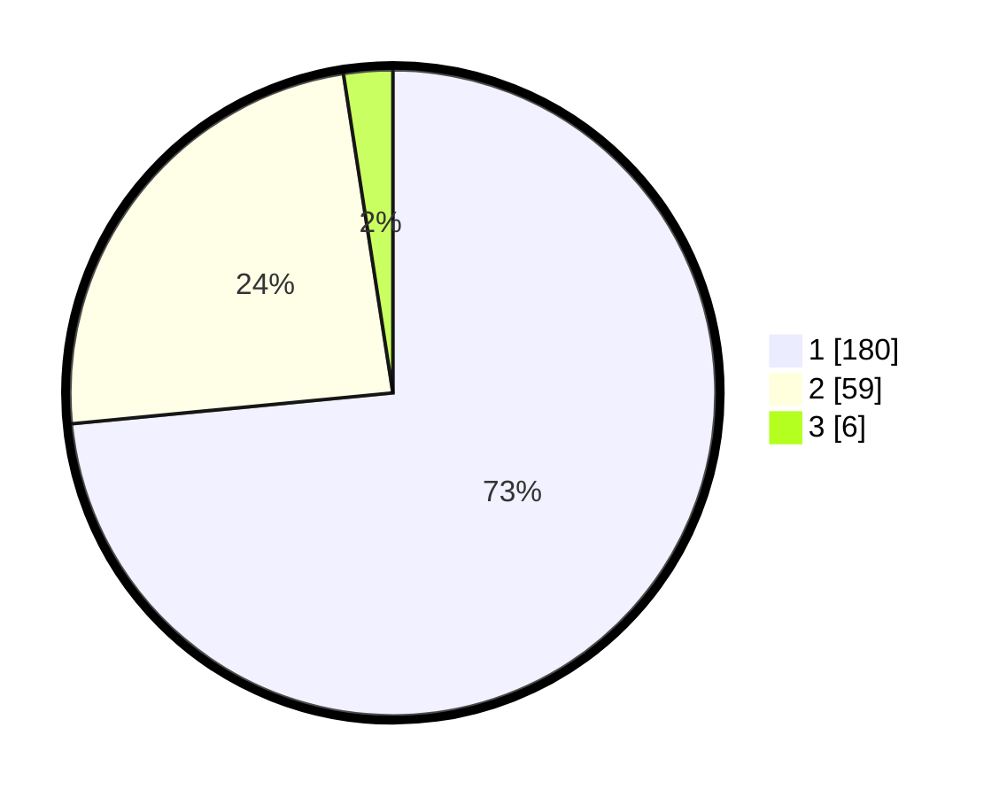

# Hasil

## Grafik

## Tabel

| No. | Nama Paslon    | Suara | Suara (raw) | Persentase |
|:--- |:-------------- | -----:| -----------:| ----------:|
| 1   | ANIES MUHAIMIN | 180   | [180][p-1]  | 73,47      |
| 2   | PRABOWO GIBRAN | 59    | [59][p-2]   | 24,08      |
| 3   | GANJAR MAHFUD  | 6     | [6][p-3]    | 2,45       |

[p-1]: https://github.com/gigit-pemilu/pemilu-2024-11-aceh/blob/main/pilpres/hitung-suara/sub/11-aceh/sub/17-bener-meriah/sub/04-bandar/sub/2019-pondok-baru/sub/001-tps/sub/paslon-1.txt
[p-2]: https://github.com/gigit-pemilu/pemilu-2024-11-aceh/blob/main/pilpres/hitung-suara/sub/11-aceh/sub/17-bener-meriah/sub/04-bandar/sub/2019-pondok-baru/sub/001-tps/sub/paslon-2.txt
[p-3]: https://github.com/gigit-pemilu/pemilu-2024-11-aceh/blob/main/pilpres/hitung-suara/sub/11-aceh/sub/17-bener-meriah/sub/04-bandar/sub/2019-pondok-baru/sub/001-tps/sub/paslon-3.txt

## Foto C Plano

https://sirekap-obj-formc.kpu.go.id/2df2/pemilu/ppwp/11/17/04/20/19/1117042019001-20240215-133713--40e707b1-7915-4968-a782-be38bcc8cd52.jpg

https://sirekap-obj-formc.kpu.go.id/2df2/pemilu/ppwp/11/17/04/20/19/1117042019001-20240215-110800--2146292d-d346-4cba-b797-2b72cb2c7967.jpg

https://sirekap-obj-formc.kpu.go.id/2df2/pemilu/ppwp/11/17/04/20/19/1117042019001-20240215-141916--ccfb2aab-5724-4db2-9824-2ea333b3e597.jpg

## Metadata

| Key        | Value               |
| ---------- | ------------------- |
| Time Stamp | 2024-02-24 22:31:28 |

