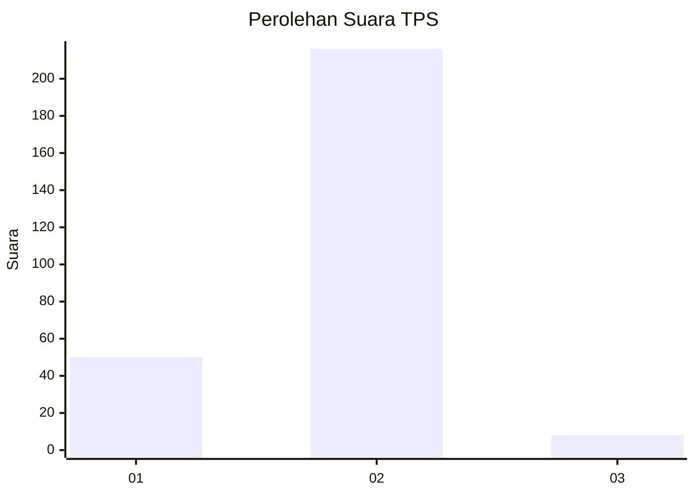
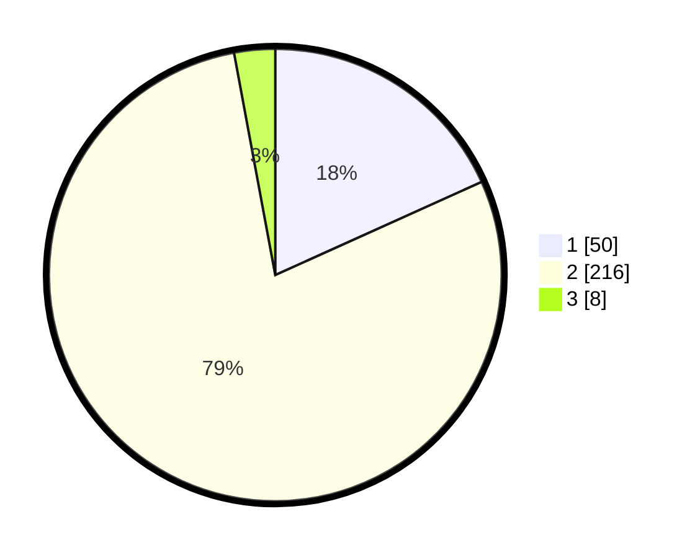

# Hasil

## Grafik

## Tabel

| No. | Nama Paslon    | Suara | Suara (raw) | Persentase |
|:--- |:-------------- | -----:| -----------:| ----------:|
| 1   | ANIES MUHAIMIN | 50    | [50][p-1]   | 18,25      |
| 2   | PRABOWO GIBRAN | 216   | [216][p-2]  | 78,83      |
| 3   | GANJAR MAHFUD  | 8     | [8][p-3]    | 2,92       |

[p-1]: https://github.com/gigit-pemilu/pemilu-2024-11-aceh/blob/main/pilpres/hitung-suara/sub/11-aceh/sub/17-bener-meriah/sub/04-bandar/sub/2025-sidodadi/sub/001-tps/sub/paslon-1.txt
[p-2]: https://github.com/gigit-pemilu/pemilu-2024-11-aceh/blob/main/pilpres/hitung-suara/sub/11-aceh/sub/17-bener-meriah/sub/04-bandar/sub/2025-sidodadi/sub/001-tps/sub/paslon-2.txt
[p-3]: https://github.com/gigit-pemilu/pemilu-2024-11-aceh/blob/main/pilpres/hitung-suara/sub/11-aceh/sub/17-bener-meriah/sub/04-bandar/sub/2025-sidodadi/sub/001-tps/sub/paslon-3.txt

## Foto C Plano

https://sirekap-obj-formc.kpu.go.id/0580/pemilu/ppwp/11/17/04/20/25/1117042025001-20240215-114530--8497dc36-1c5d-4cd3-aa90-91991c0ebf4f.jpg

https://sirekap-obj-formc.kpu.go.id/0580/pemilu/ppwp/11/17/04/20/25/1117042025001-20240215-114833--1bc02eae-ea0b-449c-a2bb-e771a5318094.jpg

https://sirekap-obj-formc.kpu.go.id/0580/pemilu/ppwp/11/17/04/20/25/1117042025001-20240215-114953--a58fd84a-21c9-46f9-9d2b-04c7c44e5253.jpg

## Metadata

| Key        | Value               |
| ---------- | ------------------- |
| Time Stamp | 2024-02-24 22:31:28 |

