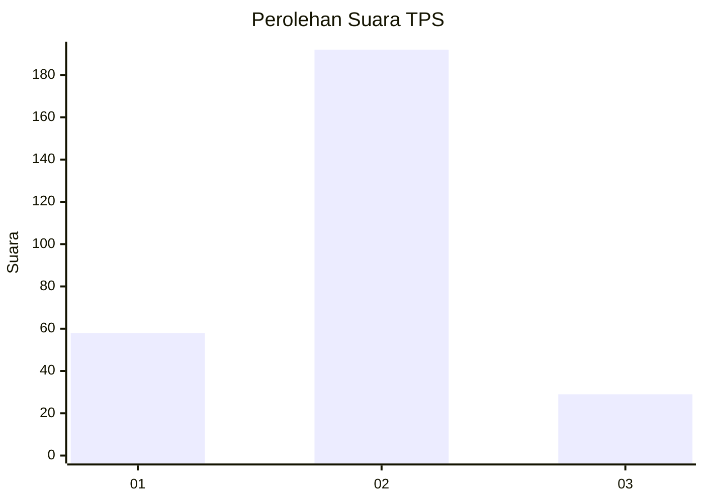

# Hasil

## Grafik

## Tabel

| No. | Nama Paslon    | Suara | Suara (raw) | Persentase |
|:--- |:-------------- | -----:| -----------:| ----------:|
| 1   | ANIES MUHAIMIN | 58    | [58][p-1]   | 20,79      |
| 2   | PRABOWO GIBRAN | 192   | [192][p-2]  | 68,82      |
| 3   | GANJAR MAHFUD  | 29    | [29][p-3]   | 10,39      |

[p-1]: https://github.com/gigit-pemilu/pemilu-2024-11-aceh/blob/main/pilpres/hitung-suara/sub/11-aceh/sub/17-bener-meriah/sub/04-bandar/sub/2025-sidodadi/sub/002-tps/sub/paslon-1.txt
[p-2]: https://github.com/gigit-pemilu/pemilu-2024-11-aceh/blob/main/pilpres/hitung-suara/sub/11-aceh/sub/17-bener-meriah/sub/04-bandar/sub/2025-sidodadi/sub/002-tps/sub/paslon-2.txt
[p-3]: https://github.com/gigit-pemilu/pemilu-2024-11-aceh/blob/main/pilpres/hitung-suara/sub/11-aceh/sub/17-bener-meriah/sub/04-bandar/sub/2025-sidodadi/sub/002-tps/sub/paslon-3.txt

## Foto C Plano

https://sirekap-obj-formc.kpu.go.id/7de7/pemilu/ppwp/11/17/04/20/25/1117042025002-20240215-130532--a7b43812-991b-41da-be3d-de5e811329c8.jpg

https://sirekap-obj-formc.kpu.go.id/7de7/pemilu/ppwp/11/17/04/20/25/1117042025002-20240215-130613--e8fad59b-6960-4d68-9cff-4c406b9df935.jpg

https://sirekap-obj-formc.kpu.go.id/7de7/pemilu/ppwp/11/17/04/20/25/1117042025002-20240215-130640--8972bd42-c5e4-42aa-b155-530fd2da7276.jpg

## Metadata

| Key        | Value               |
| ---------- | ------------------- |
| Time Stamp | 2024-02-24 22:31:28 |

