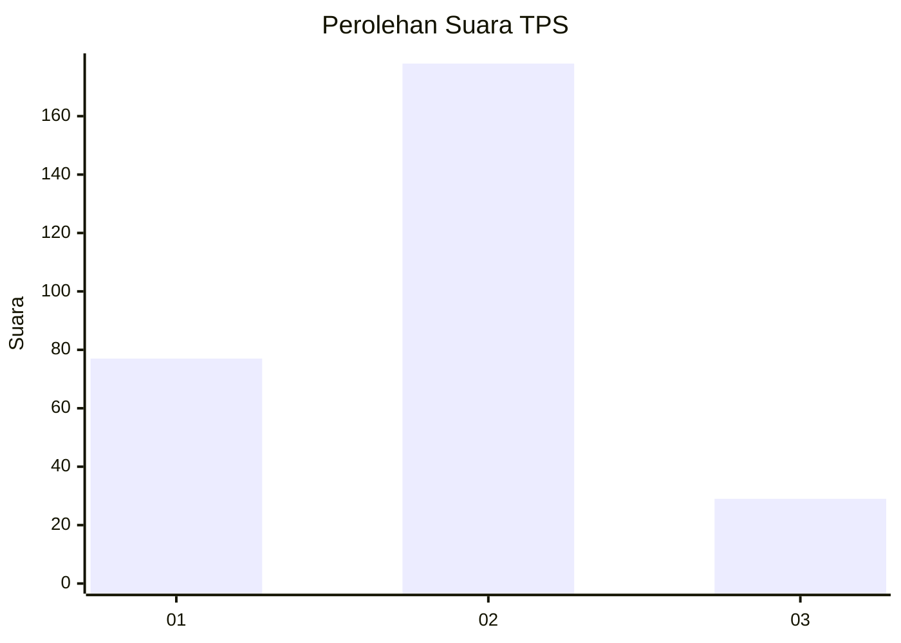
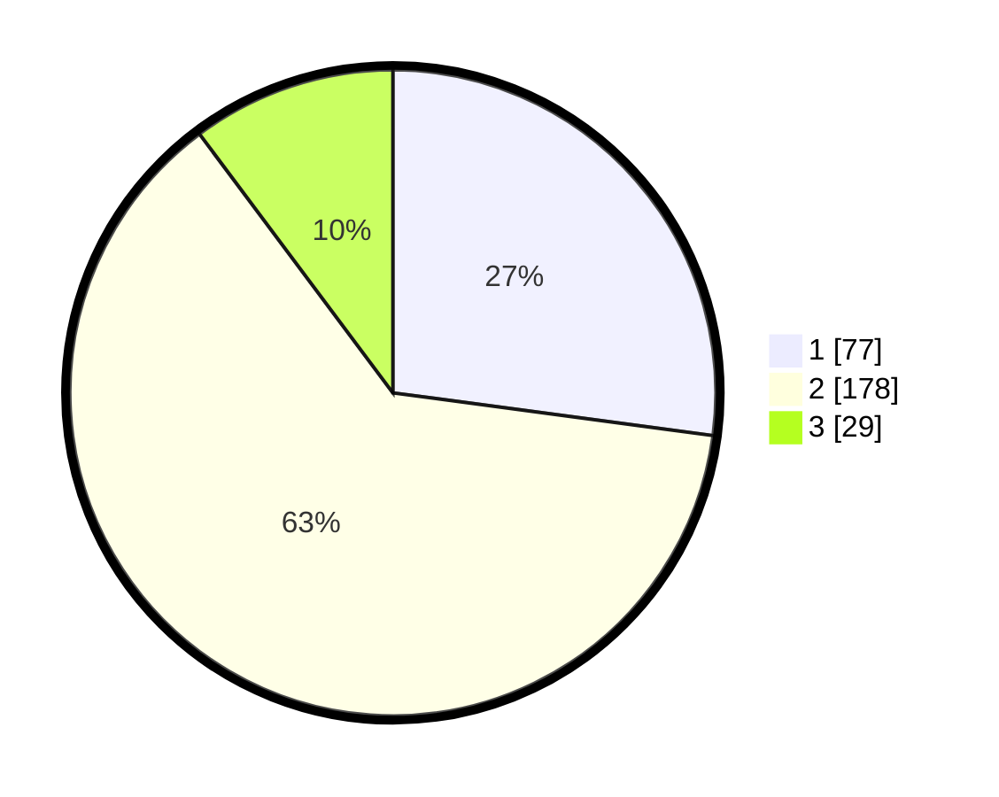

# Hasil

## Grafik

## Tabel

| No. | Nama Paslon    | Suara | Suara (raw) | Persentase |
|:--- |:-------------- | -----:| -----------:| ----------:|
| 1   | ANIES MUHAIMIN | 77    | [77][p-1]   | 27,11      |
| 2   | PRABOWO GIBRAN | 178   | [178][p-2]  | 62,68      |
| 3   | GANJAR MAHFUD  | 29    | [29][p-3]   | 10,21      |

[p-1]: https://github.com/gigit-pemilu/pemilu-2024-11-aceh/blob/main/pilpres/hitung-suara/sub/11-aceh/sub/17-bener-meriah/sub/04-bandar/sub/2029-wonosari/sub/002-tps/sub/paslon-1.txt
[p-2]: https://github.com/gigit-pemilu/pemilu-2024-11-aceh/blob/main/pilpres/hitung-suara/sub/11-aceh/sub/17-bener-meriah/sub/04-bandar/sub/2029-wonosari/sub/002-tps/sub/paslon-2.txt
[p-3]: https://github.com/gigit-pemilu/pemilu-2024-11-aceh/blob/main/pilpres/hitung-suara/sub/11-aceh/sub/17-bener-meriah/sub/04-bandar/sub/2029-wonosari/sub/002-tps/sub/paslon-3.txt

## Foto C Plano

https://sirekap-obj-formc.kpu.go.id/4a50/pemilu/ppwp/11/17/04/20/29/1117042029002-20240215-071240--0a3fd91d-8e71-4bf1-afdc-5c3368000851.jpg

https://sirekap-obj-formc.kpu.go.id/4a50/pemilu/ppwp/11/17/04/20/29/1117042029002-20240215-071246--1ea42099-5398-4e59-997d-732e1e88da6c.jpg

https://sirekap-obj-formc.kpu.go.id/4a50/pemilu/ppwp/11/17/04/20/29/1117042029002-20240215-071249--6fdfb4d2-3d6c-48d2-967f-ffe39242030b.jpg

## Metadata

| Key        | Value               |
| ---------- | ------------------- |
| Time Stamp | 2024-02-16 12:51:22 |

## DATA PEMILIH TETAP

Jumlah pemilih dalam DPT: **298**.
 * L: **255**.
 * P: **136**.

## DATA PENGGUNA HAK PILIH

Jumlah pengguna hak pilih dalam DPT: **289**.
 * L: **148**.
 * P: **532**.

Jumlah pengguna hak pilih dalam DPTb: **2**.
 * L: **825**.
 * P: **3**.

Jumlah pengguna hak pilih dalam DPK: **60**.
 * L: **4**.
 * P: **6**.

Jumlah pengguna hak pilih: **292**.
 * L: **153**.
 * P: **539**.

## JUMLAH SUARA SAH DAN TIDAK SAH

JUMLAH SELURUH SUARA SAH: **284**.

JUMLAH SUARA TIDAK SAH: **8**.

JUMLAH SELURUH SUARA SAH DAN SUARA TIDAK SAH: **292**.

