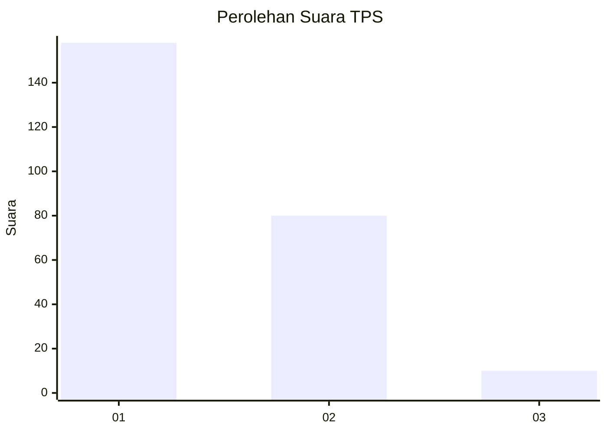
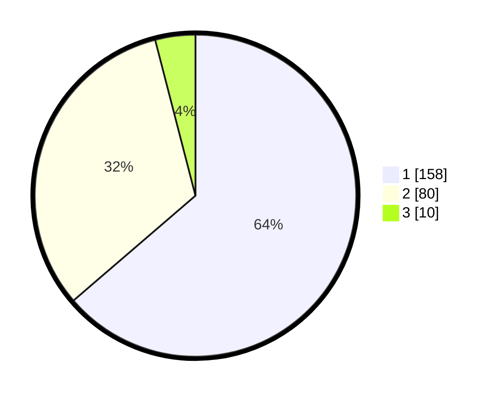

# Hasil

## Grafik

## Tabel

| No. | Nama Paslon    | Suara | Suara (raw) | Persentase |
|:--- |:-------------- | -----:| -----------:| ----------:|
| 1   | ANIES MUHAIMIN | 158   | [158][p-1]  | 63,71      |
| 2   | PRABOWO GIBRAN | 80    | [80][p-2]   | 32,26      |
| 3   | GANJAR MAHFUD  | 10    | [10][p-3]   | 4,03       |

[p-1]: https://github.com/gigit-pemilu/pemilu-2024-11-aceh/blob/main/pilpres/hitung-suara/sub/11-aceh/sub/17-bener-meriah/sub/04-bandar/sub/2030-mutiara/sub/002-tps/sub/paslon-1.txt
[p-2]: https://github.com/gigit-pemilu/pemilu-2024-11-aceh/blob/main/pilpres/hitung-suara/sub/11-aceh/sub/17-bener-meriah/sub/04-bandar/sub/2030-mutiara/sub/002-tps/sub/paslon-2.txt
[p-3]: https://github.com/gigit-pemilu/pemilu-2024-11-aceh/blob/main/pilpres/hitung-suara/sub/11-aceh/sub/17-bener-meriah/sub/04-bandar/sub/2030-mutiara/sub/002-tps/sub/paslon-3.txt

## Foto C Plano

https://sirekap-obj-formc.kpu.go.id/aa01/pemilu/ppwp/11/17/04/20/30/1117042030002-20240214-185325--ebbb6208-af5f-4870-8c42-f8b2e58c79d8.jpg

https://sirekap-obj-formc.kpu.go.id/aa01/pemilu/ppwp/11/17/04/20/30/1117042030002-20240214-230623--2ca7d7e0-b80f-44d6-a25e-ef34f51d3b39.jpg

https://sirekap-obj-formc.kpu.go.id/aa01/pemilu/ppwp/11/17/04/20/30/1117042030002-20240214-185613--bf917bd0-62c8-4670-8cb2-9968f75649ac.jpg

## Metadata

| Key        | Value               |
| ---------- | ------------------- |
| Time Stamp | 2024-02-15 16:30:25 |

