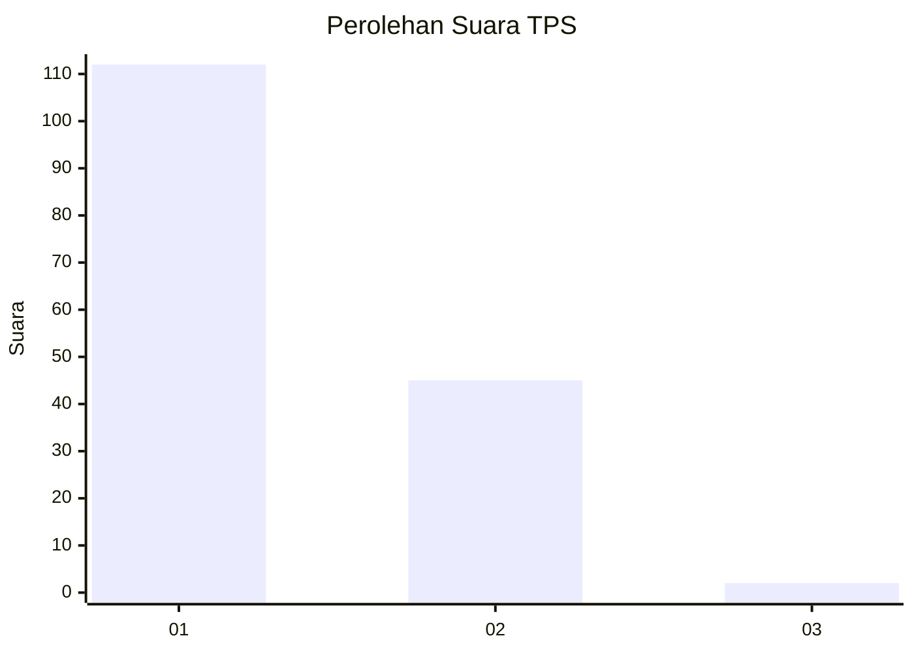
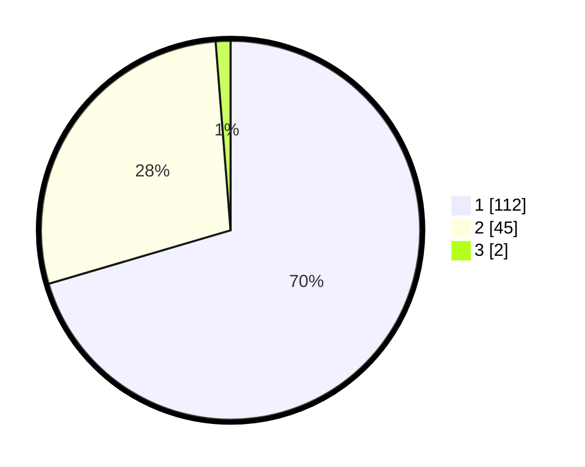

# Hasil

## Grafik

## Tabel

| No. | Nama Paslon    | Suara | Suara (raw) | Persentase |
|:--- |:-------------- | -----:| -----------:| ----------:|
| 1   | ANIES MUHAIMIN | 112   | [112][p-1]  | 70,44      |
| 2   | PRABOWO GIBRAN | 45    | [45][p-2]   | 28,30      |
| 3   | GANJAR MAHFUD  | 2     | [2][p-3]    | 1,26       |

[p-1]: https://github.com/gigit-pemilu/pemilu-2024-11-aceh/blob/main/pilpres/hitung-suara/sub/11-aceh/sub/17-bener-meriah/sub/04-bandar/sub/2035-kala-nempan/sub/001-tps/sub/paslon-1.txt
[p-2]: https://github.com/gigit-pemilu/pemilu-2024-11-aceh/blob/main/pilpres/hitung-suara/sub/11-aceh/sub/17-bener-meriah/sub/04-bandar/sub/2035-kala-nempan/sub/001-tps/sub/paslon-2.txt
[p-3]: https://github.com/gigit-pemilu/pemilu-2024-11-aceh/blob/main/pilpres/hitung-suara/sub/11-aceh/sub/17-bener-meriah/sub/04-bandar/sub/2035-kala-nempan/sub/001-tps/sub/paslon-3.txt

## Foto C Plano

https://sirekap-obj-formc.kpu.go.id/f6d2/pemilu/ppwp/11/17/04/20/35/1117042035001-20240215-022636--267cb2ba-7c3e-443d-9117-c01af4cf3ab8.jpg

https://sirekap-obj-formc.kpu.go.id/f6d2/pemilu/ppwp/11/17/04/20/35/1117042035001-20240216-200540--b0087596-7f86-4a0d-852f-d31dc003313d.jpg

https://sirekap-obj-formc.kpu.go.id/f6d2/pemilu/ppwp/11/17/04/20/35/1117042035001-20240215-023215--5d1a1fca-ada0-4423-b18b-f8b81228730e.jpg

## Metadata

| Key        | Value               |
| ---------- | ------------------- |
| Time Stamp | 2024-02-24 22:31:28 |

