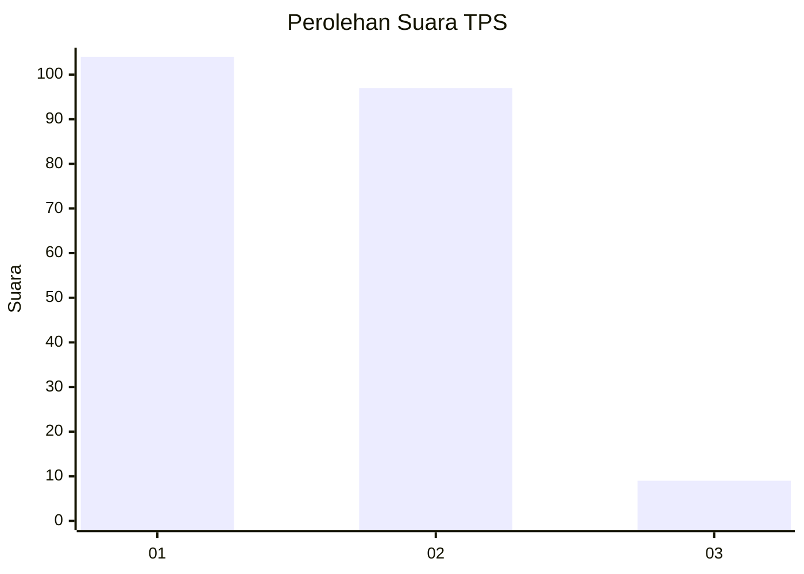
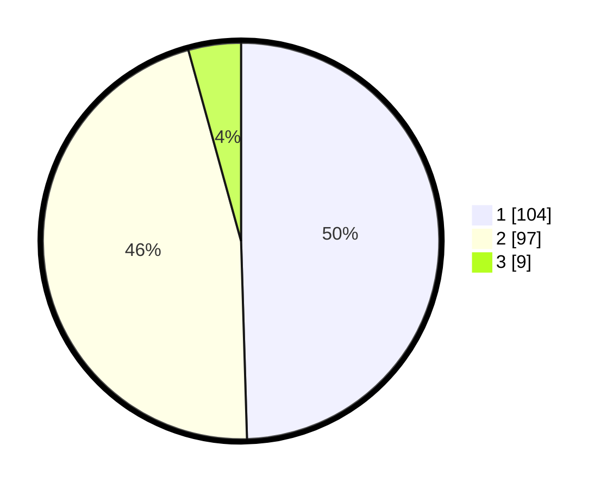

# Hasil

## Grafik

## Tabel

| No. | Nama Paslon    | Suara | Suara (raw) | Persentase |
|:--- |:-------------- | -----:| -----------:| ----------:|
| 1   | ANIES MUHAIMIN | 104   | [104][p-1]  | 49,52      |
| 2   | PRABOWO GIBRAN | 97    | [97][p-2]   | 46,19      |
| 3   | GANJAR MAHFUD  | 9     | [9][p-3]    | 4,29       |

[p-1]: https://github.com/gigit-pemilu/pemilu-2024-11-aceh/blob/main/pilpres/hitung-suara/sub/11-aceh/sub/17-bener-meriah/sub/04-bandar/sub/2042-tawar-sedenge/sub/001-tps/sub/paslon-1.txt
[p-2]: https://github.com/gigit-pemilu/pemilu-2024-11-aceh/blob/main/pilpres/hitung-suara/sub/11-aceh/sub/17-bener-meriah/sub/04-bandar/sub/2042-tawar-sedenge/sub/001-tps/sub/paslon-2.txt
[p-3]: https://github.com/gigit-pemilu/pemilu-2024-11-aceh/blob/main/pilpres/hitung-suara/sub/11-aceh/sub/17-bener-meriah/sub/04-bandar/sub/2042-tawar-sedenge/sub/001-tps/sub/paslon-3.txt

## Foto C Plano

https://sirekap-obj-formc.kpu.go.id/e2cb/pemilu/ppwp/11/17/04/20/42/1117042042001-20240215-052246--90dd1aef-8be7-4e3d-a363-d634a266798f.jpg

https://sirekap-obj-formc.kpu.go.id/e2cb/pemilu/ppwp/11/17/04/20/42/1117042042001-20240215-052429--ca867253-87f1-4b38-9113-84df075fb754.jpg

https://sirekap-obj-formc.kpu.go.id/e2cb/pemilu/ppwp/11/17/04/20/42/1117042042001-20240215-052935--8b99d67f-bcd7-4d29-a609-7008c5af27ba.jpg

## Metadata

| Key        | Value               |
| ---------- | ------------------- |
| Time Stamp | 2024-02-25 22:00:00 |

