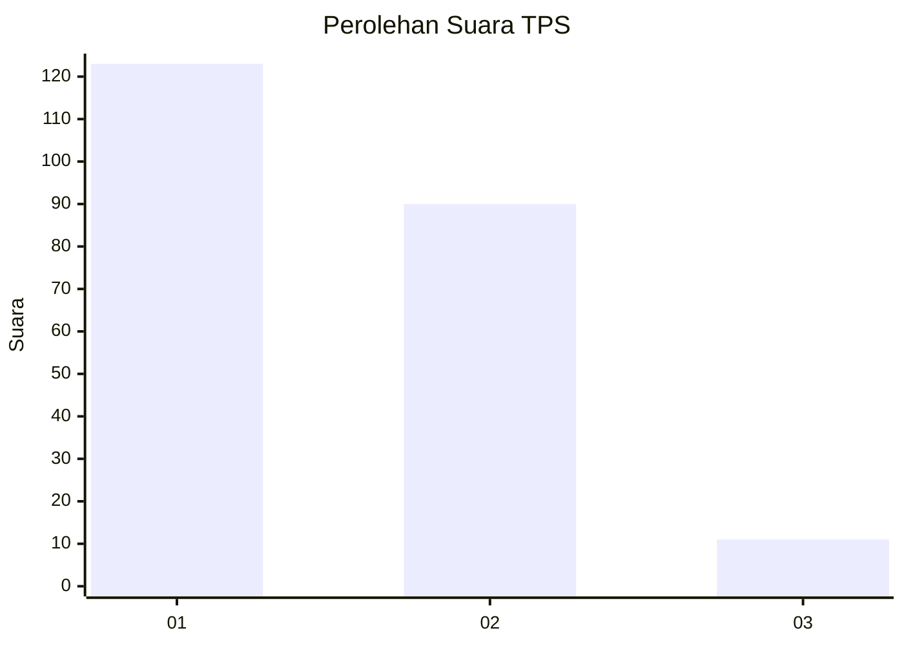
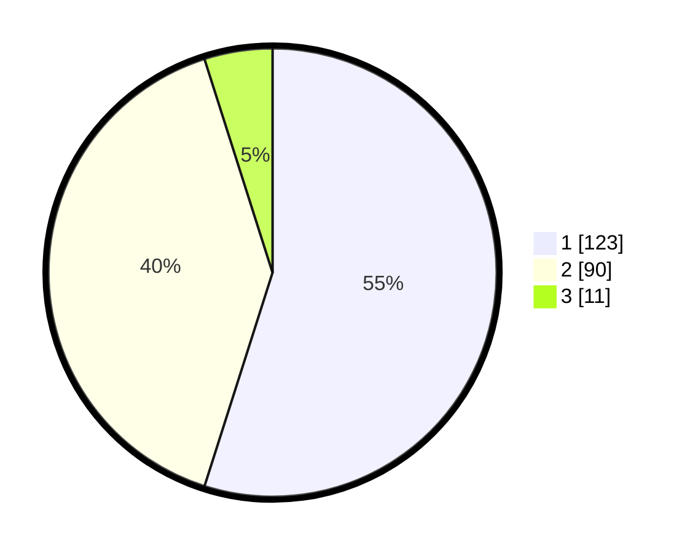

# Hasil

## Grafik

## Tabel

| No. | Nama Paslon    | Suara | Suara (raw) | Persentase |
|:--- |:-------------- | -----:| -----------:| ----------:|
| 1   | ANIES MUHAIMIN | 123   | [123][p-1]  | 54,91      |
| 2   | PRABOWO GIBRAN | 90    | [90][p-2]   | 40,18      |
| 3   | GANJAR MAHFUD  | 11    | [11][p-3]   | 4,91       |

[p-1]: https://github.com/gigit-pemilu/pemilu-2024-11-aceh/blob/main/pilpres/hitung-suara/sub/11-aceh/sub/17-bener-meriah/sub/04-bandar/sub/2042-tawar-sedenge/sub/003-tps/sub/paslon-1.txt
[p-2]: https://github.com/gigit-pemilu/pemilu-2024-11-aceh/blob/main/pilpres/hitung-suara/sub/11-aceh/sub/17-bener-meriah/sub/04-bandar/sub/2042-tawar-sedenge/sub/003-tps/sub/paslon-2.txt
[p-3]: https://github.com/gigit-pemilu/pemilu-2024-11-aceh/blob/main/pilpres/hitung-suara/sub/11-aceh/sub/17-bener-meriah/sub/04-bandar/sub/2042-tawar-sedenge/sub/003-tps/sub/paslon-3.txt

## Foto C Plano

https://sirekap-obj-formc.kpu.go.id/ab5a/pemilu/ppwp/11/17/04/20/42/1117042042003-20240215-021952--96b5d0fa-489b-4e3a-ab75-c5848c0ff1e8.jpg

https://sirekap-obj-formc.kpu.go.id/ab5a/pemilu/ppwp/11/17/04/20/42/1117042042003-20240215-022308--0b3484ed-4f6e-4150-a3fa-8b3a2aa8d228.jpg

https://sirekap-obj-formc.kpu.go.id/ab5a/pemilu/ppwp/11/17/04/20/42/1117042042003-20240215-022523--cee44d42-b878-486d-a6b5-fc1b91881c96.jpg

## Metadata

| Key        | Value               |
| ---------- | ------------------- |
| Time Stamp | 2024-02-24 22:31:28 |

