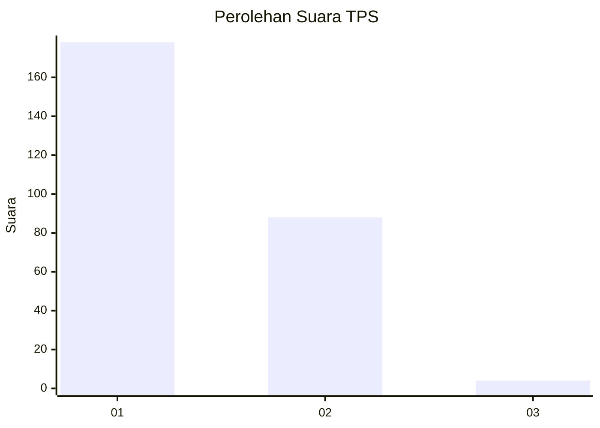
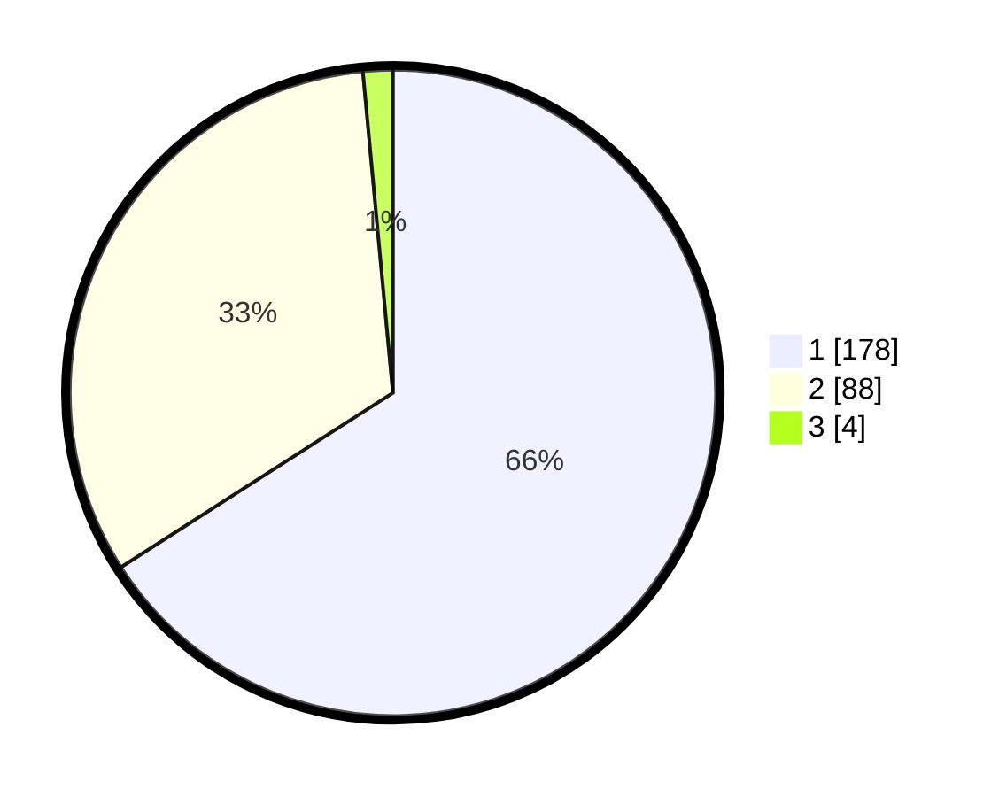

# Hasil

## Grafik

## Tabel

| No. | Nama Paslon    | Suara | Suara (raw) | Persentase |
|:--- |:-------------- | -----:| -----------:| ----------:|
| 1   | ANIES MUHAIMIN | 178   | [178][p-1]  | 65,93      |
| 2   | PRABOWO GIBRAN | 88    | [88][p-2]   | 32,59      |
| 3   | GANJAR MAHFUD  | 4     | [4][p-3]    | 1,48       |

[p-1]: https://github.com/gigit-pemilu/pemilu-2024-11-aceh/blob/main/pilpres/hitung-suara/sub/11-aceh/sub/17-bener-meriah/sub/04-bandar/sub/2043-beranun-teleden/sub/001-tps/sub/paslon-1.txt
[p-2]: https://github.com/gigit-pemilu/pemilu-2024-11-aceh/blob/main/pilpres/hitung-suara/sub/11-aceh/sub/17-bener-meriah/sub/04-bandar/sub/2043-beranun-teleden/sub/001-tps/sub/paslon-2.txt
[p-3]: https://github.com/gigit-pemilu/pemilu-2024-11-aceh/blob/main/pilpres/hitung-suara/sub/11-aceh/sub/17-bener-meriah/sub/04-bandar/sub/2043-beranun-teleden/sub/001-tps/sub/paslon-3.txt

## Foto C Plano

https://sirekap-obj-formc.kpu.go.id/5542/pemilu/ppwp/11/17/04/20/43/1117042043001-20240215-114634--0312ee90-3f7e-46e0-98e1-77f7d1295881.jpg

https://sirekap-obj-formc.kpu.go.id/5542/pemilu/ppwp/11/17/04/20/43/1117042043001-20240215-114736--41faf182-e396-49f9-b95e-7081bd7b3fd5.jpg

https://sirekap-obj-formc.kpu.go.id/5542/pemilu/ppwp/11/17/04/20/43/1117042043001-20240215-114838--bf1315bc-3e1c-40b1-b3f8-5e0c1037fa67.jpg

## Metadata

| Key        | Value               |
| ---------- | ------------------- |
| Time Stamp | 2024-02-24 22:31:28 |

