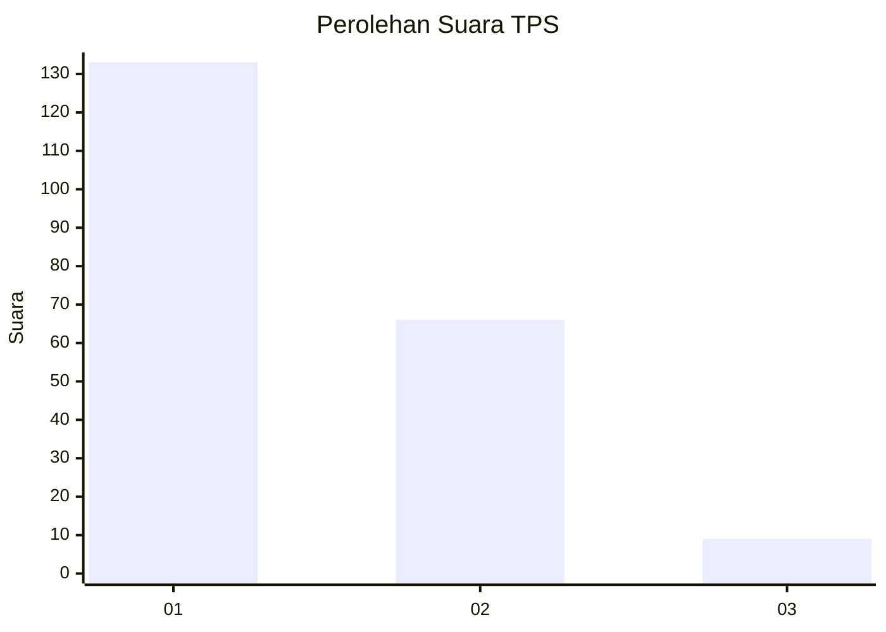
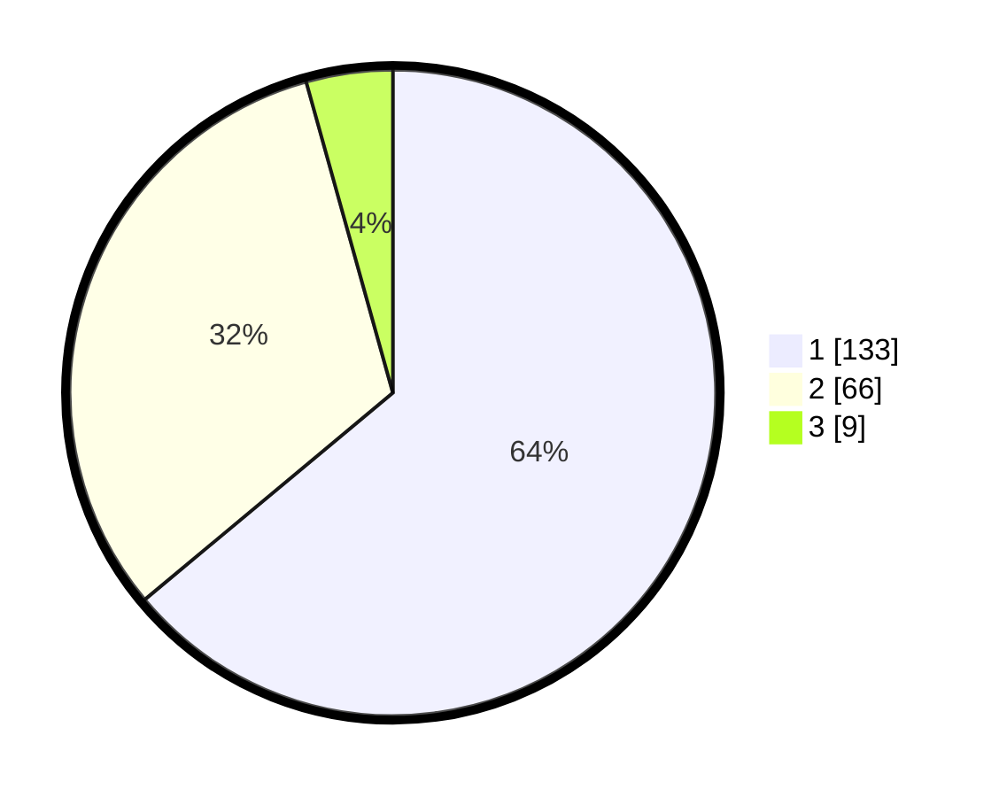

# Hasil

## Grafik

## Tabel

| No. | Nama Paslon    | Suara | Suara (raw) | Persentase |
|:--- |:-------------- | -----:| -----------:| ----------:|
| 1   | ANIES MUHAIMIN | 133   | [133][p-1]  | 63,94      |
| 2   | PRABOWO GIBRAN | 66    | [66][p-2]   | 31,73      |
| 3   | GANJAR MAHFUD  | 9     | [9][p-3]    | 4,33       |

[p-1]: https://github.com/gigit-pemilu/pemilu-2024-11-aceh/blob/main/pilpres/hitung-suara/sub/11-aceh/sub/17-bener-meriah/sub/05-bukit/sub/2001-bale-atu/sub/001-tps/sub/paslon-1.txt
[p-2]: https://github.com/gigit-pemilu/pemilu-2024-11-aceh/blob/main/pilpres/hitung-suara/sub/11-aceh/sub/17-bener-meriah/sub/05-bukit/sub/2001-bale-atu/sub/001-tps/sub/paslon-2.txt
[p-3]: https://github.com/gigit-pemilu/pemilu-2024-11-aceh/blob/main/pilpres/hitung-suara/sub/11-aceh/sub/17-bener-meriah/sub/05-bukit/sub/2001-bale-atu/sub/001-tps/sub/paslon-3.txt

## Foto C Plano

https://sirekap-obj-formc.kpu.go.id/2e58/pemilu/ppwp/11/17/05/20/01/1117052001001-20240214-185738--7a7e90de-8de6-4327-83a3-700007abd7c8.jpg

https://sirekap-obj-formc.kpu.go.id/2e58/pemilu/ppwp/11/17/05/20/01/1117052001001-20240214-190639--07ef039b-b2f6-47e4-abec-8ead9154119f.jpg

https://sirekap-obj-formc.kpu.go.id/2e58/pemilu/ppwp/11/17/05/20/01/1117052001001-20240214-195416--e0a0e47a-7a96-4b90-a797-708079ec1478.jpg

## Metadata

| Key        | Value               |
| ---------- | ------------------- |
| Time Stamp | 2024-02-15 16:30:25 |

