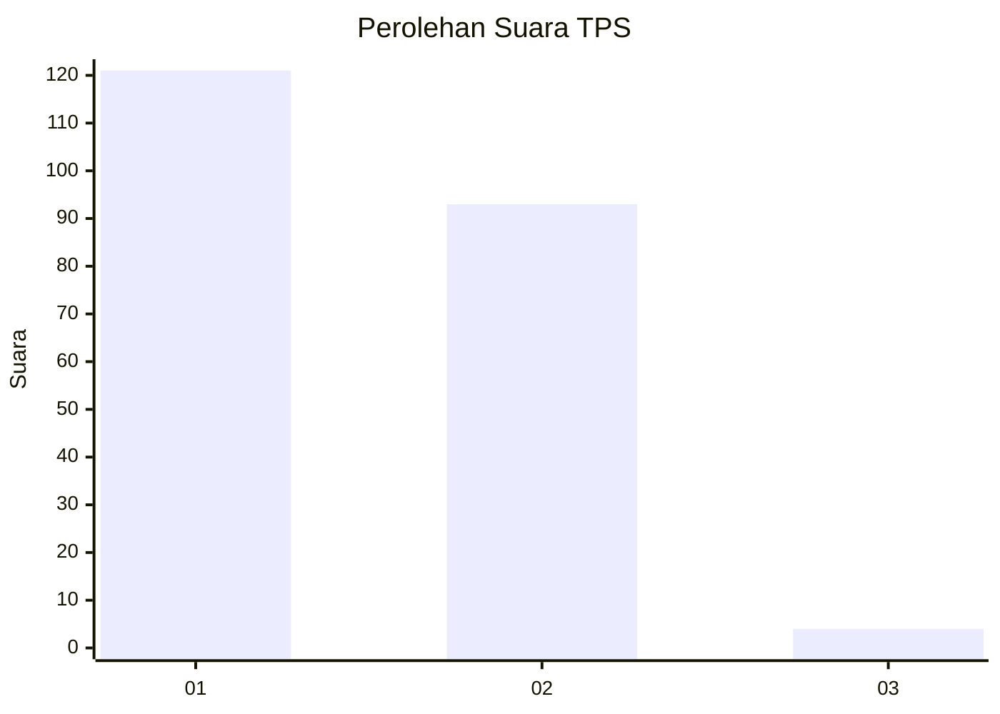
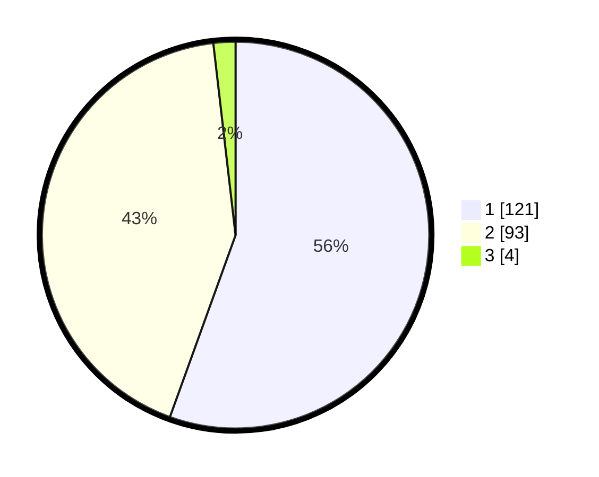

# Hasil

## Grafik

## Tabel

| No. | Nama Paslon    | Suara | Suara (raw) | Persentase |
|:--- |:-------------- | -----:| -----------:| ----------:|
| 1   | ANIES MUHAIMIN | 121   | [121][p-1]  | 55,50      |
| 2   | PRABOWO GIBRAN | 93    | [93][p-2]   | 42,66      |
| 3   | GANJAR MAHFUD  | 4     | [4][p-3]    | 1,83       |

[p-1]: https://github.com/gigit-pemilu/pemilu-2024-11-aceh/blob/main/pilpres/hitung-suara/sub/11-aceh/sub/17-bener-meriah/sub/05-bukit/sub/2001-bale-atu/sub/005-tps/sub/paslon-1.txt
[p-2]: https://github.com/gigit-pemilu/pemilu-2024-11-aceh/blob/main/pilpres/hitung-suara/sub/11-aceh/sub/17-bener-meriah/sub/05-bukit/sub/2001-bale-atu/sub/005-tps/sub/paslon-2.txt
[p-3]: https://github.com/gigit-pemilu/pemilu-2024-11-aceh/blob/main/pilpres/hitung-suara/sub/11-aceh/sub/17-bener-meriah/sub/05-bukit/sub/2001-bale-atu/sub/005-tps/sub/paslon-3.txt

## Foto C Plano

https://sirekap-obj-formc.kpu.go.id/6a38/pemilu/ppwp/11/17/05/20/01/1117052001005-20240214-222702--d289600f-43b6-4fe2-a475-1ead2f9c0342.jpg

https://sirekap-obj-formc.kpu.go.id/6a38/pemilu/ppwp/11/17/05/20/01/1117052001005-20240214-222841--0fee1b7c-6f60-47c1-82d4-add8b64dffee.jpg

https://sirekap-obj-formc.kpu.go.id/6a38/pemilu/ppwp/11/17/05/20/01/1117052001005-20240214-223104--1f7bfd57-4943-478b-80c7-9cd42aa8f9d9.jpg

## Metadata

| Key        | Value               |
| ---------- | ------------------- |
| Time Stamp | 2024-02-24 22:31:28 |

