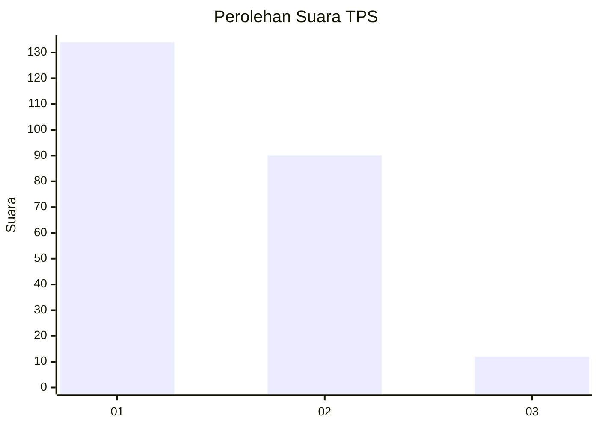
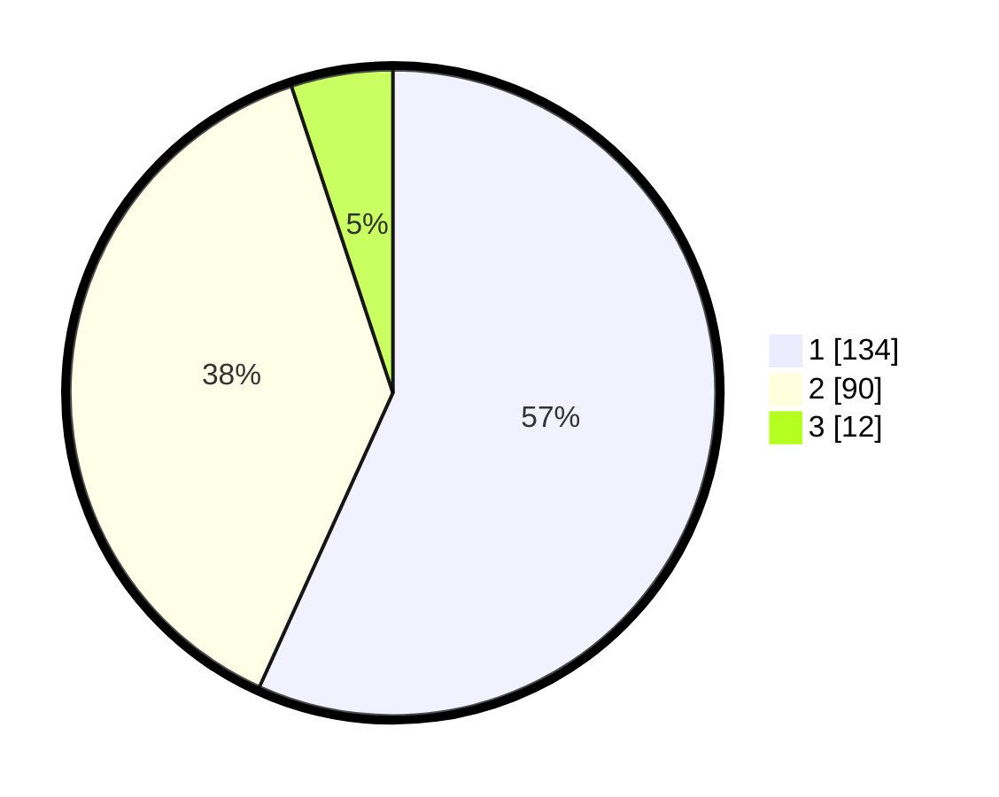

# Hasil

## Grafik

## Tabel

| No. | Nama Paslon    | Suara | Suara (raw) | Persentase |
|:--- |:-------------- | -----:| -----------:| ----------:|
| 1   | ANIES MUHAIMIN | 134   | [134][p-1]  | 56,78      |
| 2   | PRABOWO GIBRAN | 90    | [90][p-2]   | 38,14      |
| 3   | GANJAR MAHFUD  | 12    | [12][p-3]   | 5,08       |

[p-1]: https://github.com/gigit-pemilu/pemilu-2024-11-aceh/blob/main/pilpres/hitung-suara/sub/11-aceh/sub/17-bener-meriah/sub/05-bukit/sub/2002-bale-redelong/sub/004-tps/sub/paslon-1.txt
[p-2]: https://github.com/gigit-pemilu/pemilu-2024-11-aceh/blob/main/pilpres/hitung-suara/sub/11-aceh/sub/17-bener-meriah/sub/05-bukit/sub/2002-bale-redelong/sub/004-tps/sub/paslon-2.txt
[p-3]: https://github.com/gigit-pemilu/pemilu-2024-11-aceh/blob/main/pilpres/hitung-suara/sub/11-aceh/sub/17-bener-meriah/sub/05-bukit/sub/2002-bale-redelong/sub/004-tps/sub/paslon-3.txt

## Foto C Plano

https://sirekap-obj-formc.kpu.go.id/bc5e/pemilu/ppwp/11/17/05/20/02/1117052002004-20240215-164135--c4fda388-524b-401f-8eb4-2cac0bb3af00.jpg

https://sirekap-obj-formc.kpu.go.id/bc5e/pemilu/ppwp/11/17/05/20/02/1117052002004-20240215-164408--f4da5908-3db8-4bdd-8101-9b8ced2becde.jpg

https://sirekap-obj-formc.kpu.go.id/bc5e/pemilu/ppwp/11/17/05/20/02/1117052002004-20240215-164619--d31802e2-8f88-48a4-9b7a-f3fcfc99611a.jpg

## Metadata

| Key        | Value               |
| ---------- | ------------------- |
| Time Stamp | 2024-02-24 22:31:28 |

