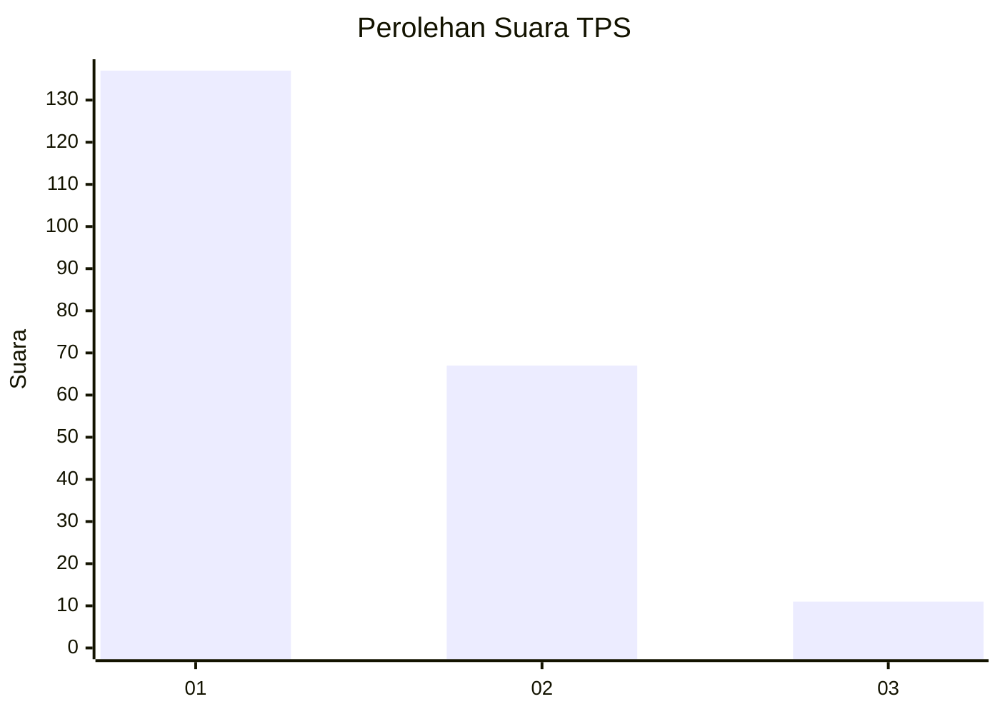
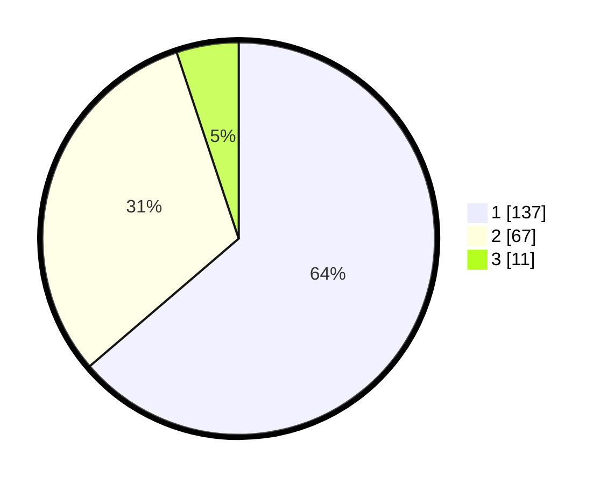

# Hasil

## Grafik

## Tabel

| No. | Nama Paslon    | Suara | Suara (raw) | Persentase |
|:--- |:-------------- | -----:| -----------:| ----------:|
| 1   | ANIES MUHAIMIN | 137   | [137][p-1]  | 63,72      |
| 2   | PRABOWO GIBRAN | 67    | [67][p-2]   | 31,16      |
| 3   | GANJAR MAHFUD  | 11    | [11][p-3]   | 5,12       |

[p-1]: https://github.com/gigit-pemilu/pemilu-2024-11-aceh/blob/main/pilpres/hitung-suara/sub/11-aceh/sub/17-bener-meriah/sub/05-bukit/sub/2005-blang-sentang/sub/001-tps/sub/paslon-1.txt
[p-2]: https://github.com/gigit-pemilu/pemilu-2024-11-aceh/blob/main/pilpres/hitung-suara/sub/11-aceh/sub/17-bener-meriah/sub/05-bukit/sub/2005-blang-sentang/sub/001-tps/sub/paslon-2.txt
[p-3]: https://github.com/gigit-pemilu/pemilu-2024-11-aceh/blob/main/pilpres/hitung-suara/sub/11-aceh/sub/17-bener-meriah/sub/05-bukit/sub/2005-blang-sentang/sub/001-tps/sub/paslon-3.txt

## Foto C Plano

https://sirekap-obj-formc.kpu.go.id/1784/pemilu/ppwp/11/17/05/20/05/1117052005001-20240215-173816--213faaaf-2676-4cff-ab5d-66e8a3eacbcc.jpg

https://sirekap-obj-formc.kpu.go.id/1784/pemilu/ppwp/11/17/05/20/05/1117052005001-20240215-173951--3aa604b1-6f9e-448b-9b8d-fd2f04eedc1c.jpg

https://sirekap-obj-formc.kpu.go.id/1784/pemilu/ppwp/11/17/05/20/05/1117052005001-20240215-174123--d5e7208c-2155-45d9-8b40-9861bffa8a02.jpg

## Metadata

| Key        | Value               |
| ---------- | ------------------- |
| Time Stamp | 2024-02-25 12:00:00 |

