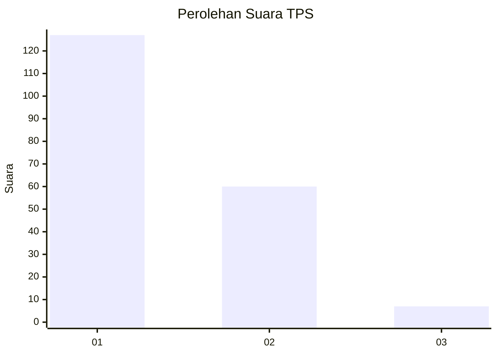
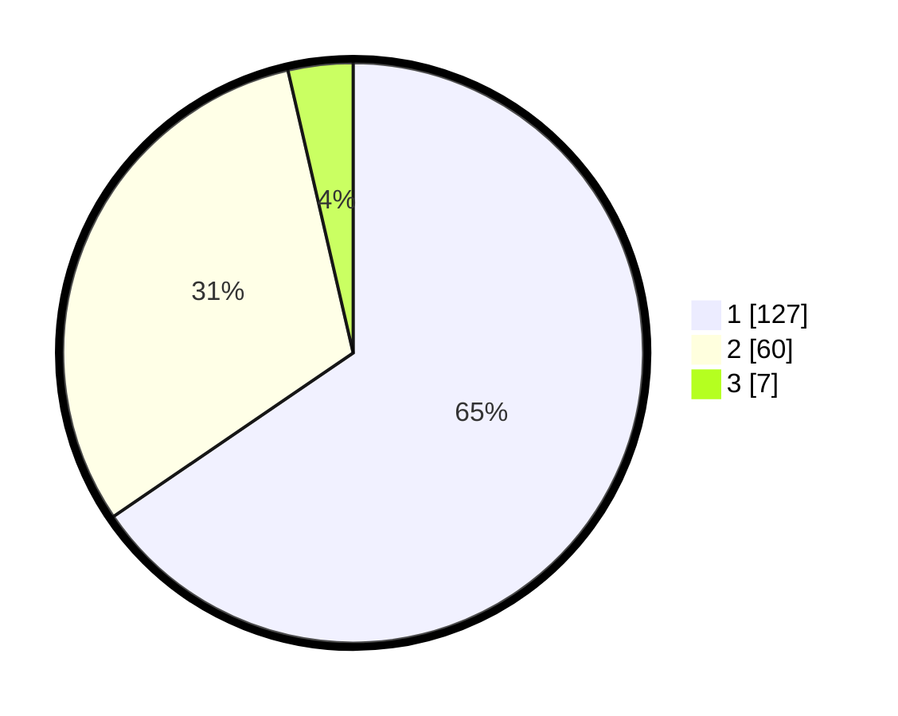

# Hasil

## Grafik

## Tabel

| No. | Nama Paslon    | Suara | Suara (raw) | Persentase |
|:--- |:-------------- | -----:| -----------:| ----------:|
| 1   | ANIES MUHAIMIN | 127   | [127][p-1]  | 65,46      |
| 2   | PRABOWO GIBRAN | 60    | [60][p-2]   | 30,93      |
| 3   | GANJAR MAHFUD  | 7     | [7][p-3]    | 3,61       |

[p-1]: https://github.com/gigit-pemilu/pemilu-2024-11-aceh/blob/main/pilpres/hitung-suara/sub/11-aceh/sub/17-bener-meriah/sub/05-bukit/sub/2009-delung-tue/sub/001-tps/sub/paslon-1.txt
[p-2]: https://github.com/gigit-pemilu/pemilu-2024-11-aceh/blob/main/pilpres/hitung-suara/sub/11-aceh/sub/17-bener-meriah/sub/05-bukit/sub/2009-delung-tue/sub/001-tps/sub/paslon-2.txt
[p-3]: https://github.com/gigit-pemilu/pemilu-2024-11-aceh/blob/main/pilpres/hitung-suara/sub/11-aceh/sub/17-bener-meriah/sub/05-bukit/sub/2009-delung-tue/sub/001-tps/sub/paslon-3.txt

## Foto C Plano

https://sirekap-obj-formc.kpu.go.id/54de/pemilu/ppwp/11/17/05/20/09/1117052009001-20240215-015901--bd35069f-d3e9-405c-aa8d-ff7f55cdd97f.jpg

https://sirekap-obj-formc.kpu.go.id/54de/pemilu/ppwp/11/17/05/20/09/1117052009001-20240215-023249--47bc5cba-cb81-4e83-a99c-190002abb173.jpg

https://sirekap-obj-formc.kpu.go.id/54de/pemilu/ppwp/11/17/05/20/09/1117052009001-20240215-012449--1bfb6dd7-4bab-4405-aef6-64d68bbfd96f.jpg

## Metadata

| Key        | Value               |
| ---------- | ------------------- |
| Time Stamp | 2024-02-15 16:30:25 |

