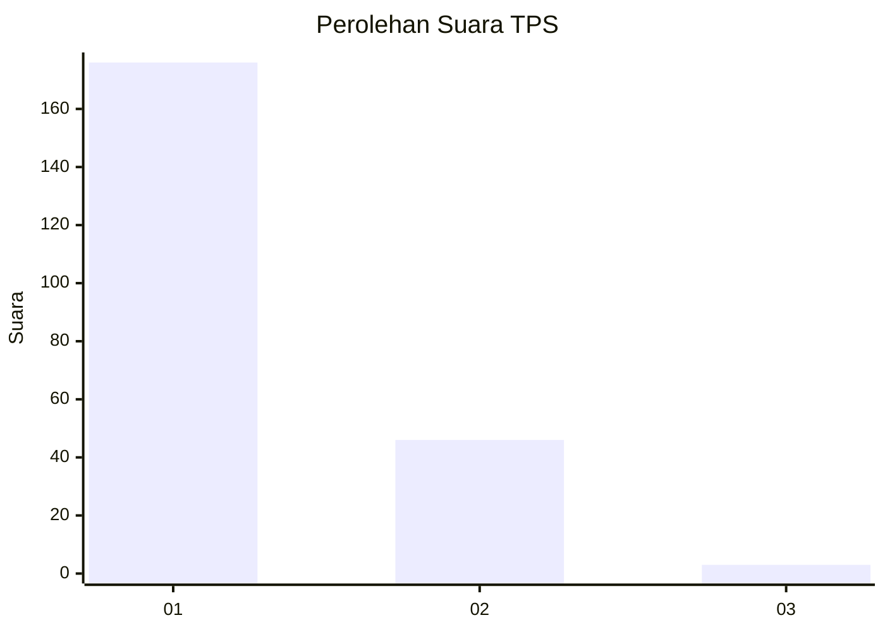
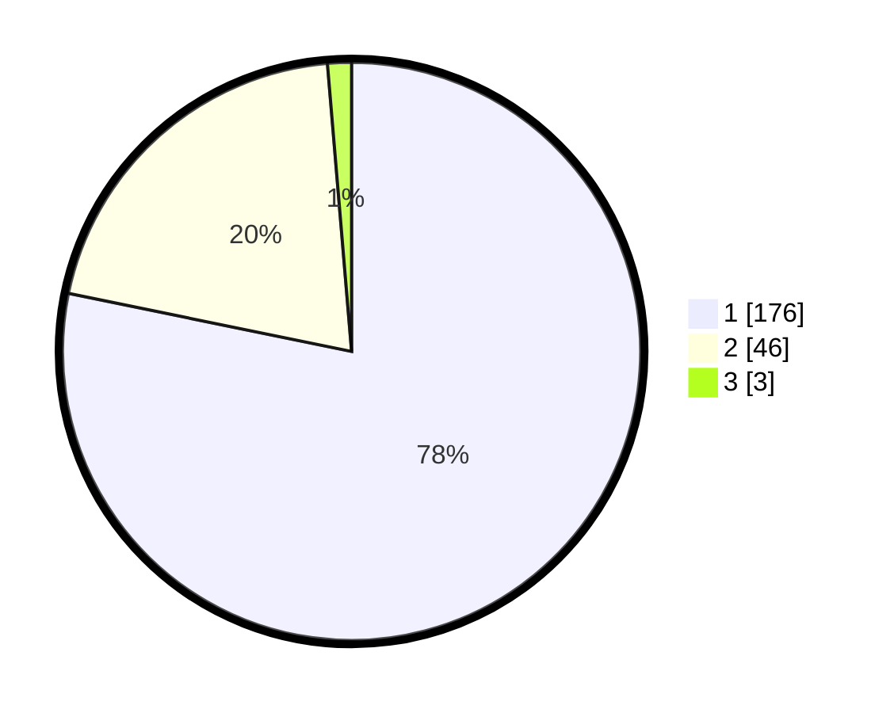

# Hasil

## Grafik

## Tabel

| No. | Nama Paslon    | Suara | Suara (raw) | Persentase |
|:--- |:-------------- | -----:| -----------:| ----------:|
| 1   | ANIES MUHAIMIN | 176   | [176][p-1]  | 78,22      |
| 2   | PRABOWO GIBRAN | 46    | [46][p-2]   | 20,44      |
| 3   | GANJAR MAHFUD  | 3     | [3][p-3]    | 1,33       |

[p-1]: https://github.com/gigit-pemilu/pemilu-2024-11-aceh/blob/main/pilpres/hitung-suara/sub/11-aceh/sub/17-bener-meriah/sub/05-bukit/sub/2009-delung-tue/sub/003-tps/sub/paslon-1.txt
[p-2]: https://github.com/gigit-pemilu/pemilu-2024-11-aceh/blob/main/pilpres/hitung-suara/sub/11-aceh/sub/17-bener-meriah/sub/05-bukit/sub/2009-delung-tue/sub/003-tps/sub/paslon-2.txt
[p-3]: https://github.com/gigit-pemilu/pemilu-2024-11-aceh/blob/main/pilpres/hitung-suara/sub/11-aceh/sub/17-bener-meriah/sub/05-bukit/sub/2009-delung-tue/sub/003-tps/sub/paslon-3.txt

## Foto C Plano

https://sirekap-obj-formc.kpu.go.id/1d89/pemilu/ppwp/11/17/05/20/09/1117052009003-20240215-142647--499ce259-4659-4d28-94b9-61469a884a6d.jpg

https://sirekap-obj-formc.kpu.go.id/1d89/pemilu/ppwp/11/17/05/20/09/1117052009003-20240215-004243--3c222376-f440-47c0-93e0-b65752de655e.jpg

https://sirekap-obj-formc.kpu.go.id/1d89/pemilu/ppwp/11/17/05/20/09/1117052009003-20240215-004812--666223e8-1386-46e0-849c-1846f77dadb2.jpg

## Metadata

| Key        | Value               |
| ---------- | ------------------- |
| Time Stamp | 2024-02-15 16:30:25 |

