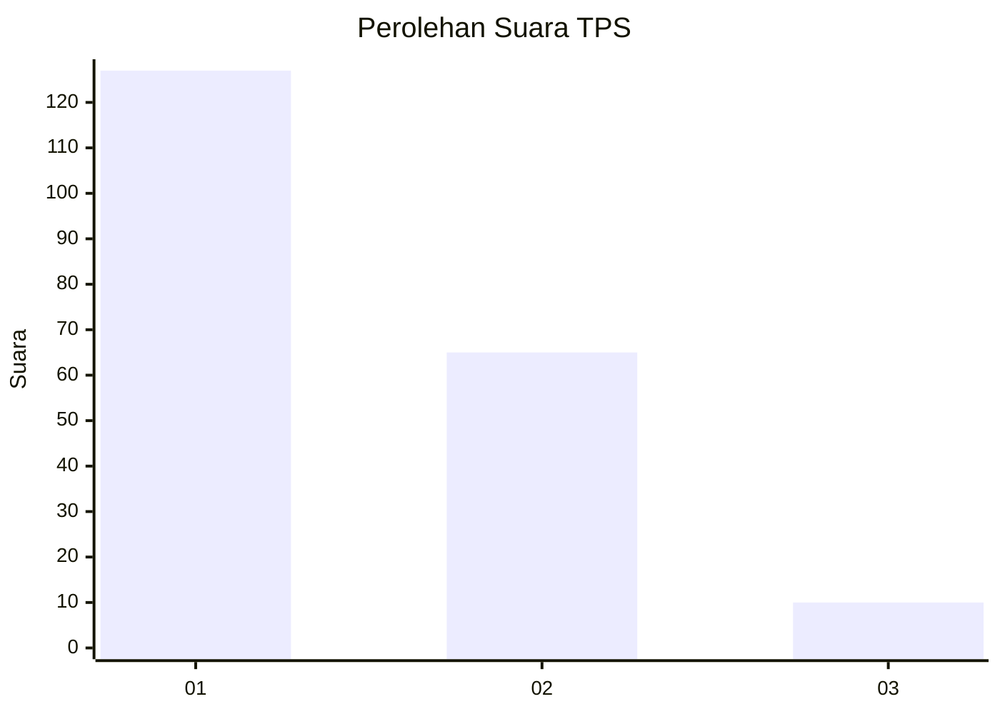
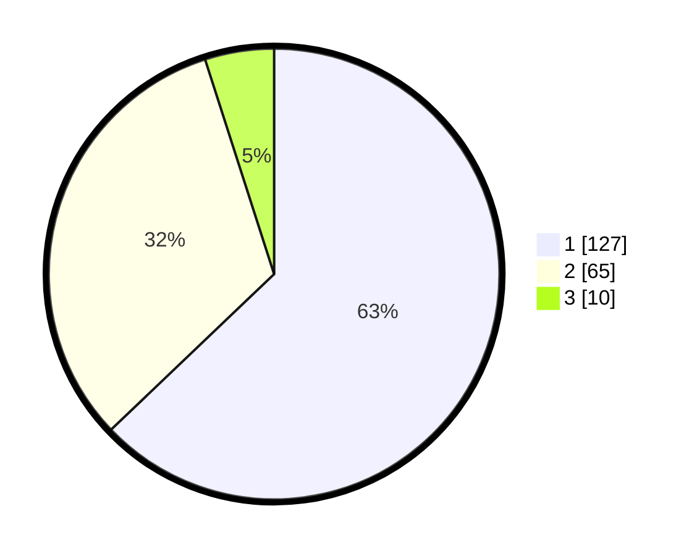

# Hasil

## Grafik

## Tabel

| No. | Nama Paslon    | Suara | Suara (raw) | Persentase |
|:--- |:-------------- | -----:| -----------:| ----------:|
| 1   | ANIES MUHAIMIN | 127   | [127][p-1]  | 62,87      |
| 2   | PRABOWO GIBRAN | 65    | [65][p-2]   | 32,18      |
| 3   | GANJAR MAHFUD  | 10    | [10][p-3]   | 4,95       |

[p-1]: https://github.com/gigit-pemilu/pemilu-2024-11-aceh/blob/main/pilpres/hitung-suara/sub/11-aceh/sub/17-bener-meriah/sub/05-bukit/sub/2010-hakim-tungul-naru/sub/002-tps/sub/paslon-1.txt
[p-2]: https://github.com/gigit-pemilu/pemilu-2024-11-aceh/blob/main/pilpres/hitung-suara/sub/11-aceh/sub/17-bener-meriah/sub/05-bukit/sub/2010-hakim-tungul-naru/sub/002-tps/sub/paslon-2.txt
[p-3]: https://github.com/gigit-pemilu/pemilu-2024-11-aceh/blob/main/pilpres/hitung-suara/sub/11-aceh/sub/17-bener-meriah/sub/05-bukit/sub/2010-hakim-tungul-naru/sub/002-tps/sub/paslon-3.txt

## Foto C Plano

https://sirekap-obj-formc.kpu.go.id/e725/pemilu/ppwp/11/17/05/20/10/1117052010002-20240223-093154--576d9c94-bc2b-4e28-bd6e-c62bcd9a90e4.jpg

https://sirekap-obj-formc.kpu.go.id/e725/pemilu/ppwp/11/17/05/20/10/1117052010002-20240214-212504--18ee2bfd-fa69-41ee-8c3b-a03ee04089bd.jpg

https://sirekap-obj-formc.kpu.go.id/e725/pemilu/ppwp/11/17/05/20/10/1117052010002-20240214-212558--4e341738-8ce6-4727-82b5-3481dd74a78f.jpg

## Metadata

| Key        | Value               |
| ---------- | ------------------- |
| Time Stamp | 2024-02-24 22:31:28 |

