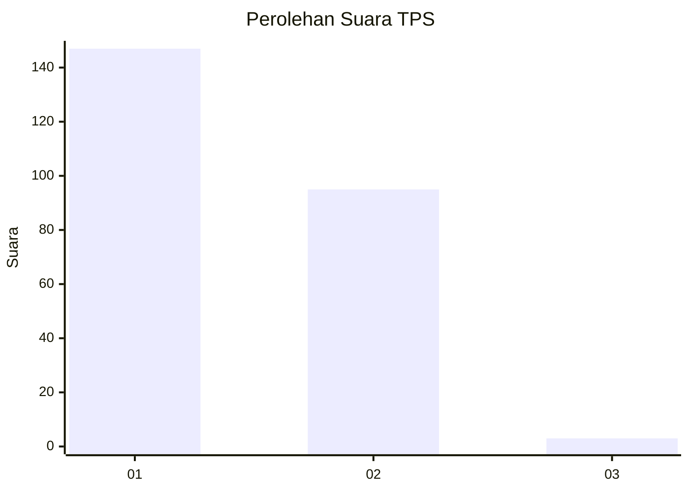
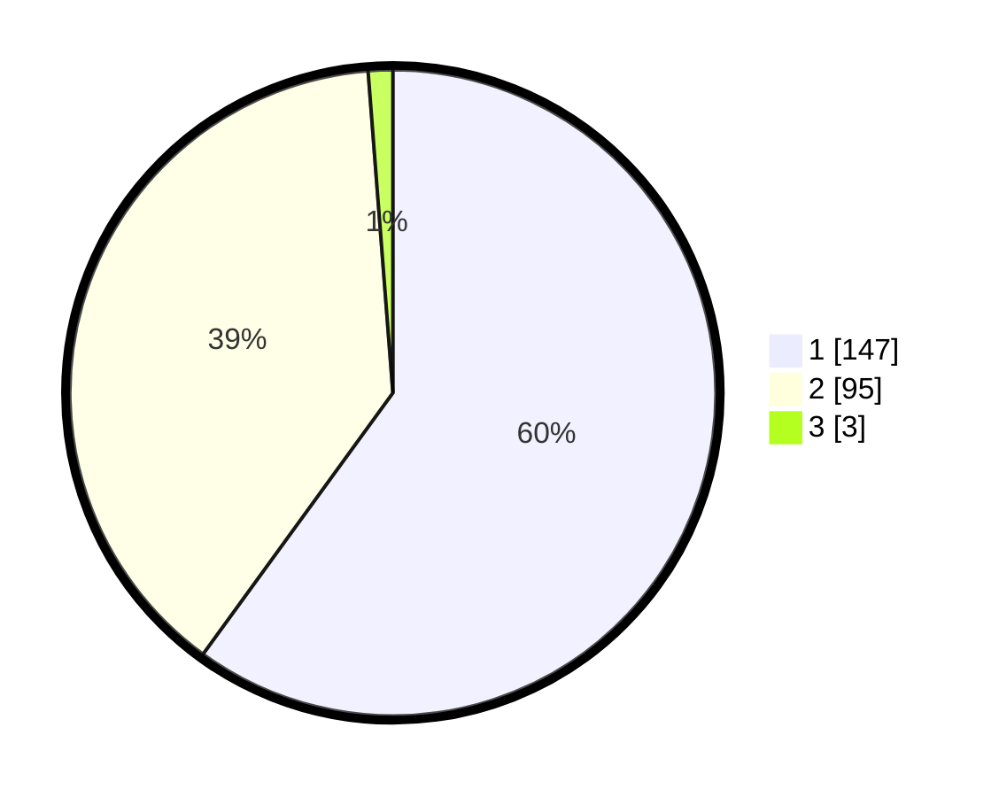

# Hasil

## Grafik

## Tabel

| No. | Nama Paslon    | Suara | Suara (raw) | Persentase |
|:--- |:-------------- | -----:| -----------:| ----------:|
| 1   | ANIES MUHAIMIN | 147   | [147][p-1]  | 60,00      |
| 2   | PRABOWO GIBRAN | 95    | [95][p-2]   | 38,78      |
| 3   | GANJAR MAHFUD  | 3     | [3][p-3]    | 1,22       |

[p-1]: https://github.com/gigit-pemilu/pemilu-2024-11-aceh/blob/main/pilpres/hitung-suara/sub/11-aceh/sub/17-bener-meriah/sub/05-bukit/sub/2017-reje-guru/sub/002-tps/sub/paslon-1.txt
[p-2]: https://github.com/gigit-pemilu/pemilu-2024-11-aceh/blob/main/pilpres/hitung-suara/sub/11-aceh/sub/17-bener-meriah/sub/05-bukit/sub/2017-reje-guru/sub/002-tps/sub/paslon-2.txt
[p-3]: https://github.com/gigit-pemilu/pemilu-2024-11-aceh/blob/main/pilpres/hitung-suara/sub/11-aceh/sub/17-bener-meriah/sub/05-bukit/sub/2017-reje-guru/sub/002-tps/sub/paslon-3.txt

## Foto C Plano

https://sirekap-obj-formc.kpu.go.id/38b0/pemilu/ppwp/11/17/05/20/17/1117052017002-20240215-042907--a7fb73cd-c58a-4c35-b9a5-30fc948be45e.jpg

https://sirekap-obj-formc.kpu.go.id/38b0/pemilu/ppwp/11/17/05/20/17/1117052017002-20240215-163140--91e5a949-19d0-4ad7-b861-70af75b04528.jpg

https://sirekap-obj-formc.kpu.go.id/38b0/pemilu/ppwp/11/17/05/20/17/1117052017002-20240215-162525--280d381e-2764-4a37-98de-85c6251a6921.jpg

## Metadata

| Key        | Value               |
| ---------- | ------------------- |
| Time Stamp | 2024-02-24 22:31:28 |

