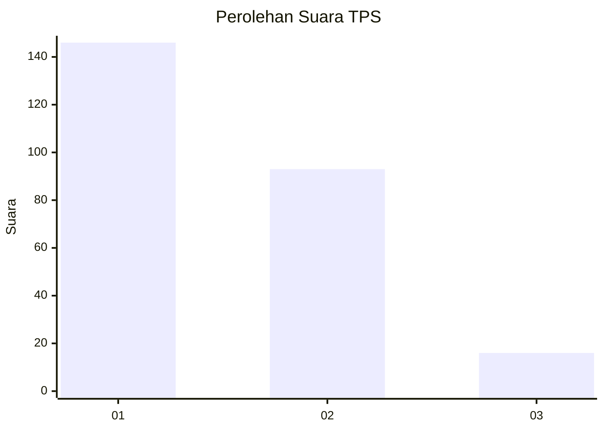
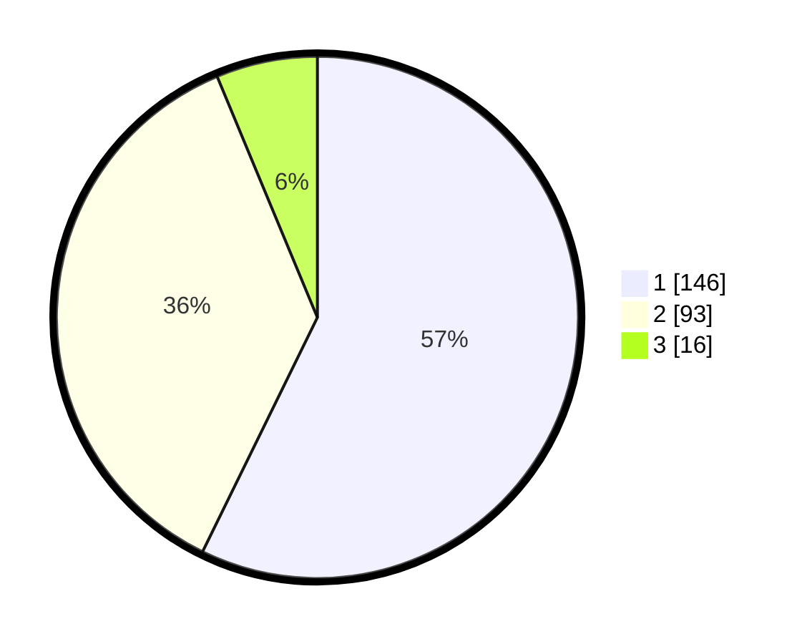

# Hasil

## Grafik

## Tabel

| No. | Nama Paslon    | Suara | Suara (raw) | Persentase |
|:--- |:-------------- | -----:| -----------:| ----------:|
| 1   | ANIES MUHAIMIN | 146   | [146][p-1]  | 57,25      |
| 2   | PRABOWO GIBRAN | 93    | [93][p-2]   | 36,47      |
| 3   | GANJAR MAHFUD  | 16    | [16][p-3]   | 6,27       |

[p-1]: https://github.com/gigit-pemilu/pemilu-2024-11-aceh/blob/main/pilpres/hitung-suara/sub/11-aceh/sub/17-bener-meriah/sub/05-bukit/sub/2018-rembele/sub/003-tps/sub/paslon-1.txt
[p-2]: https://github.com/gigit-pemilu/pemilu-2024-11-aceh/blob/main/pilpres/hitung-suara/sub/11-aceh/sub/17-bener-meriah/sub/05-bukit/sub/2018-rembele/sub/003-tps/sub/paslon-2.txt
[p-3]: https://github.com/gigit-pemilu/pemilu-2024-11-aceh/blob/main/pilpres/hitung-suara/sub/11-aceh/sub/17-bener-meriah/sub/05-bukit/sub/2018-rembele/sub/003-tps/sub/paslon-3.txt

## Foto C Plano

https://sirekap-obj-formc.kpu.go.id/31f3/pemilu/ppwp/11/17/05/20/18/1117052018003-20240214-191301--3fa620e3-eb06-41ae-92e7-6711b4ceeb38.jpg

https://sirekap-obj-formc.kpu.go.id/31f3/pemilu/ppwp/11/17/05/20/18/1117052018003-20240214-190213--5dd40b0a-9f60-4a5e-a104-eb84eee2b6dc.jpg

https://sirekap-obj-formc.kpu.go.id/31f3/pemilu/ppwp/11/17/05/20/18/1117052018003-20240214-185614--06bc8200-3dfe-4625-a84b-5fee7d62a4cb.jpg

## Metadata

| Key        | Value               |
| ---------- | ------------------- |
| Time Stamp | 2024-02-14 21:46:01 |

