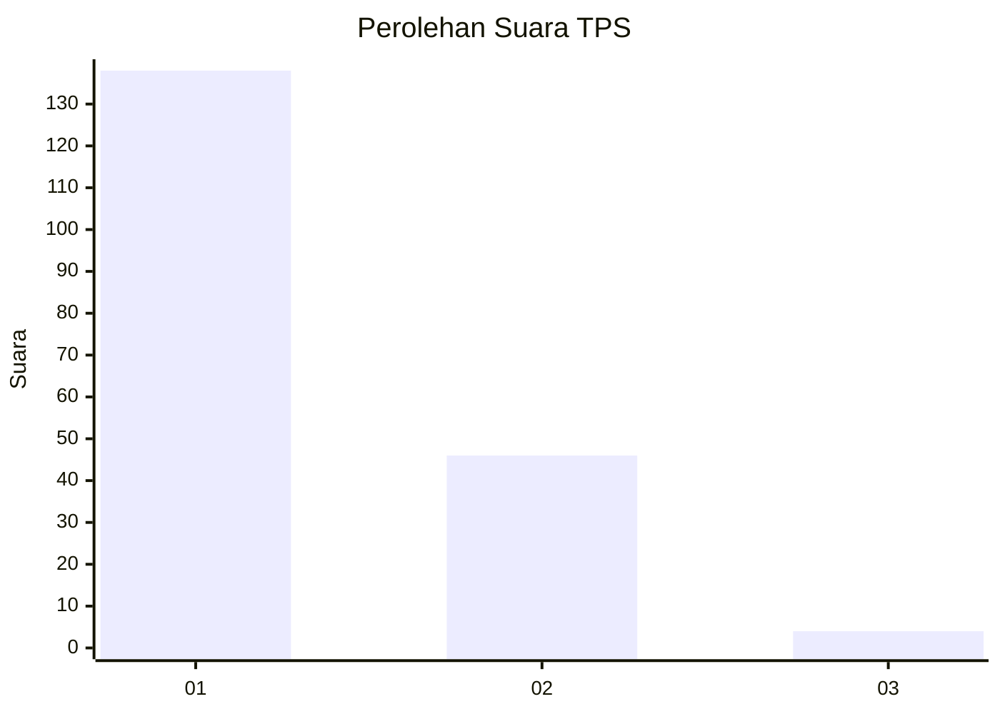
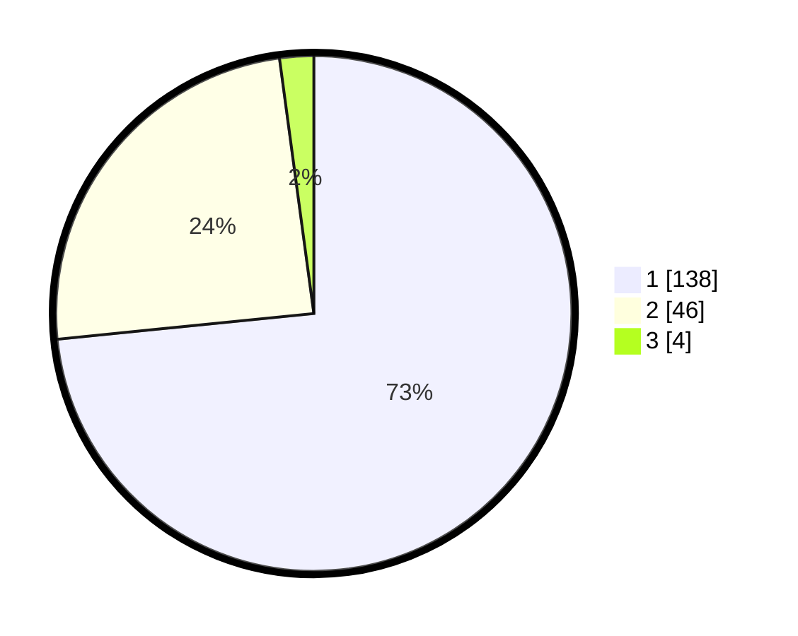

# Hasil

## Grafik

## Tabel

| No. | Nama Paslon    | Suara | Suara (raw) | Persentase |
|:--- |:-------------- | -----:| -----------:| ----------:|
| 1   | ANIES MUHAIMIN | 138   | [138][p-1]  | 73,40      |
| 2   | PRABOWO GIBRAN | 46    | [46][p-2]   | 24,47      |
| 3   | GANJAR MAHFUD  | 4     | [4][p-3]    | 2,13       |

[p-1]: https://github.com/gigit-pemilu/pemilu-2024-11-aceh/blob/main/pilpres/hitung-suara/sub/11-aceh/sub/17-bener-meriah/sub/05-bukit/sub/2024-uning-bersah/sub/001-tps/sub/paslon-1.txt
[p-2]: https://github.com/gigit-pemilu/pemilu-2024-11-aceh/blob/main/pilpres/hitung-suara/sub/11-aceh/sub/17-bener-meriah/sub/05-bukit/sub/2024-uning-bersah/sub/001-tps/sub/paslon-2.txt
[p-3]: https://github.com/gigit-pemilu/pemilu-2024-11-aceh/blob/main/pilpres/hitung-suara/sub/11-aceh/sub/17-bener-meriah/sub/05-bukit/sub/2024-uning-bersah/sub/001-tps/sub/paslon-3.txt

## Foto C Plano

https://sirekap-obj-formc.kpu.go.id/a945/pemilu/ppwp/11/17/05/20/24/1117052024001-20240215-101141--ad262f95-2bc1-4cb8-8d2d-08fb42f44c39.jpg

https://sirekap-obj-formc.kpu.go.id/a945/pemilu/ppwp/11/17/05/20/24/1117052024001-20240215-112716--0b80b730-42be-467d-b0fc-ba633471788b.jpg

https://sirekap-obj-formc.kpu.go.id/a945/pemilu/ppwp/11/17/05/20/24/1117052024001-20240215-112954--131c5688-e8ba-409f-875e-b415fd3266c7.jpg

## Metadata

| Key        | Value               |
| ---------- | ------------------- |
| Time Stamp | 2024-02-24 22:31:28 |

