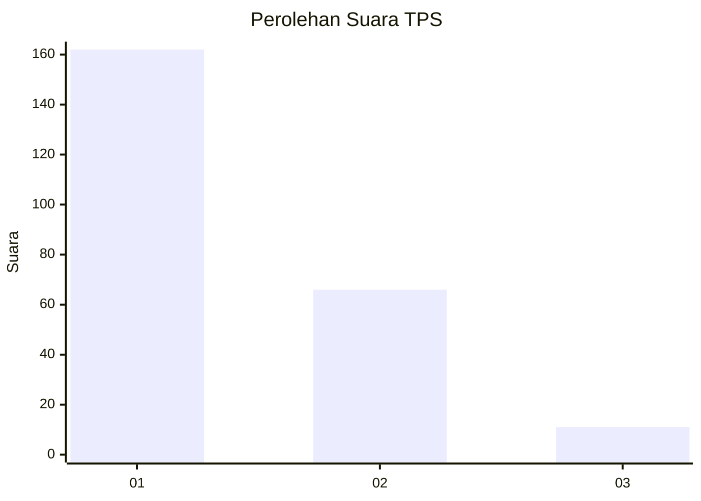
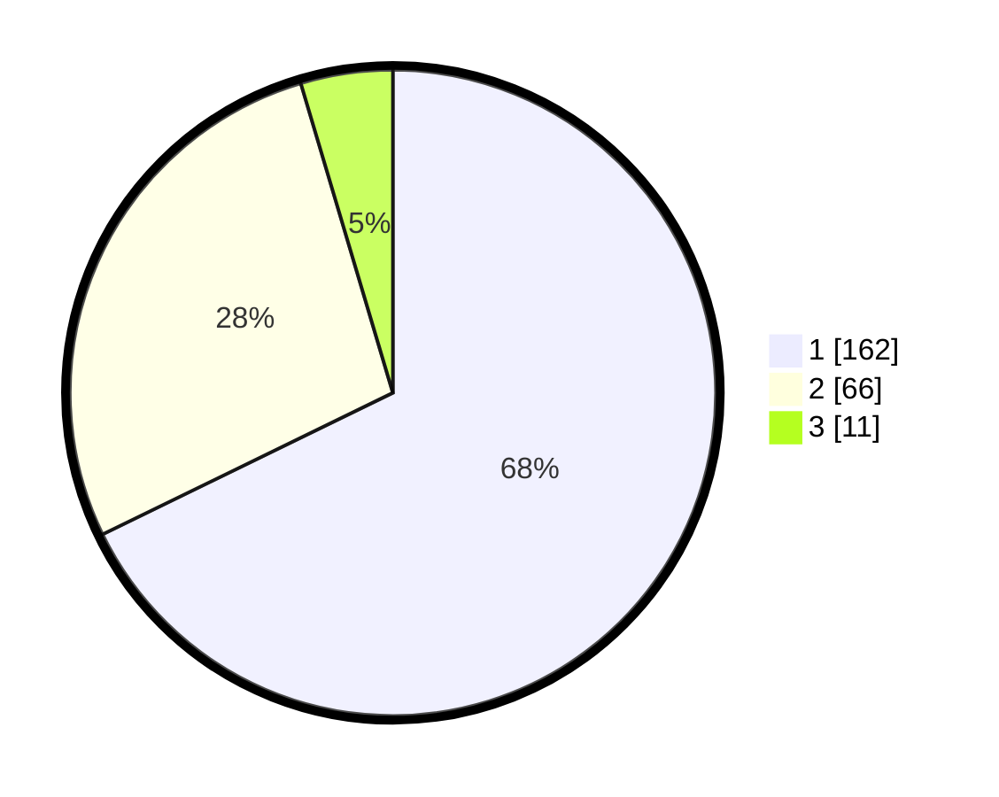

# Hasil

## Grafik

## Tabel

| No. | Nama Paslon    | Suara | Suara (raw) | Persentase |
|:--- |:-------------- | -----:| -----------:| ----------:|
| 1   | ANIES MUHAIMIN | 162   | [162][p-1]  | 67,78      |
| 2   | PRABOWO GIBRAN | 66    | [66][p-2]   | 27,62      |
| 3   | GANJAR MAHFUD  | 11    | [11][p-3]   | 4,60       |

[p-1]: https://github.com/gigit-pemilu/pemilu-2024-11-aceh/blob/main/pilpres/hitung-suara/sub/11-aceh/sub/17-bener-meriah/sub/05-bukit/sub/2025-uning-teritit/sub/002-tps/sub/paslon-1.txt
[p-2]: https://github.com/gigit-pemilu/pemilu-2024-11-aceh/blob/main/pilpres/hitung-suara/sub/11-aceh/sub/17-bener-meriah/sub/05-bukit/sub/2025-uning-teritit/sub/002-tps/sub/paslon-2.txt
[p-3]: https://github.com/gigit-pemilu/pemilu-2024-11-aceh/blob/main/pilpres/hitung-suara/sub/11-aceh/sub/17-bener-meriah/sub/05-bukit/sub/2025-uning-teritit/sub/002-tps/sub/paslon-3.txt

## Foto C Plano

https://sirekap-obj-formc.kpu.go.id/13c8/pemilu/ppwp/11/17/05/20/25/1117052025002-20240215-092802--af78d8f6-d18f-45be-b3c0-8ce523927e66.jpg

https://sirekap-obj-formc.kpu.go.id/13c8/pemilu/ppwp/11/17/05/20/25/1117052025002-20240215-081518--87830781-0099-46d1-87ae-3a288bcfdb6c.jpg

https://sirekap-obj-formc.kpu.go.id/13c8/pemilu/ppwp/11/17/05/20/25/1117052025002-20240215-081553--de606da4-60d5-411b-b209-cf9f73e88824.jpg

## Metadata

| Key        | Value               |
| ---------- | ------------------- |
| Time Stamp | 2024-02-24 22:31:28 |

