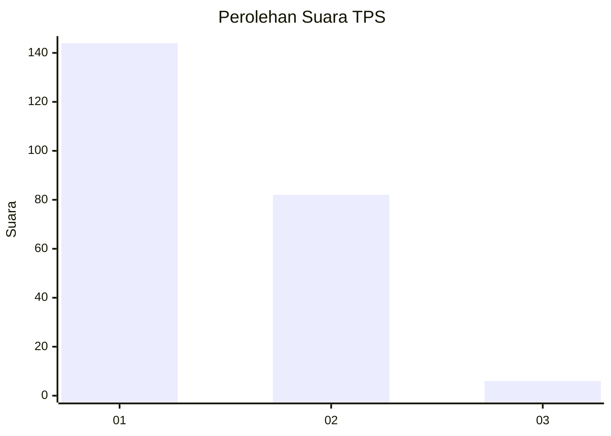
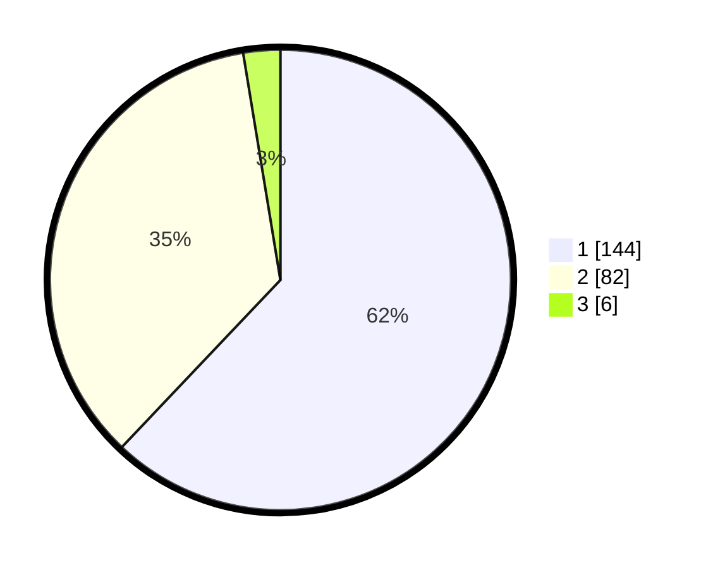

# Hasil

## Grafik

## Tabel

| No. | Nama Paslon    | Suara | Suara (raw) | Persentase |
|:--- |:-------------- | -----:| -----------:| ----------:|
| 1   | ANIES MUHAIMIN | 144   | [144][p-1]  | 62,07      |
| 2   | PRABOWO GIBRAN | 82    | [82][p-2]   | 35,34      |
| 3   | GANJAR MAHFUD  | 6     | [6][p-3]    | 2,59       |

[p-1]: https://github.com/gigit-pemilu/pemilu-2024-11-aceh/blob/main/pilpres/hitung-suara/sub/11-aceh/sub/17-bener-meriah/sub/05-bukit/sub/2025-uning-teritit/sub/003-tps/sub/paslon-1.txt
[p-2]: https://github.com/gigit-pemilu/pemilu-2024-11-aceh/blob/main/pilpres/hitung-suara/sub/11-aceh/sub/17-bener-meriah/sub/05-bukit/sub/2025-uning-teritit/sub/003-tps/sub/paslon-2.txt
[p-3]: https://github.com/gigit-pemilu/pemilu-2024-11-aceh/blob/main/pilpres/hitung-suara/sub/11-aceh/sub/17-bener-meriah/sub/05-bukit/sub/2025-uning-teritit/sub/003-tps/sub/paslon-3.txt

## Foto C Plano

https://sirekap-obj-formc.kpu.go.id/6f0b/pemilu/ppwp/11/17/05/20/25/1117052025003-20240215-091833--8ab8cb4c-d4e4-4b51-8350-e872c8a81dfd.jpg

https://sirekap-obj-formc.kpu.go.id/6f0b/pemilu/ppwp/11/17/05/20/25/1117052025003-20240215-092518--c02b94af-b7a3-4982-a18b-a4196949f7ce.jpg

https://sirekap-obj-formc.kpu.go.id/6f0b/pemilu/ppwp/11/17/05/20/25/1117052025003-20240215-092259--56768e4f-3bae-4281-8b5c-1d1b818fcd57.jpg

## Metadata

| Key        | Value               |
| ---------- | ------------------- |
| Time Stamp | 2024-02-24 22:31:28 |

